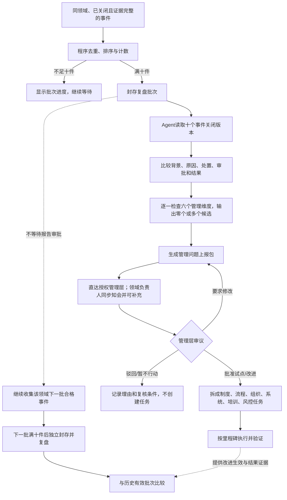

# 管理问题复盘闭环设计规格

> 日期：2026-07-19
>
> 状态：用户已批准，母稿已实施，待 PDF 验收
>
> 适用文档：`docs/圣农经营智能中枢_完整方案母稿.md`
>
> 本规格只定义方案母稿新增内容，不代表圣农现有系统已经具备该能力。

## 1. 目标

在单个经营事件完成“发现、调查、审批、执行、验证、关闭”之后，增加一个跨事件的管理学习闭环：系统对同一业务领域内已经关闭且证据完整的事件进行分批复盘，每十件抽象一次候选管理问题，直接形成管理层可审议的材料；管理层批准改进后，再把制度、流程、组织、系统、培训或风控改进拆成任务，并用后续批次验证复发和改进效果。

这项能力解决的不是“把十个事件重新摘要一遍”，而是识别单案背后的重复性管理短板，并把组织学习变成有证据、有审批、有执行、有验证的闭环。

## 2. 范围与非目标

### 2.1 本次纳入

- 在方案母稿中新增 `M12 跨事件管理复盘`，原持续治理模块顺延为 `M13`；
- 新增复盘批次、管理问题上报包及其状态、数据合同和看板要求；
- 新增 `management-review` Skill，并说明程序、Agent 和管理层的职责边界；
- 将复盘闭环接入既有 M07 审批、M08 任务、M09 岗位辅导、M10 里程碑、M11 结果验证与 M13 持续治理；
- 在能力分级、实施路线、验收指标、访谈清单和最终答卷表达中体现该能力；
- 更新 Markdown 后重新生成并检查 PDF。

### 2.2 本次不做

- 不修改现有演示网站或 HTML；
- 不部署服务器；
- 不把“每十件”写成已在圣农运行的事实；
- 不让 Agent 自动修改制度、调整组织、处罚员工或发布生产配置；
- 不把复盘功能设计成员工消极怠工监控或个人绩效排名工具；
- 不承诺十个事件足以证明统计因果关系或集团风险已经下降。

## 3. 核心定义

| 名称 | 定义 |
|---|---|
| 复盘领域 `review_domain_id` | 由企业批准并版本化的业务分类，如价格、库存、质量、履约；不是 Agent 临时生成的自由文本 |
| 合格事件 | 同一复盘领域、经营事件状态为 `closed`、结果验证已经完成、证据完整性检查为 `complete`，且未被分配给任何已封存批次的事件关闭版本 |
| 事件关闭版本 | 一次关闭时的事实、原因、处置、结果、证据及规则/语义/Skill/模型版本快照 |
| 复盘批次 `management_review_batch` | 同一领域按关闭确认顺序组成的十个互不重叠的合格事件关闭版本 |
| 管理问题上报包 `management_issue_dossier` | Agent 对十个事件进行比较后形成的候选管理短板、证据、反例、其他解释、影响、建议和验证指标 |
| 系统性短板 | 在多个事件中有重复证据支持，且可能属于制度、流程、组织、系统、培训或风控缺陷的候选判断；只有管理层审议后才能进入改进流程 |

“证据完整”必须由业务 owner 与风控/内审共同批准的确定性清单判定，至少包括事件背景、原始证据索引、调查结论或保留分歧、处置过程、审批记录、结果验证和关闭理由。Agent 不能自行把缺失信息补写成完整。

一个经营问题可能产生多条信号、通知或任务，但只能按一个规范 `event_id/canonical_case_id` 计数。技术去重不能只去掉重复消息，还要阻止同一根问题因多系统重复上报而被算成多件。

## 4. 触发与分批规则

```text
同一 review_domain_id
+ status = closed
+ result_verification = complete
+ evidence_completeness = complete
+ 未被分配给任何已封存批次
                    ↓
程序按 eligibility_confirmed_at、event_id 稳定排序
                    ↓
每十件封存一个不可重叠批次
                    ↓
触发 management-review Skill
```

1. 第 1-10 件形成第 1 批，第 11-20 件形成第 2 批，以此类推；不同领域分别计数。
2. 九件时只显示进度，不提前生成系统性结论；不得为了凑满十件混入其他领域、未关闭事件或证据不完整事件。
3. 归组、资格校验、排序、去重、计数和封存由确定性程序完成；Agent 不负责决定“现在是否正好十件”。
4. 批次封存采用幂等键 `review_domain_id + taxonomy_version + batch_sequence`，并发关闭或消息重放不能重复建批。
5. 每个规范问题及其事件关闭版本最多进入一个批次；`canonical_case_id` 的批次席位一经封存即被永久保留。事件重开后的新关闭版本只能修订原批次，不能再次参与后续计数。
6. 批次之间互不重叠。新批次与历史有效批次比较，但不重复生成上一批已经上报的同一结论；持续存在的问题应标为“延续/复发”，并引用原管理问题 ID。
7. 未关闭、超期未关闭和长期证据不完整事件不进入十件复盘，但必须在 M11 的积压/超时风险队列中独立上报，避免组织通过不关单或不补证来规避管理复盘。
8. 排序使用“资格确认时间”而不是业务关闭时间：迟到证据在真正达到合格条件时进入尚未封存的下一批，不追溯改写已封存批次。

## 5. 端到端流程



新批次的累计、封存和复盘不依赖上一批是否批准改进。即使管理层驳回、暂缓或没有发现系统性短板，第 11-20 件仍会形成下一批；只有“把变化归因为某项改进有效”才依赖已批准并生效的改进记录。

## 6. Agent 的分析合同

`management-review` Skill 接收批次快照和历史管理问题索引，不直接读取无边界的全库。其输出必须包含：

1. 批次范围、十个事件 ID、领域与分类版本；
2. 共同背景和差异背景；
3. 重复出现的直接原因、促成条件和反例；
4. 原处置动作、审批层级、结果及是否复发；
5. 逐一检查制度、流程、组织、系统、培训、风控六个维度，输出零个或多个有证据支持的候选，而不是每类强行生成一个结论；
6. 每个候选的支持事件、反证、替代解释、影响范围、置信度和待补证项；
7. “不行动”风险与至少两个可选改进方案；
8. 建议 owner、试点范围、里程碑、衡量指标、停止/回滚条件；
9. 与历史批次相比是新增、延续、改善、恶化还是证据不足；
10. 若没有稳定规律，明确输出“本批未发现有充分证据支持的系统性管理短板”。

Agent 不得把同时发生写成因果关系，不得为满足上报要求强行制造系统性问题，也不得把员工姓名或个案错误直接提升为组织结论。关键频次、金额、时长和比率由确定性服务计算，Agent 只引用计算结果并解释其业务含义。

## 7. 中间态与状态机

### 7.1 复盘批次状态

```text
collecting
→ sealed
→ analyzing
→ report_ready
→ management_review
   ├─ approved → improvement_executing → effectiveness_observing
   │             → verified / ineffective / superseded
   ├─ change_requested → reanalyzing → report_ready
   ├─ rejected → closed_with_reason
   └─ no_action → deferred

任意已封存状态 --成员事件重开/资格失效--> invalidated
invalidated --成员事件重新关闭且证据完整--> reanalyzing → 新报告版本
```

批次成员身份在正常重算和事件重开场景下保持不变，以保证审计和“第 1-10、第 11-20”边界稳定。若其中事件重开，原报告立即标为失效但不删除；该事件再次关闭并通过完整性检查后，对同一批次生成新版本。后续批次可以继续归组，但跨批趋势不得把失效批次当作有效基线。

领域分类及其版本在批次封存时冻结。后续分类体系变更只面向未来事件，不追溯重排历史批次。若发现某个历史事件当时就被事实性误分类，原报告应增加纠错版本并退出跨批基线；该事件仍保留原批次席位且不得转入另一批次重复计数。这样牺牲一批的可比性，换取稳定序号、无级联重排和完整审计。

### 7.2 管理问题状态

```text
candidate
→ under_review
   ├─ approved_for_pilot / approved_for_change
   │  → executing → observing
   │  → improved / unchanged / worsened / inconclusive
   ├─ rejected
   └─ deferred
```

“候选管理问题”不是企业事实，也不是自动问责结论。只有审批后的改进方案才能创建正式改进任务；制度、组织、价格、存栏、产能和市场进入等变化继续受 M07 权限和审批闸门约束。

## 8. 数据合同

### 8.1 `management_review_batch`

```json
{
  "batch_id": "MRB-price-001",
  "review_domain_id": "price_management",
  "taxonomy_version": "v1.0.0",
  "batch_sequence": 1,
  "event_closure_versions": [
    "PRICE-0001@close-v1", "PRICE-0002@close-v1",
    "PRICE-0003@close-v1", "PRICE-0004@close-v1",
    "PRICE-0005@close-v1", "PRICE-0006@close-v1",
    "PRICE-0007@close-v1", "PRICE-0008@close-v1",
    "PRICE-0009@close-v1", "PRICE-0010@close-v1"
  ],
  "eligibility_policy_version": "v1.0.0",
  "sealed_at": "2026-07-19T10:00:00+08:00",
  "status": "sealed",
  "invalidated_reason": null,
  "report_version": 1,
  "previous_batch_id": null,
  "created_by": "deterministic_batch_service"
}
```

`status` 枚举为：`collecting|sealed|analyzing|report_ready|management_review|approved|change_requested|rejected|no_action|closed_with_reason|deferred|improvement_executing|effectiveness_observing|verified|ineffective|superseded|invalidated|reanalyzing`。`event_closure_versions` 必须恰好包含十个不同 `canonical_case_id`，由服务端约束而不是依赖 Prompt。

### 8.2 `management_issue_dossier`

```json
{
  "dossier_id": "MID-price-001-v1",
  "batch_id": "MRB-price-001",
  "report_version": 1,
  "skill_version": "management-review@1.0.0",
  "model_version": "approved-model-release-id",
  "candidate_issues": [
    {
      "issue_id": "MI-price-policy-001",
      "dimensions": ["policy", "process"],
      "claim": "示例：促销例外有效期与门店执行确认之间可能存在流程缺口",
      "supporting_event_ids": [],
      "counterexample_event_ids": [],
      "alternative_explanations": [],
      "confidence": "medium",
      "missing_evidence": [],
      "impact_scope": {},
      "options": [],
      "recommended_owner_role": "pricing_process_owner",
      "success_metrics": [],
      "stop_conditions": [],
      "historical_link": {
        "proposed_issue_id": null,
        "relation": "new",
        "evidence": [],
        "confirmed_by": null
      }
    }
  ],
  "historical_comparison": {
    "baseline_batch_ids": [],
    "comparability": "limited",
    "limitations": []
  },
  "systemic_issue_found": true,
  "management_approval_id": null,
  "status": "candidate"
}
```

`candidate_issues[].dimensions` 只能取 `policy|process|organization|system|training|risk_control` 且至少包含一个维度；`candidate_issues` 本身可以为空，此时 `systemic_issue_found` 必须为 `false`。`status` 枚举为 `candidate|under_review|approved_for_pilot|approved_for_change|rejected|deferred|executing|observing|improved|unchanged|worsened|inconclusive|invalidated`。Agent 只能提出 `historical_link`，管理层或受权管理 owner 确认后才可合并管理问题 ID，防止模型把新问题错误压入旧结论。

生产 Schema 应另外记录法人范围、证据权限标签、运行 ID、Prompt/工具版本和审计字段；此处只展示评委理解闭环所需的最小结构。

## 9. 上报、权限与看板

- 报告只直达被授权的集团管理角色，不等于向全公司公开；字段级权限、法人隔离和敏感信息脱敏沿用 M03/M07。
- 领域负责人同步收到报告，可以在管理层审议前提交事实纠正、反证或补充说明，但不能拦截、删除或改写原报告。
- 每次封批保存当时的接收角色与人员快照，仅用于审计；实际投递、失败重试和打开报告时，都必须重新解析并校验当前角色、法人范围和字段权限，已经撤权的人员不得继续收到或读取报告。投递记录至少包含 `queued|delivered|failed|read|acknowledged`、发送时间、失败原因、重试次数和审计 ID。领域负责人未读或未响应不影响向授权管理层投递。
- 员工个人信息默认聚合或脱敏。确需查看原事件时按最小权限逐级展开，并保留访问审计。
- 看板必须显示：当前领域已累计几件、资格不通过原因、批次成员、报告版本、失效状态、管理层已读/审议状态、改进任务、下一批验证进度。
- 看板必须并列显示未关闭、超期未关闭和证据长期不完整的事件积压，不能让“只复盘已关闭事件”掩盖更严重的流程卡点。
- Agent 的候选结论、领域负责人意见和管理层决定分栏展示，不能混写成一个“系统结论”。

## 10. 跨批验证规则

第 2 批及以后至少比较：

- 同一管理问题在十个事件中的出现件数；
- 事件严重度、平均发现/调查/审批/执行/验证时长；
- 重开、复发、返工和补证逾期情况；
- 已批准改进任务的完成与里程碑证据；
- 新问题、延续问题、改善问题和可能副作用。

每项获批改进必须记录 `approved_at`、`improvement_effective_at` 和 `stabilization_until`。后续事件据此标为 `pre_intervention`、`transition` 或 `post_intervention`；过渡期事件可以用于发现副作用，但不能直接证明改进无效。

“样本和暴露足够”不能交给 Agent 自由判断。每个领域必须有版本化 `effectiveness_policy`，由业务、经营分析和风控共同批准，至少定义最小干预后事件数、最小订单/门店/销量/巡检等暴露量、稳定观察窗口、季节与口径可比条件。一个固定十件批次可以混合干预前、过渡期和干预后事件，因此每批都做比较，但可以跨一个或多个后续批次累计干预后样本；未达到策略门槛时只能输出 `inconclusive`。

由于每批固定十件，批内出现件数可以用于案件结构比较，但不能单独证明企业总体发生率下降。若要判断经营风险是否下降，必须同时取得订单量、门店数、销量、巡检量或其他暴露分母，并处理季节性、渠道结构、并表和规则口径变化。分母缺失时只能写“在已关闭样本中的占比变化”，结论标为 `inconclusive` 或限制适用范围。

## 11. 异常与失败处理

| 场景 | 系统行为 |
|---|---|
| 事件未关闭或证据不完整 | 不计入批次；显示缺口和责任 owner；超期项进入 M11 风险队列 |
| 重复消息、重复信号或并发关单 | 按消息 ID 和规范问题 ID 双重幂等去重；同一问题只计一次 |
| 历史事件被发现误分类 | 不追溯重排；生成纠错报告版本并退出跨批基线；该事件不得转入另一批次重复计数 |
| 成员事件重开 | 批次和报告立即失效，通知管理层；不自动撤销已批准改进，但要求重新审议 |
| Agent 超时或工具失败 | 批次停留在可重试状态，不生成“无问题”结论；记录失败原因 |
| 无稳定共同规律 | 生成“未发现系统性短板”报告，而不是空报告或强行归因 |
| 报告包含敏感信息 | 服务端权限与脱敏拦截，Agent 不能通过提示词绕过 |
| 管理层不批准 | 记录驳回/暂缓理由、复核时间和触发条件，不创建正式任务 |
| 历史口径发生变化 | 保存原分类和规则版本；新旧批次不可比时明确标为不可比 |

## 12. 与母稿既有模块的关系

```text
M11 单事件结果验证并关闭
→ M12 同领域十事件批量复盘
→ M07 管理层审议候选管理问题和改进方案
→ M08/M09/M10 拆任务、辅导岗位、按里程碑执行
→ M11 验证单项改进结果
→ 下一批 M12 验证复发和管理效果
→ M13 将批准的制度、语义、规则、Skill、模型和案例变更受控发布
```

M12 不是替代 M11：M11 回答“这一个事件是否真正解决”，M12 回答“十个同类事件是否暴露重复性管理短板”。M13 也不是复盘报告库，而是负责把管理层批准的知识和系统变更版本化、评测、发布与回滚。

## 13. 验收测试

1. 同领域只有九个合格事件时不生成批次，第十个合格事件到达时只生成一个批次。
2. 未关闭、证据不完整、其他领域或已经归组的事件不计数；其中超期事件仍在 M11 风险队列可见。
3. 同一问题的多条信号、并发关单、消息重放和任务重试不会重复归组或重复上报。
4. 第 1-10 件和第 11-20 件互不重叠，且都保留分类和资格规则版本。
5. 任一成员事件重开后，原报告可见但明确失效；重新关闭后生成新版本，不覆盖审计历史。
6. 有重复模式的样本输出支持证据、反例、其他解释和六类短板候选；关键数值可复算。
7. 无稳定模式的样本明确输出“未发现系统性短板”，不会强行凑结论。
8. 领域负责人可以补充和纠错但不能阻断授权管理层收到报告。
9. 未获得管理层 approval_id 时，系统不能创建正式制度修改、组织调整或其他高风险任务。
10. 第二批能够引用历史问题 ID 并标注新增、延续、改善、恶化或证据不足；没有暴露分母时不宣称总体风险下降。
11. Agent、规则、分类、Prompt、Skill、模型、证据和审批版本均可追溯。
12. 代表性 E2E 覆盖正常触发、无规律、事件重开、Agent 失败、权限拦截和管理层驳回。
13. 人为长期不关单或不补证不能让问题从管理视野消失；积压、超时和责任状态可被管理层看到。
14. 领域负责人未读或未响应不阻断管理层投递；投递失败可重试并保留角色、人员、时间和失败审计。
15. 封批后、投递前或读取前被撤权的人员无法收到或打开报告；历史人员快照只用于审计，不能替代实时鉴权。
16. 改进生效前和过渡期事件不会被计入“改进已验证”；未满足版本化领域策略规定的最小干预后事件数、暴露量、观察窗口和可比条件时，结果只能为 `inconclusive`。
17. 无论上一批被批准、驳回、暂缓或未发现系统性短板，下一批合格事件仍独立累计并在满十件时触发复盘。

## 14. 母稿实施清单

- 一页结论：将持续进化明确为“单事件结果 + 十事件管理复盘 + 资产治理”；
- 双向框架：在结果验证之后增加跨事件复盘反馈；
- 案例：在价格案例结束处展示十个价格事件如何抽象管理短板；
- 第 7 章：七个关键中间态改为九个，新增复盘批次和管理问题上报包；新增复盘状态线；扩展案件/管理看板；
- 第 8 章：新增 M12，原 M12 改为 M13；更新总览和路由；
- 第 9 章：增加 Aily 复盘 Skill、批处理服务和权限边界；
- 第 10 章：增加复盘分类、证据完整标准、管理层接收角色和目标租户 E2E 问题；
- 第 11 章：增强版可先人工复盘，终局版实现自动分批、Agent 抽象和跨批验证；
- 第 12 章：在单事件闭环稳定后增加复盘试点门；补充复发、重复管理问题、批准改进完成率和跨批变化指标；
- 第 13 章：把“从解决问题到补足管理短板”纳入对题面回应；
- 附录 B：新增 `management-review` Skill；
- 附录 C：新增两个数据合同；
- 附录 A/F/G：更新访谈对象、术语和提交前自检；
- 修正 M07/M08 中可能把 2024 飞书客户案例误写成 2026 现状的历史口吻。

## 15. 成功标准

更新后的母稿应让第一次接触方案的管理学评委明确看懂：

1. 单个事件闭环与跨事件管理复盘是两个不同层次；
2. 为什么选择同领域、已关闭、证据完整、每十件分批；
3. 程序、Agent、领域负责人和管理层分别做什么；
4. 报告如何直达管理层，又如何防止误判、越权和员工标签化；
5. 管理问题如何经过审批变成改进任务，并由下一批事件验证效果；
6. 哪些属于方案设计，哪些仍需圣农数据、流程和飞书/Aily 目标租户 E2E 才能验证。
