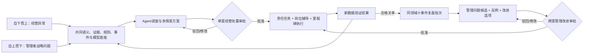
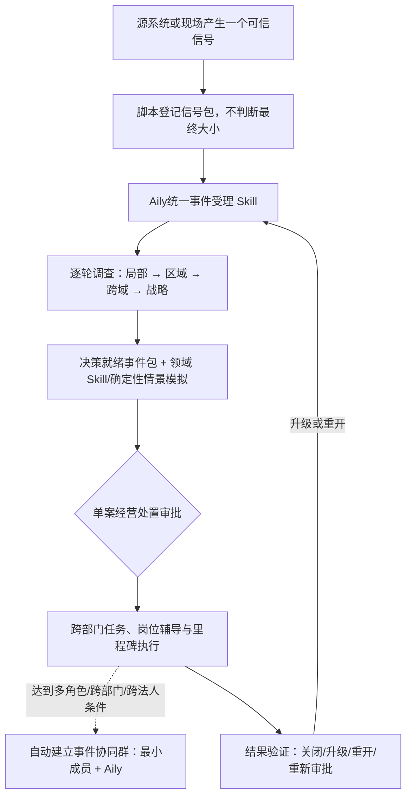
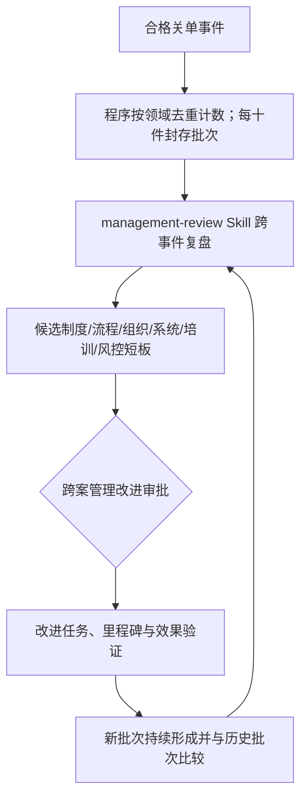
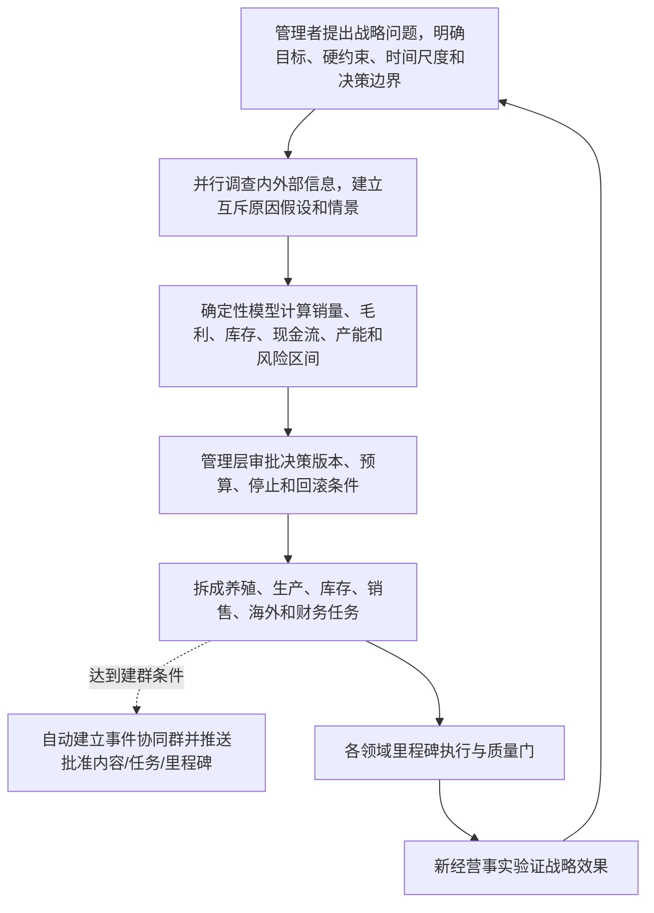
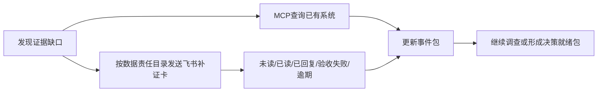
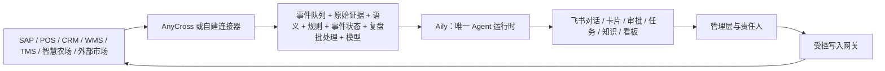

# 圣农经营智能中枢：从经营异常到集团战略的双向闭环

> 文档性质：比赛方案母稿（证据审查版）  
> 版本日期：2026-07-19  
> 当前状态：方案文档已完整、目标架构已冻结；公开证据审计 `verified`；圣农内部流程 `unknown`；目标企业代表性 E2E `unsupported`  
> 适用范围：本稿用于统一答卷内容、后续演示网站和汇报材料，不代表系统已经在圣农生产环境部署。

---

## 0. 阅读规则：先区分事实，再讨论方案

本方案同时处理“圣农现在是什么情况”和“我们建议圣农建设什么能力”。两者不能混写。

### 0.1 事实证据等级

| 标签 | 含义 | 在答卷中的用法 |
|---|---|---|
| `公开事实已核验` | 年报、公告、公司或项目官方材料可复核 | 可以陈述公开披露的事实，不自动延伸原因和效果 |
| `信号/个案` | 第三方页面、单方投诉或局部样本 | 只能作为调查入口，不能直接定责 |
| `推断/行业类比` | 由公开事实推导的风险假设，或其他企业做法 | 用于设计调查方向，不冒充圣农事实 |
| `待企业确认` | 公开渠道没有真实内部样本 | 必须访谈、取脱敏数据或做现场 E2E 后才能下结论 |

### 0.2 能力实现状态

| 标签 | 含义 |
|---|---|
| `平台公开能力` | 飞书/Aily 官方材料已公开该通用能力 |
| `需要配置` | 租户开通后仍需配置 Prompt、Workflow、Skill、权限或表单 |
| `需要开发` | 需要语义服务、事件库、规则引擎、模型服务、连接器或写入网关 |
| `需要 E2E` | 必须在目标租户、真实接口和代表性业务样本上验收 |
| `不支持/不采用` | 不能满足要求，或本方案明确不让该组件承担 |

### 0.3 法人与组织范围

交接包的上市公司研究对象主要是福建圣农发展股份有限公司（002299.SZ）；飞书客户案例的主体是圣农集团，部分 SRM/TMS/CRM 门户也可能属于圣农控股集团范围。集团材料只能证明相关集团场景曾被公开披露，不能自动外推到上市公司全部法人、基地和用户。所有数据合同、事件、审批和能力状态都必须记录 `legal_entity` 与 `scope`，具体覆盖范围待企业确认。

> **关键纪律**：`公开信息没有披露` 不等于 `圣农没有该能力`；`平台有功能` 不等于 `圣农已经开通并配置完成`；`问题清单被回答` 也不等于 `系统已经上线`。

---

## 1. 一页结论

### 1.1 我们究竟要建设什么

圣农已经具备 SAP S/4HANA 及多套外围业务系统。公开材料称 SAP 与 SRM、CRM、WMS、智慧农场等 18 个外围系统进行数据互联互通，并已形成按产品、客户、渠道查看毛利贡献的能力。与此同时，圣农年报仍使用“继续完善一体化数据管理平台与智慧运营系统”“积极推进智慧中台”等进行时表述。

因此，本方案不是再造一套 ERP，也不是用飞书多维表格复制一套业务账，而是对照终局目标验证现有能力，并按真实缺口增强以下七项能力：

1. **口径统一**：让同一个 SKU、到手价、区域、库存、销量和毛利在不同系统中具有可解释、可版本化的共同含义；
2. **快速发现**：由确定性程序在正确的业务里程碑上识别可信信号；
3. **动态调查**：由 Aily Agent 按企业方法跨系统取证，由点及线、由线及面地扩大调查；
4. **决策支持**：形成有证据、缺口、备选方案、影响区间和停止条件的决策就绪事件包；
5. **责任执行**：管理层审批后，拆成养殖、生产、库存、销售、海外等责任任务；当存在两个以上主动责任角色或跨部门/跨法人协作时自动建立最小成员事件协同群，单人任务只发任务卡；再按源系统里程碑验证；
6. **管理复盘**：同一经批准、版本化领域内，每十个按根问题去重、已关闭、结果已验证且证据完整的事件形成一个批次，由 Agent 比较背景、原因、处置和结果，抽象候选管理短板并直接报管理层审议；
7. **持续进化**：把单事件结果、跨事件复盘和管理层批准的改进反哺语义、规则、模型、Skill、岗位案例和经营目标。

为避免后文口径漂移，本稿统一把“同一经批准、版本化领域内，按根问题去重、已经关闭、结果已经验证且证据完整的事件”简称为**合格关单事件**。十件是固定的常规批次规则。

### 1.2 一个底座、两个方向、一个共同执行闭环



自下而上解决“一个门店、一个价格、一个投诉，是否会演变成区域或集团风险”；自上而下解决“管理层主动研究世界市场、政策和出口机会，如何把战略下沉到基层执行”。两条路径共享同一语义、工具、权限、审批、任务和验证体系。单事件闭环解决具体问题；跨事件复盘寻找重复性管理短板；持续资产治理只把涉及语义、规则、模型、Skill 和案例等数字资产的获批变更受控发布。三者是前后衔接的层次，不是三套系统。

### 1.3 人与机器的边界

| 主体 | 应该做什么 | 不能做什么 |
|---|---|---|
| 确定性程序 | 搬运、去重、对账、计算、规则命中、里程碑检测 | 猜原因、补缺失信息、给复杂事件定责 |
| Aily Agent | 建立原因假设、选择下一项查询、融合证据、解释冲突、组织方案 | 把模型记忆当事实、心算关键金额、绕过权限、自动拍板 |
| 预测/模拟服务 | 计算需求、销量、毛利、库存、现金流和产能情景 | 决定企业愿意承担哪种风险 |
| 管理层 | 批准价格、存栏、产能、市场进入等高风险决策 | 把最终责任交给模型 |
| 责任人 | 确认现场事实、执行任务、回写证据并承担岗位责任 | 用“Agent建议”替代本人业务承诺 |
| 飞书事件协同群 | 在责任到人后聚合相关负责人、任务、证据、里程碑和岗位追问 | 不替代 ERP/正式审批/任务状态；不自动扩大数据权限或拍板 |

“自动拉群”准确含义是：Aily 根据事件和已批准任务图提出协作范围，受控事件协同群服务再按当前 RACI、组织、法人和权限校验成员，调用飞书建群/加人/发卡能力。Aily 不直接持有飞书应用凭据，也不能仅凭提示词决定拉入谁。

### 1.4 响应速度的准确表述

- 数据事件和规则命中：**毫秒至秒级**，取决于源系统是否能实时推送；
- Agent 跨系统调查：**秒至分钟级**，取决于查询数量、接口延迟和补证情况；
- 人工补证、审批和业务执行：按企业 **SLA** 运行，可能跨小时或跨天；
- 所谓“毫秒级响应”只能指信号检测和事件登记，不能承诺 Agent 在毫秒内完成完整经营判断。

---

## 2. 为什么“18 个系统打通”仍然不能直接回答题目

“系统打通”至少有四个不同层次：

```text
接口连通：数据能从 A 搬到 B
    !=
语义统一：双方对 SKU、价格、区域、销量、库存的含义一致
    !=
决策贯通：异常能被组织成证据充分、可审批的经营事件
    !=
执行闭环：批准的决策能责任到人、按里程碑执行并验证结果
```

SAP 与外围系统互联互通，主要解决交易、核算和专业系统之间的数据流转问题；题目关心的是跨系统、跨角色、跨时间的异常反应和经营决策。即使接口全部在线，仍可能存在：

- 2024 年前后成本核算口径发生变化，指标不能机械同比；
- 同一“销售收入”存在抵消前/抵消后、未经审计/经审计口径；
- 页面标价、商家直降、平台券、会员券、运费和最终实付价不是一个概念；
- SAP 能看公司出货，不代表能看到经销商和门店的真实 `sell-out`；
- 系统状态“已发货”不等于门店已经登记、上架、标价并产生真实动销；
- 数据能看见，不等于异常已有原因、责任人、审批权限、方案和关闭证据。

本方案复用满足数据合同的既有集成，仅为 Agent 补充缺失的只读查询、事件暴露和证据适配；并在销售、库存和战略场景扩展、验证语义、决策和执行闭环。这不表示圣农从未拥有相关能力，也不表示所有所需接口已经存在。

### 2.1 ERP、MOM/MES、飞书与 Agent 的概念边界

| 系统 | 本质职责 | 在本方案中的位置 |
|---|---|---|
| ERP/SAP | 订单、采购、生产、库存、成本、财务等正式交易和核算 | 企业事实源和正式执行系统，不被替代 |
| WMS/TMS/SRM/CRM/智慧农场 | 仓储、运输、采购、客户、养殖等专业执行 | 提供领域事实与里程碑 |
| MOM/MES | 制造运营/车间执行、工序、质量、设备与生产进度 | 圣农是否有独立系统及其范围公开信息不足，必须企业确认；不能把它简化成“ERP信息的前端页面” |
| 飞书 | IM、卡片、任务、审批、文档、知识和组织协作 | 人机协作控制面与责任界面，不承载第二套 ERP 交易账 |
| Aily Agent | 语义理解、动态调查、工具调用、方案组织和岗位问答 | 唯一 Agent 运行时的目标选择，生产可用性需目标租户 E2E |
| 后端确定性服务 | 语义、规则、事件状态、预测、审计、连接器、权限闸门 | 系统可靠性的主体；它们是服务，不是第二个 Agent |

---

## 3. 事实底座：公开信息真正证明了什么

### 3.0 飞书官方客户案例披露的圣农闭环，不应重复发明

飞书官方圣农客户案例（页面创建/更新于 2024 年）披露，圣农集团当时曾：

- 将 OA、人力、财务等多个系统的审批流程集成进飞书统一待办，每日约有数千条审批流程流转；
- 用多维表格搭建生产品质巡检工具，品管员按标准清单检查并拍照上传；
- 发现品质问题后，由机器人自动生成整改任务、推送厂责任人并跟踪督办；
- 责任人整改完成后，必须由品管验证确认才关闭问题；
- 建设知识空间、产品知识看板、数百项飞书词典词条和定制工作台。

按飞书供应商客户案例口径，“巡检发现问题 → 自动建任务 → 责任人整改 → 专业岗位验证关闭”的飞书闭环已在圣农集团相关品质场景中实践。本方案的创新起点不是再做一套相同巡检工具，而是：

> **在确认当前运行状态后，复用这套曾被公开披露的闭环范式，把数据入口从人工巡检扩展到 SAP/POS/CRM/WMS 和外部市场，把问题范围从生产质量扩展到销售、价格、库存、产能和战略风险，并增加语义、跨系统 Agent 调查、情景模拟与管理层责任门。**

该材料是飞书官方客户案例，不是圣农内部运行审计；主体为圣农集团，也不能自动外推到上市公司全部业务范围。它不证明 SAP/POS 已实时供 Agent 查询，也不证明圣农已经部署 Aily；这些仍需企业确认和 E2E。

### 3.1 可进入主叙事的证据矩阵

| 公开记录/证据项 | 证据 ID | 证据状态 | 允许得出的结论 | 不允许得出的结论 | 对方案的要求 |
|---|---|---|---|---|---|
| SAP 上线伴随成本核算口径切换 | `01a-11`、`SN-01b-03` | `官方事实` | 2024 年前后形成可比性断点 | 旧数据错误；所有毛利变化均来自经营 | 指标必须带口径版本、生效期和血缘 |
| 上线后可按产品、客户、渠道看毛利贡献 | `01a-12`、`SN-01b-04` | `可信报道/管理层转述` | 已具备重要经营分析基础 | 已能识别门店破价、券承担方和订单级毛利 | 复用现有视图，不另建利润核算系统 |
| 月度简报部分数据为抵消前且未经审计 | `04b-10` | `官方事实` | 同名指标不能机械加总或同比 | 数据不可信；系统未打通 | 显式保存抵消和审计状态，建立勾稽关系 |
| 2025 年直销增长、经销下降、出口增长，毛利有差异 | `03b-04`、`04a-03` | `官方事实` | 渠道结构发生明显变化 | 经销商已压货、窜货或被打压 | 取得 sell-in、sell-out、库存、返利和退货再判断 |
| 2025 年末存货账面价值约 32.86 亿元，跌价准备为关键审计事项 | `04a-01`、`04b-09` | `官方事实` | 库存价格风险应进入集团预警 | 32.86 亿元全是冻鸡肉滞销货；减值就是管理失职 | 连接批次、账龄、成本、可变现净值和需求预测 |
| 深加工肉制品库存量同比 +50.57%，销量 +41.25% | `04a-02` | `官方事实` | 库存增速高于销量，但并表口径需拆分 | 已证实滞销；生产增速也高于销量 | 同时提供法定口径、可比口径和剔除并购口径 |
| 历史第三方页面显示多层优惠叠加 | `C2B-07/08` | `第三方价格信号` | 价格判断必须拆解优惠条件和结算证据 | 页面价就是当前真实成交价或违规低价 | 建立到手价证据结构和可比性校验 |
| 存在一条直播赠品履约投诉 | `C2B-09` | `单方投诉信号` | 可作为“话术—订单—仓配—售后”调查样本 | 已被监管认定虚假宣传；存在系统性问题 | 关联直播、活动、订单、赠品 SKU、发货和客服记录 |
| 内控公开材料证明有定价、预算和合同制度框架 | `SJ-05b-14` | `官方事实；流程细节未知` | 企业存在制度框架 | 已知单场促销的发起、审批、承担和核销流程 | 真实审批链必须取企业样本后配置 |
| 日报、巡店、价格审批和区域升级细节未公开 | `06a-12/13/14` | `待企业确认` | 这些是最高优先级访谈项 | 圣农没有日报、巡店、审批或责任机制 | 优先复用现有系统，真实缺口才由飞书补位 |

> 同一公开事实被多个研究文件复用时，只能算一个事实单元，不能重复加权。

### 3.2 公开证据支持的核心命题

最稳妥的比赛命题不是“AI 已经发现圣农窜货、压货或员工违规降价”，而是：

> **如何在核算口径会变化、渠道优惠结构复杂、跨系统证据分散且内部流程尚需验证的情况下，建立一个可解释、可追溯、能识别合法例外，并能从局部异常升级到集团决策的经营闭环。**

### 3.3 当前不能写成事实的内容

以下表述必须删除或改为待验证假设：

- 已证实圣农存在窜货、压货、跨区低价或业务员擅自降价；
- 圣农没有日报、巡店、审批、MOM/MES 或责任推进系统；
- 经销收入下降证明经销商被边缘化并开始甩货；
- 32.86 亿元存货全部是冻鸡肉或滞销品；
- 六个区域降价就必然说明全国白羽鸡需求下降；
- 公开平台促销页可以直接复原订单级最终价格和承担方；
- 飞书或 Aily 开箱即用就能承担企业生产闭环。

---

## 4. 核心思想：五项母原则与六条实施纪律

### 4.1 五项母原则

| 母原则 | 在本方案中的落地 |
|---|---|
| 业务概念优先于数据表 | 先定义 SKU、价盘、到手价、sell-out、里程碑、经营事件和责任角色，再映射 SAP/POS/CRM/WMS 字段 |
| 语义必须包含暗知识 | 保存区域范围、指标口径、合法例外、审批条件、责任链、动作边界和版本，而非只保存表名字段名 |
| 必须有可检查中间态 | 信号包、调查计划、原因假设、证据请求、决策就绪包、审批版本、任务和里程碑全部可看、可重放 |
| 必须有系统护栏 | 最小权限、工具白名单、确定性计算、服务端写入闸门、人工审批、补偿回滚和审计共同限制 Agent |
| 语义需要长期治理 | 语义、规则、Skill、模型、案例和接口都有 owner、版本、生效期、回归样本和退出机制 |

### 4.2 六条实施纪律

1. **复用不替代**：SAP 和专业系统继续保存正式事实；中枢保存经营事件、证据索引和跨系统状态。
2. **原文不丢失**：任何抽取字段都能回到原始记录、图片、文档或接口返回值。
3. **缺失不补零**：未报、无权限、接口失败和真实为零是四种不同状态。
4. **例外需版本化**：合法促销、临期处置、渠道特供规格可以抑制误报，但必须有审批、范围和有效期。
5. **任务按里程碑检测**：未到业务节点只监控进度，达到节点并过宽限期后才检查质量。
6. **先跑一个闭环再复制**：先用一个区域、一个 SKU 和一条真实价格事件验证，再扩展库存、生产和战略治理。

---

## 5. 双向经营运转框架

### 5.1 自下而上：从一个异常点到集团战略

单个经营事件先完成从发现、调查到审批、执行和验证的闭环：



同一领域的单事件闭环累积后，再进入更长时间尺度的管理改进闭环：



两张图不是两套系统：上图处理单个事件，下图从十个合格关单事件中抽象管理短板，二者通过责任任务、里程碑和结果验证衔接。局部、区域、跨域、战略表示调查范围，不是脚本预判的“小、中、大严重度”。Agent 根据新证据逐轮扩大范围，每轮只选择下一项最小、必要且已授权的查询。

### 5.2 自上而下：从管理者问题到基层执行



### 5.3 两条路径如何互相辅助

- 一个门店的价格信号可能逐步暴露为区域竞品冲击、渠道库存风险，最终进入集团产销决策；
- 一项集团海外战略经批准后，会下沉为认证、客户开发、产能安排、产品改造、物流和回款任务；
- 责任到人后，事件协同群把跨部门负责人、任务、证据、里程碑和 Aily 岗位辅导放在同一上下文中；建群失败时仍退回个人任务和人工协作，不阻断正式系统；
- 底层经营事实为战略提供证据，战略决策又改变基层目标、规则和任务；
- 两条路径最终都汇入同一个“审批后执行—里程碑验证—结果回流”闭环，不是四套独立系统。
- 每个事件关闭后仍保留自己的证据链；只有十个合格关单事件才进入跨事件复盘。下一批独立累计，不因上一批被驳回、暂缓或未发现系统性短板而停止。

---

## 6. 三个案例：用同一套系统证明方案边界

### 6.1 案例一：29.9 元标准价与 24.9 元门店价

> 案例性质：方案演示场景，不是公开证据已确认的圣农违规事件。

#### 第 0 步：规则到底是什么

这里的“规则”不是 SAP 自动附赠的一段神秘程序，而是由企业批准、可版本化的经营判断条件。SAP/POS/CRM 提供事实，规则服务执行确定性比较。

```text
输入事实：SKU、规格、门店、区域、时点、标准价、实付价、促销标识
企业规则：可比性条件 + 价格偏差阈值 + 正式例外 + 生效时间
程序结果：登记“待调查价格信号”，而不是判定“违规降价”
```

#### 完整闭环

| 阶段 | 系统动作 | 关键证据/输出 |
|---|---|---|
| 1. 信号登记 | POS 或巡店显示 24.9 元，规则服务与 29.9 元有效价盘比较 | `signal_packet`：对象、时间、来源、偏差、规则版本 |
| 2. 局部调查 | Agent 查询规格、购物车、券、促销审批、承担方、价签与 POS 是否一致 | 合法活动、价签错误、规格差异、未授权低价等互斥假设 |
| 3. 区域调查 | 若单店不能解释，查询同区域门店、同渠道库存、动销、投诉和竞品覆盖 | 判断是单店问题、区域活动还是竞品抢量 |
| 4. 跨域调查 | 若区域广泛发生，联查经销商库存、退货、回款、毛利和供应计划 | 识别价格、渠道、库存、履约或数据口径的组合风险 |
| 5. 战略调查 | 若多区域持续扩散，连接行业供需、产能、存栏和海外机会 | 战略风险假设，不直接断言全国需求下降 |
| 6. 方案模拟 | 比较定向券、规格区隔、临期处置、不跟价等方案 | 销量、毛利、库存、预算、外溢风险和置信度区间 |
| 7. 管理层审批 | 批准适用门店、SKU、数量、时间、预算、停止和回滚条件 | `approval_id + decision_version` |
| 8. 责任执行 | 拆成销售、库存、门店、财务等任务；自动建立事件协同群；新人可在任务或群内追问 | 负责人、协同成员、截止时间、完成证据、岗位指导 |
| 9. 里程碑验证 | 到货、登记、上架宽限期后，再核验价签、实付价和 sell-out | 防止货还在路上就误报“未标价” |
| 10. 结果验证与关单 | 按企业批准的回读窗口（可将 6/24/48/72 小时作为待校准示例）读取结果 | 恢复则关闭；无效则升级、重开或重新审批 |

这一个案例已经包含整套经营闭环。所谓“风险闭环”和“执行闭环”是其中的能力视角，不是额外增加两条互相割裂的流程。

#### 对手只让利 3 天，系统怎样来得及响应

竞品短促不是等活动结束后复盘，而是另一类事件入口：

```text
T0：授权竞品源/业务员上报一个可比价格信号
→ 秒级登记来源、SKU、规格、门店、时点、优惠和活动期限
→ Agent 先做最小可比性核验
→ 并行查询竞品覆盖门店、我方 sell-out、库存、毛利和已有活动
→ 证据足够则在秒至分钟级形成有限范围方案；不足则显示缺口和风险
→ 管理层按企业快速审批 SLA 决定定向券、规格区隔、不跟价或小范围试验
→ 批准后立即下发限定门店/数量/时间的任务
→ 活动期间持续回读 sell-out、毛利、库存和价盘外溢，满足停止条件即撤回
```

这里的速度来自三点：脚本先登记、Agent只查询下一项必要证据、管理层拿到的是已算好的有限选项。若关键证据来不及补齐，系统不能伪造确定性，但可以把不确定性、最大损失和可逆的小范围试验同时呈现，让管理层决定是否承担风险。

责任到人后，系统在多角色或跨部门/跨法人任务达到触发条件时，依据任务图自动建立事件协同群；单人任务只发任务卡。群名只使用事件编号和业务范围，不泄露客户或财务敏感信息；首条卡片包含群 ID、权限裁剪后的事实/证据、批准范围、责任人、任务依赖、SLA/完成证据、补证与升级角色、当前里程碑、禁止事项、停止/回滚条件和 Aily 岗位追问入口。群聊只承载协作上下文，正式审批、任务完成和价格/库存状态仍以授权系统为准。

#### 十个价格事件之后：从解决个案到补足管理短板

单个 29.9 元与 24.9 元事件关闭，只能证明该案已经处理。若要判断企业是否存在重复性管理短板，系统还要进入第二层闭环：

```text
同一价格领域
+ 已关闭
+ 结果已验证
+ 证据完整
+ 十个不同根问题（`canonical_case_id`，即同一根问题的去重编号）
→ 程序去重、排序并封存第 1 批
→ Agent 比较十案的背景、原因、审批、处置和结果
→ 逐一检查制度、流程、组织、系统、培训、风控六个维度
→ 输出零个或多个候选管理问题，并保留反例与其他解释
→ 直接投递给当前有权的管理层，价格负责人同步补充但不能拦截
→ 管理层批准试点后，才生成改进任务、里程碑和回滚条件
→ 第 11-20 个合格价格事件形成第 2 批，与历史批次比较
```

例如，十案中若多次出现“促销有效期已经结束，但门店价签与 POS 未在批准里程碑后同步恢复”，Agent 可以提出“促销退出流程或系统联动可能存在缺口”，而不能直接断言员工违规。若十案没有稳定共同规律，也必须上报“本批未发现有充分证据支持的系统性短板”。

固定十件便于形成互不重叠、管理负担可控的批次，但它不是统计因果证明。只有后续事件落在改进生效后的稳定观察期，并达到企业批准的最小事件数、订单/门店/销量等暴露量和可比性条件，系统才可以判断改进效果；否则只能写 `inconclusive`。长期未关闭、逾期或证据不完整的事件另进风险积压看板，不能通过“不关单”逃出管理视野。

十件是本方案已经确定的常规复盘批次规则，不是待校准阈值，也不替代重大风险升级。重大单案仍按 M05-M11 立即扩大调查、上报和审批；未关闭、逾期或缺证积压达到企业批准的风险门时，也由 M11 立即升级管理层，均不需要等待第十件且不占用常规批次编号。

### 6.2 案例二：多区域降价与滞销，如何传导到生产和存栏

> 案例性质：多区域同时降价滞销是压力测试假设；公开事实仅证明圣农存在重大存货和跌价风险、渠道结构变化及价格周期压力，不能证明全国需求已经下降。

#### 先建立互斥解释，不能直接减存栏

```text
假设 H1：终端真实需求下降
假设 H2：竞品短期补贴抢量
假设 H3：圣农价格/规格竞争力下降
假设 H4：经销商或门店库存转移，sell-in 尚可但 sell-out 走弱
假设 H5：局部缺货、陈列或履约问题造成假性滞销
假设 H6：并购、抵消、成本或区域口径变化造成伪异常
```

#### 三个时间尺度

| 时间尺度 | 主要数据 | 可模拟动作 | 决策边界 |
|---|---|---|---|
| 短期 1-30 天 | sell-out、价格、促销、门店/渠道库存、客诉、竞品 | 定向促销、区域调货、规格区隔、临期处置 | 价格与特殊处置需批准 |
| 中期 1-6 个月 | 订单、生产、屠宰、加工、仓储、渠道需求、现金流 | 调整产品组合、排产、采购和区域资源 | 生产计划和产能调用需批准 |
| 长期 6-18 个月 | 种鸡、鸡苗、养殖计划、生物资产、行业供需、海外市场 | 调整存栏/产能、市场布局和战略客户 | 存栏、产能、市场进入必须管理层批准 |

#### 决策就绪包必须呈现的方案

| 方案 | 可能收益 | 主要代价/风险 | 必要停止条件 |
|---|---|---|---|
| 继续或扩大定向促销 | 拉动短期 sell-out、降低临期风险 | 毛利下降、价格外溢、消费者形成低价预期 | 增量销量不足、预算耗尽或价盘扩散 |
| 维持价格、优化陈列与渠道 | 保护品牌和贡献毛利 | 库存、现金占用可能继续上升 | sell-out 持续低于安全区间 |
| 调整产品组合/转深加工 | 延长价值链、改善部分产品消化 | 加工产能、研发、包装和渠道约束 | 订单覆盖不足或单位贡献恶化 |
| 降低排产或未来存栏 | 减少未来供给压力 | 产能利用率下降、单位成本上升、需求恢复时缺货 | 领先需求指标恢复或核心订单上升 |
| 开拓海外市场 | 分散国内风险、改善市场结构 | 认证、客户、物流、汇率、回款周期长 | 合规未通过、单位经济性不成立 |

管理层看到的不是“建议减鸡”一句话，而是每种方案在销量、库存、毛利、现金流、产能利用率、食品/生物安全和不可逆风险上的比较。

#### 审批后怎样走完集团执行闭环

假设管理层批准一个组合方案：“先在受影响区域做限时定向促销，同时下调下一周期部分产品排产；暂不调整长期存栏，待领先指标连续验证后再议”。系统将同一决策版本拆成：

| 责任域 | 批准后的任务 | 权威里程碑候选 | 结果回读 |
|---|---|---|---|
| 销售/区域 | 配置限定 SKU、门店、数量、预算和退出条件；确认门店执行 | 活动生效、价签/结算一致、首笔 sell-out | 覆盖门店、增量 sell-out、毛利、价格外溢 |
| 渠道/库存 | 按批次和库龄分配库存，避免只向经销商移库 | 调拨出库、到货、门店登记、渠道库存回报 | 公司/经销/门店库存、库龄、退货、回款 |
| S&OP/生产 | 更新同口径需求预测，形成经批准的排产调整 | 计划版本批准、工单释放、完工入库 | 订单覆盖、产量、单位成本、产能利用率 |
| 养殖 | 先更新未来出栏和存栏情景，不在短期信号下直接减存栏 | 养殖计划评审、资源确认、管理层再次审批 | 领先需求指标、预计/实际出栏、成活和成本 |
| 财务 | 锁定活动预算、贡献毛利底线和核销口径 | 预算占用、活动核销、经营报表勾稽 | 现金占用、贡献毛利、减值风险和核销差异 |
| 管理层 | 在批准的复核日比较短中长期结果 | 复核会议/审批版本 | 继续、收缩、停止、扩大或重新审批 |

任务图校验后，事件协同群服务按当前 RACI 自动拉入销售、库存、S&OP、养殖和财务的主动责任人以及升级负责人，并加入 Aily 助手。只需知会的人员默认看脱敏看板，不全部入群。外部经销商、客户或供应商不得进入内部事件群；确需外部协作时，必须另建经批准的外部群模板，并使用独立成员、字段裁剪和数据保留边界。成员转岗、离职或撤权时重新同步，历史成员快照只用于审计。

系统按批准的观察窗口回读销量、库存、排产和养殖领先指标。若短期 sell-out 恢复且库存风险下降，关闭局部事件但继续观察复发；若促销无效或风险继续向上游传导，则重开事件、扩大调查，并要求管理层重新批准生产或存栏方案。这样，该案例不只“预测风险”，还完成集团决策向基层下沉、再由基层新事实反向校准战略。

### 6.3 案例三：管理者主动发起海外市场调查

> 事实锚点：2025 年报披露出口收入同比增长 41.60%，境外毛利率 15.97%、境内 11.92%；这证明海外是值得研究的方向，但不能直接证明某一国家适合立即进入。

#### 自上而下的调查流程

```text
管理者提问：“未来 12 个月应优先进入哪些海外市场？”
→ 明确产品、产能、目标回报、风险容忍度和时间边界
→ 内部查询：可供产品、成本、认证、产能、客户、历史出口、回款
→ 外部查询：进口规模、增长、关税、检疫、准入、竞品、价格、汇率、物流
→ 可比性和来源质量校验
→ 市场初筛
→ 进入模式与多情景模拟
→ 管理层审批
→ 认证/产品/客户/生产/物流/财务任务
→ 里程碑验证和战略复盘
```

#### 海外决策里程碑示例

```text
O0 市场研究批准
→ O1 官方准入与检疫要求核验
→ O2 产品/工厂认证差距评估
→ O3 目标客户与报价验证
→ O4 小批量试单批准
→ O5 生产与冷链履约
→ O6 到港、回款和单位经济性验证
→ O7 扩大、暂停或退出
```

海外市场不是即时去库存按钮。只有当准入、单位经济性、交付、回款和风险门全部通过，才能成为集团中长期配置方案。

---

## 7. 共享业务对象与可检查中间态

### 7.1 先定义业务世界，再映射数据表

| 对象组 | 核心对象 | 必须保存的关系 |
|---|---|---|
| 组织责任 | 集团、法人、区域、部门、岗位、人员、资历、代理人、事件协同群 | 谁拥有数据、谁可查看、谁可审批、谁执行、谁被拉入协作、逾期向谁升级 |
| 商品与市场 | 产品、SKU、规格、品牌、渠道、客户、门店、区域 | 同款/不可比关系、渠道特供、区域归属、客户合同 |
| 价格与促销 | 价盘、标价、实付价、券、返利、运费、承担方、活动 | 哪个政策在何时、何地、对谁生效，谁批准、谁承担 |
| 销售与渠道 | 订单、sell-in、sell-out、退货、回款、经销库存、门店库存 | 货是否只是转移到渠道，是否形成终端购买和可靠回款 |
| 供应链 | 批次、库龄、仓、在途、签收、生产计划、产能、养殖计划、生物资产 | 产品从养殖、生产、仓储、经销到门店的状态与成本传导 |
| 外部环境 | 竞品价格、行业供需、政策、贸易、汇率、物流、天气、节日 | 来源、抓取时点、可比性、授权、有效期和可信度 |
| 经营过程 | 信号、原因假设、证据、方案、审批、任务、里程碑、验证、事件协同群、复盘批次、管理问题 | 一个问题怎样从发现推进到决策和结果，以及多个同类问题怎样转化为管理改进 |

### 7.2 三层语义资产

```text
物理事实层：SAP/POS/CRM/WMS 字段、文档、图片、接口返回
    ↓ 映射
业务语义层：SKU、到手价、sell-out、区域、库存、指标口径、合法例外
    ↓ 声明
Agent 动作层：允许查询什么、怎样调查、何时停止、什么动作需要谁批准
```

#### 暗知识应放在哪里

暗知识不应全部复制成一座与 SAP 平行的大数据库。正确做法是分层保存：

- SAP、CRM、WMS 等源系统已有的配置和事实，继续以源系统为准，通过接口查询；
- “华东包含哪些区域”“到手价如何计算”“平台券由谁承担”“什么折扣需要集团审批”等解释性规则，进入版本化语义注册中心；
- 制度、SOP 和批准过的例外，进入知识库与政策库；
- 如何调查价格、库存、竞品和战略风险，进入 Skill；
- 实时事件、审批、任务和里程碑状态，进入经营事件库。

部分语义可以从 SAP 配置、主数据和文档自动提取，部分必须由业务、财务、IT 和前线部署工程师（FDE）联合访谈确认。机器负责扫描、比对和生成候选映射；人负责批准业务含义、例外和责任边界。所谓“通过脚本把语义统一”，准确含义是：脚本依据已批准的数据合同，把源字段稳定转换为共同对象；脚本不能自己发明缺失的业务含义。

### 7.3 九个关键中间态

| 中间态 | 产生者 | 最小内容 | 作用 |
|---|---|---|---|
| 原始证据包 | 接入层 | 原文/原值、源 ID、时间、版本、数字指纹、权限 | 保证任何结论都能回到原始事实 |
| 信号事件包 | 确定性规则 | 对象、偏差、规则版本、里程碑、来源 | 只说明“值得调查”，不定性和定责 |
| 调查计划 | Agent | 原因假设、缺口、下一查询、权限和停止条件 | 让推理可检查、可拦截 |
| 证据请求 | Agent/事件服务 | 缺失项、责任人、原因、格式、SLA、状态 | 把系统查不到的数据并行交给人补齐 |
| 决策就绪事件包 | Agent + 确定性服务 | 事实、信号、推断、缺口、影响、方案、约束 | 支持管理层在不假装信息绝对完整的情况下决策 |
| 决策与任务包 | 审批/编排服务 | 决策版本、批准范围、任务、里程碑、回滚、协同群上下文 | 把建议转成可执行责任，并让相关人员共享同一事件背景 |
| 结果验证记录 | 规则/模型/责任人 | 新数据、目标差异、复发、关闭或重开原因 | 证明任务完成是否真正改善经营结果 |
| 管理复盘批次 | 确定性批处理服务 | 同一领域、十个不同问题、关闭版本、资格/分类版本、失效状态 | 提供互不重叠、可重放的跨事件分析输入 |
| 管理问题上报包 | Agent + 确定性服务 | 支持证据、反例、替代解释、六维候选、历史关联、改进选项 | 让管理层审议重复性短板，而不是只看十篇摘要 |

### 7.4 五套互不混用的状态线（技术上是五套状态机）

#### 经营事件生命周期

```text
信号登记
→ 调查中
→ 等待补证 / 数据问题
→ 决策就绪
→ 待审批
→ 已批准 / 驳回 / 要求修改
→ 执行中
→ 结果验证
→ 关闭 / 升级 / 重开 / 重新审批
```

#### Agent 调查循环

```text
观察 → 评估 → 计划 → 取证 → 校验 → 决定
                         ↑            │
                         └────────────┘

决定 = 停止 / 扩大 / 等待补证 / 转人工
```

#### 执行里程碑状态

```text
里程碑未到：只监控进度，不检查后续质量
未在 SLA 到达下一节点：生成进度异常
节点已到 + 宽限期结束 + 检查失败：生成质量异常
```

#### 管理复盘批次生命周期

```text
同领域合格事件累计
→ 满十件封存
→ Agent 分析
→ 报告就绪
→ 管理层审议
   ├─ 批准：改进执行 → 效果观察 → 有效 / 无效 / 证据不足
   ├─ 要求修改：报告修订
   ├─ 驳回：带理由关闭
   └─ 暂不行动：记录复核条件

成员事件重开 → 原报告失效但不删除 → 该事件重新关闭后生成新报告版本
下一批合格事件始终独立累计，不等待上一批审批结果
```

#### 管理问题生命周期

```text
候选
→ 管理层审议
   ├─ 批准试点 / 批准改进 → 执行中 → 观察中
   │  → 改善 / 无变化 / 恶化 / 证据不足
   ├─ 驳回
   └─ 暂缓并记录复核条件
```

批次状态说明“这十个事件和报告走到哪里”，管理问题状态说明“某项候选短板是否被批准、执行和验证”。两者不能合成一个 `done`，否则可能把“报告已送达”误写成“管理问题已改善”。

程序只对同一 `review_domain_id` 下已关闭、结果已验证、证据完整的不同 `canonical_case_id` 计数；同一问题产生的多条信号不能重复凑数。事件关闭、证据完整性和分类规则都保存版本。长期未关闭、逾期或证据不完整的事件不计入十件批次，但必须进入 M11 风险积压队列，防止“只复盘容易关闭的案件”。

每次状态迁移都必须记录操作者、时间、原因、输入证据版本、语义版本和前后状态。Agent Run 可以结束，经营事件状态不能丢失。

### 7.5 事件案件看板与管理复盘看板各司其职

```text
┌──────────────────────────────────────────────────────────────┐
│ 事件：PRICE-0249  状态：等待补证  调查范围：区域            │
├───────────────────┬───────────────────┬──────────────────────┤
│ 1. 信息与取证      │ 2. 决策与审批      │ 3. 执行与验证         │
│ 已知事实/来源      │ 原因假设/证据状态  │ 负责人/依赖/SLA       │
│ 缺失字段           │ 方案/模型/副作用   │ 当前里程碑/宽限期      │
│ 系统查询轨迹       │ 批准人/版本/范围   │ 进度风险/质量检查      │
│ 补证责任人         │ 停止/回滚条件      │ 岗位追问/结果/复发     │
│ 协同群 ID/成员状态  │ 驳回/修改/会签     │ 关闭/升级/重开         │
│ 未读/接收/回复/逾期│ 群卡片版本/投递审计│ 群内求助/升级/重开     │
└───────────────────┴───────────────────┴──────────────────────┘
```

看板只显示有来源的事实和可解释状态。三个区域共享 event_id 和决策版本，因此管理层能看到“为什么还不能决策”，责任人能看到“下一步该做什么”，审计者能看到“谁在何时依据哪个版本改变了状态”。

单事件关闭后，管理层还需要看到跨事件层次：

```text
┌──────────────────────────────────────────────────────────────┐
│ 领域：价格管理  当前批次：第 2 批  进度：7/10              │
├───────────────────┬───────────────────┬──────────────────────┤
│ 1. 批次与资格      │ 2. 管理问题候选    │ 3. 改进与验证           │
│ 十个问题/关闭版本  │ 支持证据/反例      │ 管理层决定/approval_id │
│ 去重/分类/规则版本 │ 替代解释/置信度    │ owner/任务/里程碑      │
│ 失效/重开/纠错     │ 六维检查/历史关联  │ 生效日/稳定期/停止条件  │
│ 开放与逾期积压     │ 负责人补充意见     │ 下批比较/inconclusive  │
│ 投递/失败/已读审计 │ 新增/延续/改善     │ 复发/副作用/暴露分母    │
└───────────────────┴───────────────────┴──────────────────────┘
```

接收人快照只用于审计；投递、重试和打开报告时都要重新校验当前角色、法人范围和字段权限。领域负责人可以补充反证，但未读或不同意不能阻断报告直达被授权管理层。Agent 候选、负责人意见和管理层决定分栏保存，避免把模型判断写成既成事实。

---

## 8. 逐模块落地设计

### 8.0 模块总览

| 编号 | 模块 | 功能本质 | 主要产物 |
|---|---|---|---|
| M01 | 数据源与采集 | 找到事实在哪里，并以正确频率取得 | 数据源目录、接口合同、原始记录 |
| M02 | 可靠传输与原始证据 | 把事实可靠搬运并保留血缘 | 原始证据包、幂等、重试、死信 |
| M03 | 语义与证据底座 | 把源字段翻译成统一业务世界 | 语义注册中心、口径、例外、证据索引 |
| M04 | 信号检测与数据质量 | 在正确节点执行确定性判断 | 信号包、数据质量事件、规则版本 |
| M05 | Aily 事件调查 | 围绕问题动态补证并逐级扩大范围 | 调查计划、原因假设、证据请求 |
| M06 | 情景预测与决策就绪 | 把证据转成多方案、可量化的管理材料 | 决策就绪事件包、模拟结果 |
| M07 | 审批、权限与写入闸门 | 把高风险决定留给人并强制执行边界 | 审批版本、权限判断、写入审计 |
| M08 | 任务编排、责任到人与事件协同群 | 把批准方案拆成跨部门任务，并建立最小成员共同上下文 | 任务图、责任矩阵、依赖、SLA、协同群与首卡 |
| M09 | 岗位辅导与案例复用 | 在任务内帮助员工理解并完成岗位动作 | 岗位化回答、SOP、案例和成长记录 |
| M10 | 里程碑与质量门 | 让检测发生在正确业务节点 | 里程碑注册表、状态映射、宽限窗口 |
| M11 | 结果验证与风险治理 | 判断行动是否产生经营改善 | 关闭/升级/重开、风险看板、复盘 |
| M12 | 跨事件管理复盘 | 每十个合格关单事件抽象候选管理短板，并跟踪获批改进 | 复盘批次、管理问题上报包、改进效果记录 |
| M13 | 语义、制度知识与 Skill 持续治理 | 防止规则、制度知识和 Agent 随业务变化而过期 | 版本、回归集、owner、发布与回滚 |

模块编号是能力目录，不代表所有事件都按编号线性流过。两种入口的路由如下：

| 路由 | 经过的核心模块 | 跳过/分支 | 汇合点 |
|---|---|---|---|
| 自下而上异常 | M01/M02 取事实 → M03 统一语义 → M10 判断是否到检测节点 → M04 登记信号 → M05 调查 → M06 情景 | 简单、低风险、规则已有明确动作的事件可不进入复杂 M05/M06 | M07 审批后进入共同尾段 |
| 管理者主动调查 | M01/M02 查询内外部事实 → M03 统一语义 → M05 规划调查 → M06 情景 | 默认不经过 M04；调查中若发现新的确定性异常，可另建信号事件 | M07 审批后进入共同尾段 |
| 共同执行尾段 | M07 审批/闸门 → M08 任务编排/事件协同群；M09 岗位辅导并行 → M10 里程碑/质量门 → M11 结果验证 | 驳回回到 M05/M06；建群失败降级为个人任务/卡片；业务失败可重开或重新审批 | 新事实反哺两种入口 |
| 跨事件管理复盘 | M11 合格关单 → M12 同领域去重分批/Agent 复盘 → M07 跨案管理改进审批模板 → M08-M11 执行验证 | 不足十件继续累计；无规律也出报告；驳回或暂缓不创建任务 | 后续批次独立形成；达到效果策略门后再判断复发/效果 |
| 持续资产治理 | 获批改进涉及制度文档、流程模板、组织责任模型、培训材料、语义、规则、Skill、模型、案例或接口配置 → M13 评测、发布、监控与回滚 | 现场执行走 M08-M11；任何受控资产未批准、无 owner 或无回归报告不得发布 | 受控资产版本反哺全部模块 |

以下每个模块均按“为什么—契约—实现—约束—证明”展开，覆盖目的、业务问题、功能本质、输入输出、流程、技术路径、实施、障碍、问题清单、降级、验收、阶段价值和未来扩展。

### 8.1 M01 数据源与采集

| 项目 | 设计 |
|---|---|
| 当前状态/责任 | 模块设计已定义；圣农接口与字段 `待企业确认`。业务负责人 + 数据负责人 + IT 共同负责 |
| 为什么 | 解决“知道要什么数据，却不知道具体在哪个系统、哪个对象、怎样取得”的问题 |
| 功能本质 | 建立权威数据源目录和数据合同，不让 Agent 在数据库中盲找 |
| 输入/输出 | 输入：业务对象和问题；输出：法人/组织范围、源系统、对象、字段、频率、负责人、权限、接口、保留期、质量标准 |
| 运转过程 | 业务概念 → 定位权威源 → 确认字段与口径 → 建立只读接口 → 采集原始值 → 对账验收 |
| 技术路径 | 优先官方/既有 API 与事件回调（Webhook），其次受控数据库增量复制（CDC），再次安全文件交换（SFTP/EDI），最后人工补录；不得未经许可直读生产库 |
| 落地步骤 | 选一条价格事件；完成系统盘点、字段走查、脱敏样本、接口联调、数据对账和失败演练 |
| 障碍/未知 | 激活的 SAP 业务范围、POS 授权、经销 sell-out、促销承担方、真实频率、历史留存均未知 |
| 必问问题 | 数据在哪个系统？谁负责？多快更新？哪个字段是主键？历史能追多久？谁能读？失败怎样发现？ |
| 降级方案 | API 不可用时用带清单文件和数字指纹的 SFTP 文件；再不行用飞书表单补证，状态必须标人工来源 |
| 验收标准 | 一个真实业务对象从源记录到统一对象可对账；缺失、迟到和重复均能识别；不把缺报当零 |
| 分阶段价值 | 基础版先接 3-4 个关键源；增强版增加经销/POS；终局覆盖产销存；战略版增加外部市场 |
| 未来扩展 | 新并购主体、新渠道和海外数据按同一数据合同接入，不改写核心事件逻辑 |

#### 逐源信息与采集方式

| 权威源 | 公开材料可确认/提示的内容 | 本方案需要的数据 | 候选采集方式 | 当前边界 |
|---|---|---|---|---|
| SAP S/4HANA | 公开材料明确提及财务、采购、生产、销售核心模块及生产订单/成本管理，并称其连接多套外围系统；具体启用模块和功能边界未公开 | 产品/客户主数据、订单、发票、批准价盘、成本、毛利、生产订单、库存账和正式状态 | 复用满足数据合同的现有集成；缺口再选 OData/CDS/BAPI/IDoc/API，具体以 SAP Basis 审批为准 | 真实对象、质量/库存等功能边界、API、频率、法人覆盖和权限待确认 |
| MTC 智慧农场 | 公开材料称养殖成本可自动核算并传入 SAP | 批次/栋舍、鸡群、日龄、存栏、死亡、饲料、环境、健康、预计出栏和成本 | 现有 SAP 集成或智慧农场只读 API/文件 | 具体字段、实时性和数据质量待确认 |
| CRM 入口线索 | 公开子域和搜索快照仅提示可能存在业务员/经销商入口，不能确认“双前端”真实运行形态与功能 | 客户归属、报价、活动、订单草稿、拜访/巡店、经销商订货和政策触达 | 企业确认后复用 CRM API/事件回调；真实缺口才用飞书表单 | `SN-01b-10` 为推断；系统、功能、接口、法人范围和当前运行均待确认 |
| WMS | 公开材料提示 WMS 与 SAP 集成 | 批次、库位、可用/冻结/临期库存、出入库、波次、发运和盘点差异 | WMS API/事件；高量场景才评估授权 CDC/只读副本 | 供应商、对象和状态码需企业确认 |
| TMS | 可见系统入口仅提示系统存在 | 运输任务、在途状态、温控、预计到达、签收和异常 | TMS API、承运商回调、电子签收 | 功能范围、集成深度和温控数据均不可由公开信息确认 |
| SRM/采购 | 公开门户和项目材料提示与 SAP 集成 | 供应商、询报价、合同、采购订单、原料价格和履约 | SRM API/现有集成/文件 | 供应商与字段范围待确认 |
| HR/组织身份源 | 飞书案例曾披露人力审批集成，但底层 HR 系统、组织主数据和 2026 状态未公开 | 法人、部门、岗位、人员、资历、代理人、汇报线、权限角色和在离职状态 | 企业目录/HR API、飞书通讯录事件或批准的同步文件 | 权威源、字段、更新时点、历史组织和可见范围待确认 |
| MOM/MES 候选源 | 是否存在独立 MOM/MES 及覆盖范围公开信息不足 | 工单、工序、在制、质量、设备、停机、损耗、完工和生产里程碑 | 若存在则复用只读 API/事件；否则从 SAP 生产订单及现场系统组合 | 不预设存在，也不预设不存在；必须现场盘点 |
| PLM/产品规格候选源 | 是否存在独立 PLM 公开信息不足 | 产品、配方/BOM、包装、规格、版本、生效和变更批准 | 若存在则复用 PLM 接口；否则确认 SAP/质量/研发系统的权威对象 | 产品版本和规格权威源待确认 |
| POS/零售平台 | 公开材料不足以证明订单级数据可得 | 门店、SKU、实付、券明细、承担方、退款、sell-out、门店库存 | 零售商授权 API/Webhook；其次日批文件 | 是价格与动销闭环的最大数据缺口之一 |
| 经销商系统 | 圣农公开材料不能证明终端 sell-through 粒度 | sell-in、sell-out、库存、库龄、退货、回款、促销执行 | CRM/商城 API、企业数据交换或安全文件传输，最后移动补录 | 缺报必须标 unknown；需抽样与发货/POS/回款对账 |
| 飞书 | 可承接消息、文档、审批、任务和人工现场证据 | 巡店照片、价签、陈列、补证回复、审批、任务、评论和指导记录 | 开放平台 API、事件订阅、卡片/表单回调 | 原件与抽取字段分存；资源和身份权限需验收 |
| 外部市场 | 数据源分散且更新频率不同 | 竞品可比价、行业供需、政策、贸易、汇率、物流、天气、节日 | 授权 API/数据文件优先；合规网页采集与人工订阅补充 | 不能保证“互联网信息瞬间同步”；必须保存来源快照与许可 |

#### “瞬间同步”的现实分级

| 级别 | 条件 | 合理目标 |
|---|---|---|
| 事件级 | 源系统有 Webhook/消息事件 | 毫秒至秒级进入事件总线 |
| 接口增量级 | 只有可轮询 API | 秒至分钟级，受限流和业务必要性约束 |
| 批文件级 | 零售商/经销商按日交换 | 小时至日级，以文件到达时间为准 |
| 公共市场级 | 官网、政策页、公开电商页面 | 分钟至日级；以来源更新频率、许可和抓取策略为准 |
| 人工事实级 | 巡店、照片、补证、审批 | 由责任人 SLA 决定 |

### 8.2 M02 可靠传输与原始证据

| 项目 | 设计 |
|---|---|
| 当前状态/责任 | `需要开发 + 需要 E2E`；集成平台、数据工程和安全团队负责 |
| 为什么 | 解决接口重复、乱序、迟到、断链和抽取后无法回看原文的问题 |
| 功能本质 | 传输只负责可靠搬运和血缘，不在这一层判断经营异常 |
| 输入/输出 | 输入：源事件/API/文件/人工提交；输出：不可变原始证据包、接收状态、质量元数据 |
| 运转过程 | 接收 → 鉴权 → 幂等去重 → 原始快照 → 数据合同校验 → 队列 → 成功/重试/死信 |
| 技术路径 | API 网关、事件总线、对象存储、数据合同注册中心、幂等键、重试与死信；AnyCross 可负责编排连接器但不替代事件库 |
| 落地步骤 | 给每个源定义 `source_record_id`、事件时间、数字指纹、数据结构版本和重放策略；演练重复、乱序、断网和迟到 |
| 障碍/未知 | 源系统事件语义、内外网连通、限流、证书、文件稳定性和时间戳质量未知 |
| 必问问题 | 源事件是否至少一次投递？能否重放？谁处理死信？是否允许留原始快照？敏感数据如何分级？ |
| 降级方案 | 最近成功快照 + `stale` 标签；关键价盘/成本过期时禁止高风险建议而不是继续猜 |
| 验收标准 | 重复不生成重复事件；乱序不倒退状态；失败可重放；任何规范化字段能追到原始值和抽取版本 |
| 分阶段价值 | 先保证一个价格源可靠，再接库存、任务和外部市场；可靠性优先于源数量 |
| 未来扩展 | 支持跨法人、跨云和并购系统的隔离接入与统一审计 |

原始证据包建议字段：

```json
{
  "source_system": "...",
  "legal_entity": "...",
  "source_record_id": "...",
  "entity_type": "...",
  "source_schema_version": "...",
  "occurred_at": "...",
  "effective_from": "...",
  "effective_to": "...",
  "ingested_at": "...",
  "source_payload_ref": "...",
  "payload_hash": "...",
  "extractor_version": "...",
  "quality_status": "valid|partial|stale|conflict",
  "lineage": [],
  "sensitivity": "...",
  "access_scope": "..."
}
```

### 8.3 M03 语义与证据底座

| 项目 | 设计 |
|---|---|
| 当前状态/责任 | `需要开发 + 需要业务批准`；业务、财务、数据治理和前线部署工程师共建 |
| 为什么 | 解决表名字段存在但 Agent 不知道业务含义、边界、口径和合法例外的问题 |
| 功能本质 | 把企业暗知识变成可查询、可版本化、可测试的业务合同 |
| 输入/输出 | 输入：主数据、字段、制度、访谈、案例；输出：对象映射、指标口径、规则、例外、责任和权限声明 |
| 运转过程 | 业务概念定义 → 源字段候选映射 → 样本对账 → owner 审批 → 发布版本 → 回归监控 |
| 技术路径 | 语义定义中心（Semantic Registry）、对象匹配服务（Entity Resolver）、指标/政策定义中心、知识库、证据索引和版本控制 |
| 落地步骤 | 先只做价格事件必需概念；用 3 个正例、3 个反例、3 个缺失样本验证，再扩展库存和产销 |
| 障碍/未知 | 同一词在法人、渠道和时间段可能含义不同；暗知识散在人、制度和系统配置中 |
| 必问问题 | 谁能定义“到手价”“有效销量”“华东”“临期”“慢动销”？变更谁批准？历史版本如何查询？ |
| 降级方案 | 无法统一时保留多口径并禁止合并；输出冲突和适用范围，不强行选一个 |
| 验收标准 | 同一业务问题由不同入口查询得到同口径结果；跨 2024 核算切换不误同比；每个定义有 owner 和版本 |
| 分阶段价值 | 从价格语义词典扩展到渠道库存、生产、养殖和海外市场本体 |
| 未来扩展 | 形成可复用的领域语义包，但只有真实跨场景复用后再平台化 |

### 8.4 M04 信号检测与数据质量

| 项目 | 设计 |
|---|---|
| 当前状态/责任 | `需要配置 + 需要开发`；业务规则 owner、数据质量和流程 owner 负责 |
| 为什么 | 让脚本做最快、最死板、最准确的事情，同时避免在任务尚未落地时过早告警 |
| 功能本质 | 在明确的数据质量和“允许检测”业务状态下运行确定性函数，只产生候选信号 |
| 输入/输出 | 输入：规范化事实、基准、例外、M10 输出的允许检测状态、规则版本；输出：信号包或数据质量事件 |
| 运转过程 | 校验数据 → 校验可比性 → 读取 M10 检测许可 → 应用正式例外 → 运行规则 → 登记信号 |
| 技术路径 | 规则服务、流处理/定时计算、质量规则、可复算函数和回归测试；里程碑定义与状态归 M10 维护 |
| 落地步骤 | 先实现价格偏差、数据过期和“禁止提前检测”三类；用合法券、规格差异、早告警样本做反例测试 |
| 障碍/未知 | 阈值、宽限期、正式例外、业务状态码和不同渠道规则均需企业校准 |
| 必问问题 | 哪个价是批准基准？何时生效？例外谁批准？哪个状态后才允许检查？多长宽限期合理？ |
| 降级方案 | 规则/口径不确定时只产生 `data_issue` 或低置信信号，不派整改任务 |
| 验收标准 | 确定性计算与独立参考计算 100% 一致；货在运输或登记中不产生“未标价”质量异常 |
| 分阶段价值 | 基础版秒级登记价格信号；增强版增加跨渠道和库存组合；终局增加产销与风险信号 |
| 未来扩展 | 规则候选可由模型从复盘中提出，但必须人审、回归通过后才能发布 |

信号包建议字段：

```json
{
  "event_id": "...",
  "signal_type": "price_deviation",
  "entity_ids": {"sku": "...", "store": "..."},
  "observed_value": 24.9,
  "baseline_value": 29.9,
  "rule_id": "...",
  "rule_version": "...",
  "milestone_id": "SELLABLE",
  "exception_check": "none_matched|matched|unknown",
  "source_ids": ["..."],
  "evidence_status": "signal",
  "occurred_at": "..."
}
```

### 8.5 M05 Aily 事件受理与调查循环

| 项目 | 设计 |
|---|---|
| 当前状态/责任 | 目标架构 `Aily 唯一 Agent`；通用能力有公开材料，圣农租户 `需要配置 + 需要 E2E` |
| 为什么 | 一个异常点可能有多种组合原因，脚本无法预先枚举它会不会扩散为区域、跨域或战略问题 |
| 功能本质 | Agent 围绕 event_id 建立假设，选择下一项最小查询，并在证据驱动下扩大调查范围 |
| 输入/输出 | 输入：信号包、语义版本、权限、事件状态；输出：调查计划、证据、缺口、调查层级和决策就绪候选 |
| 运转过程 | 观察 → 评估 → 计划 → MCP/人工并行取证 → 校验 → 停止/扩大/等待/转人工 |
| 技术路径 | Aily Custom Agent 用于管理者对话；Workflow + Agent Node 用于系统事件；Agent Skill 固化方法；领域 MCP 暴露受控工具；事件库保存跨天状态 |
| 落地步骤 | 配置统一受理 Skill、价格领域 Skill、工具白名单、查询预算、输出 Schema、失败路径和十组回归样本 |
| 障碍/未知 | Aily 套餐、Workflow/MCP/身份、超时、并发、日志留存及目标租户可见范围需 E2E |
| 必问问题 | 哪些用户可主动调查？无人值守用什么身份？每轮最大查询数？何时必须停止或转人工？ |
| 降级方案 | Aily 暂不可用时，规则登记信号并派人工调查卡；事件和证据合同保持不变，避免业务中断 |
| 验收标准 | 合法券、未授权低价、规格差异三类样本能区分；缺失数据输出 unknown；结论均带 source/time/version |
| 分阶段价值 | 先完成价格局部/区域调查；再扩展跨域库存；最后支持战略研究 |
| 未来扩展 | 只有并行独立子任务确有收益时才加少量子 Agent；不按部门机械复制多个 Agent |

#### 有界 while 循环

```text
1. 观察：读取 event_id、已知/未知、调查层级、数据质量和权限
2. 评估：建立互斥原因假设，判断当前证据能否解释异常
3. 计划：选择下一项最小、必要、已授权的查询
4. 取证：调用领域 MCP；同时向数据责任人发补证请求
5. 校验：核对来源、时间、口径、冲突和证据质量，更新事件版本
6. 决定：停止 / 局部→区域→跨域→战略 / 等待补证 / 转人工
```

每轮必须有查询次数、总时长、工具白名单、证据门槛和费用上限。等待人工补证时，本次 Agent Run 结束；补证回调按 event_id 恢复，不能让一次会话跨天挂起。

#### 人工补证与系统查询并行



补证卡必须写清缺什么、为什么需要、对应事件、截止时间、提交格式和质量标准。看板同时展示现有证据、缺失项、责任人、状态和预计完成时间。

---

### 8.6 M06 情景预测与决策就绪事件包

| 项目 | 设计 |
|---|---|
| 当前状态/责任 | `需要开发 + 需要业务校准`；经营分析、供应链、财务和数据科学团队负责 |
| 为什么 | Agent 能提出方向，但关键数值、约束和因果影响不能靠语言模型心算或自由发挥 |
| 功能本质 | 把事实、假设和企业目标转化为可复算的多情景比较，而不是给一个“最优答案” |
| 输入/输出 | 输入：事件包、经营目标、硬约束、历史数据、模型版本；输出：影响区间、置信度、风险、前提和停止条件 |
| 运转过程 | 识别目标冲突 → 建立基准情景 → 定义候选动作 → 调用模型 → 敏感性分析 → 形成决策就绪包 |
| 技术路径 | 规则/公式服务、时间序列预测、因果/弹性估计、库存与产能模拟、优化器；Agent 通过 MCP 调用并解释 |
| 落地步骤 | 先用历史回测验证价格—销量—毛利计算；再加入库存；数据成熟后才做存栏和海外组合模型 |
| 障碍/未知 | 价格弹性、促销自然销量基线、渠道库存、成本分摊、生产约束、决策偏好和风险容忍度未知 |
| 必问问题 | 优先保什么？硬约束是什么？容许多大毛利/现金流风险？哪个结果由谁签字？历史动作是否可作为训练样本？ |
| 降级方案 | 数据不足时只给可解释的上下界、敏感性和需补证清单，不生成伪精确预测 |
| 验收标准 | 数值与独立参考计算一致；回测误差和适用范围可见；同一输入版本可重现同一结果 |
| 分阶段价值 | 基础版做确定性毛利测算；增强版做需求/库存情景；终局做产销存；战略版做市场组合 |
| 未来扩展 | 模型可升级，但输入合同、审批边界和结果 Schema 保持稳定，便于替换和回滚 |

#### 企业目标不是一个单指标

本方案建议由管理层确认以下目标顺序，当前只能作为方案推荐，不能写成圣农已经批准：

1. 食品安全、生物安全、合规和核心客户履约是不可突破的硬约束；
2. 以真实终端 `sell-out` 和可靠回款衡量“有效销量”，不以向经销商移库冒充需求；
3. 分层保持养殖、生产、公司仓、经销商和门店库存周转健康；
4. 同时约束毛利、现金流、应收、价格体系和产能利用率；
5. 在上述条件成立后，再优化份额、产品结构、新品和海外布局。

#### 决策就绪事件包

```json
{
  "event_id": "...",
  "dossier_version": "...",
  "semantic_version": "...",
  "investigation_level": "local|regional|cross_domain|strategic",
  "facts": [{"source_id": "...", "finding": "...", "occurred_at": "..."}],
  "signals": [],
  "inferences": [],
  "conflicts": [],
  "missing_data": [],
  "evidence_requests": [],
  "business_impact": {},
  "constraints": [],
  "options": [{"name": "...", "model_run_id": "...", "risks": [], "stop_conditions": []}],
  "decision_scope": "...",
  "approval_required": true
}
```

“决策就绪”表示证据和缺口已经透明到足以让指定层级的人作出有边界的决定，不表示所有信息绝对完整。

### 8.7 M07 管理层审批、权限与写入闸门

| 项目 | 设计 |
|---|---|
| 当前状态/责任 | 2024 年飞书官方案例披露圣农集团当时曾将多个系统审批集成进飞书统一待办；2026 当前状态和覆盖范围 `待企业确认`；本方案决策对象和写入闸门 `需要配置/开发/E2E` |
| 为什么 | 防止模型把建议直接变成改价、减产、减存栏或进入市场的不可控动作 |
| 功能本质 | 将权力、责任、版本和动作绑定；审批不是页面上的“同意”按钮，而是服务端授权凭证 |
| 输入/输出 | 输入：决策就绪包、权限矩阵、预算和风险；输出：批准/驳回/修改、approval_id、决策版本和有效范围 |
| 运转过程 | 生成审批草案 → 权限校验 → 指定审批链 → 批准/驳回/修改 → 生成执行授权 → 到期/撤销 |
| 技术路径 | 飞书审批/卡片作为人类责任门；角色与属性权限控制；审批回调；服务端写入闸门；不可变审计日志 |
| 落地步骤 | 选择一个低风险模拟价盘；定义批准对象、身份、回调、写入白名单和回滚；先在沙箱 E2E |
| 障碍/未知 | 圣农真实折扣、金额、产品、法人、替岗和升级权限未知；飞书现有流程与业务系统写回关系未知 |
| 必问问题 | 谁能批什么？多人会签还是或签？代理/休假如何处理？审批后哪些系统可写？撤销如何传播？ |
| 降级方案 | 只生成建议和人工操作清单，不自动写回；由原系统负责人手工执行并回填执行凭证 |
| 验收标准 | 缺少匹配的 approval_id、decision_version、范围或权限时，所有高风险写入 100% 被拒绝 |
| 分阶段价值 | 先审批不写回；再做低风险模拟写回；通过生产验收后才开放受控动作 |
| 未来扩展 | 把批准的策略变成限时、限量策略令牌，支持撤销、到期和跨系统补偿 |

M07 使用同一权限与审计底座，但至少提供两类不同审批模板：

| 审批类型 | 审批对象 | 最低批准内容 | 批准后的去向 |
|---|---|---|---|
| 单案经营处置 | 价格、促销、库存、排产、存栏、产能、市场进入等经营动作 | 适用范围、数量/预算、生效期、目标、停止和回滚条件 | M08-M11 执行与结果验证 |
| 跨案管理改进 | 制度、流程、组织、系统、培训或风控改进候选 | 问题证据、试点范围、owner、生效日、成功指标、观察窗、停止和回滚条件 | M08-M11 执行；涉及数字资产时再进入 M13 |

两类审批不能共用一张语义含混的“同意”表单。跨案报告到达管理层不等于改进已经获批；只有对应审批模板产生有效 `approval_id`，才能创建正式改进任务。

所有价格、存栏、产能和市场进入决定必须由管理层批准。审批对象至少包含：

```text
决策版本 + 适用法人/区域/渠道/SKU + 生效期 + 数量范围
+ 预算上限 + 目标区间 + 风险边界 + 停止条件
+ 回滚/补偿方案 + 责任人 + 复核时间
```

回滚不是简单的数据库撤销。已经发出的货、已经执行的促销、已经减少的养殖计划可能不可逆，需要预先定义业务补偿动作、责任人、触发指标和是否重新审批。

### 8.8 M08 任务编排与责任到人

| 项目 | 设计 |
|---|---|
| 当前状态/责任 | 2024 年飞书官方案例披露圣农集团曾有品质整改闭环；2026 当前运行状态和可复用性 `待企业确认`；经营决策任务图与事件协同群服务 `需要配置/开发/E2E` |
| 为什么 | 管理层批准的是一个方案，基层需要的是“我现在具体做什么、依赖谁、怎样算完成” |
| 功能本质 | 把决策分解成跨部门任务图，而不是把一条长文本建议群发给所有人 |
| 输入/输出 | 输入：批准的决策版本、组织/岗位目录、领域模板；输出：任务、负责人、依赖、里程碑、SLA、验收和升级链、协同群范围与状态 |
| 运转过程 | 读取 approval_id → 选择任务模板 → 映射岗位/人员 → 校验依赖与权限 → 计算最小协作成员 → 幂等建群/加人/发事件卡 → 下发任务 → 跟踪 → 验收 |
| 技术路径 | 任务编排服务 + 事件协同群服务 + 飞书任务/卡片/多维表格视图 + 组织目录 + 事件状态库；正式执行仍在 SAP/WMS/TMS 等源系统 |
| 落地步骤 | 先确认 2024 年披露闭环的当前状态和可复用性；若可复用，则借鉴“自动建整改任务—责任人处理—品管复核关闭”范式，扩展价格事件任务模板和协同群卡片 |
| 障碍/未知 | 真实组织区域数、岗位职责、代理人、SLA、当前租户建群/加人权限、跨法人边界和现有任务工具使用方式未知 |
| 必问问题 | 谁是 A/R/C/I？哪些角色必须入群？同一任务能否跨法人？撤权如何同步？建群失败是否影响任务？谁能修改截止时间？什么证据才能验收？ |
| 降级方案 | 生成任务草案和协作成员清单由流程管理员确认后下发；建群失败不阻断正式任务，改为个人任务/卡片和人工建群按钮；复杂跨系统执行采用人工勾选并上传源系统凭证 |
| 验收标准 | 每个任务唯一 owner；跨部门任务只建一个活动群；成员与当前权限/RACI一致；首卡包含事件上下文；群失败可见、可重试且不把任务标为完成；关单必须绑定验收证据和决策版本 |
| 分阶段价值 | 从单部门整改扩展到销售—库存协同群；再扩展生产—养殖—海外跨部门协同和岗位成长 |
| 未来扩展 | 对反复出现的任务图和协作成员集合做模板化；只有得到多个真实复用案例后才抽象为通用编排平台 |

责任人收到的任务包必须包含：

- 当前事件与背景；
- 触发证据、当前里程碑和决策版本；
- 本岗位动作、完成标准和禁止事项；
- 前置依赖、所需权限、升级联系人；
- 截止时间、后置验证节点和需回写的证据。

#### 事件协同群：责任到人后的共同上下文

“自动拉群”不是把所有人加入一个大群，而是由 Aily 提议、服务端校验的最小协作集合。只有任务图存在两个以上主动责任角色，或需要跨部门/跨法人协作时才自动建内部群；单人任务只发个人任务卡。重大事件可由有权限的事件负责人提前建立调查协同群，但这不授予未经审批的经营动作权限。默认成员包括事件负责人、主动责任人、必须协同的负责人、缺证责任人、升级负责人和 Aily 机器人；仅知会人员默认留在看板，外部客户/经销商/供应商不得进入内部事件群，外部协作必须另用经批准模板和独立数据边界。

```text
有效 approval_id + 已校验任务图
→ Aily 生成 collaboration_scope 草案
→ 服务端重查 RACI、法人、组织和当前权限
→ 幂等调用飞书创建群聊/加入成员/发送首卡
→ 同步任务、审批、里程碑和补证状态
→ 角色变更时重新鉴权并同步成员
→ 关闭/观察期结束后按保留策略归档；重开保留双向链接
```

首卡使用不泄露敏感客户和财务信息的名称，例如 `[经营事件] PRICE-0249｜华东区域价格处置`，内容包括 `collaboration_chat_id`、`event_id`、`process_id`、`decision_version`、权限裁剪后的已知事实与证据链接、管理层批准的具体内容/动作与范围、当前任务清单、责任人、依赖、SLA/完成证据、补证责任人、升级路径、当前里程碑、禁止事项、缺口、停止/回滚条件和“向 Aily 追问岗位下一步”的入口。群聊讨论不等于审批、任务完成或源系统业务状态。

Aily 在群内可以按成员岗位解释任务、引用制度和历史案例、汇总进度、提醒逾期、把群内新事实标为待核验证据；不能扩大成员权限、把聊天共识写成批准决定，或直接改变价格、存栏、产能、市场进入、制度和组织。

建群、加人、移人、发卡、失败、重试和归档均记录飞书请求 ID、当前权限版本、时间和结果。重复触发返回现有群 ID；部分成员加入失败时任务继续但状态标为协同降级，事件卡列出失败成员、失败原因和重试状态，并通知事件负责人。事件关闭时先发送结果/关闭卡，过观察期和企业保留期后再按策略归档；重开时恢复原群或建立可追溯替代群，始终保留群与事件双向链接。任务图或审批版本变化时，服务重新计算协作范围，更新成员和首卡，并把旧卡片/旧指令明确标为失效；旧版本不能继续作为有效操作依据。

### 8.9 M09 岗位辅导与案例复用

| 项目 | 设计 |
|---|---|
| 当前状态/责任 | 2024 年飞书官方案例披露圣农集团曾建设知识空间和数百项词典词条；当前状态和可复用性 `待企业确认`；任务上下文辅导 `需要配置/E2E` |
| 为什么 | 责任到人只解决“谁做”，不能解决业务人员成才慢和新人不知道“怎样做” |
| 功能本质 | 让员工在当前任务中追问岗位职责、第一步、完成标准、类似案例和求助路径 |
| 输入/输出 | 输入：事件、任务、岗位、资历、区域、权限、当前里程碑和协同群上下文；输出：带来源和版本的岗位化指导 |
| 运转过程 | 在任务或事件群中识别身份/节点 → 路由岗位 Skill → 检索制度和已验证案例 → 生成步骤 → 提示边界和升级条件 |
| 技术路径 | Aily 对话/事件群入口、任务上下文服务、岗位/权限目录、知识库、飞书词典、案例库和引用校验 |
| 落地步骤 | 选一个新任销售岗位；整理岗位 SOP 和 5 个已验证案例；测试四类常见追问和越权问题 |
| 障碍/未知 | 岗位职责和历史案例可能过期；聊天经验不能自动升级为公司制度；知识可见范围需控制 |
| 必问问题 | 哪份制度是现行版本？谁批准案例进入知识库？新人和资深人员解释深度如何不同？哪些问题必须找主管？ |
| 降级方案 | 找不到可靠来源时明确回答“无已批准依据”，并指向主管/制度 owner，不生成经验性指令 |
| 验收标准 | 回答与岗位、事件和里程碑相关；每个职责/步骤/案例有来源和版本；不越过用户权限 |
| 分阶段价值 | 首先减少重复问答和返工；随后用首次完成率、返工率、独立完成周期衡量真实成长 |
| 未来扩展 | 将复盘后的成功与失败案例转成可评测 Skill 样本，形成组织学习闭环 |

```text
责任执行线：接收任务 → 执行动作 → 回写证据 → 里程碑验证
岗位成长线：理解背景 → 追问标准 → 查看案例 → 获得下一步指导
```

两条线并行运行。Agent 可以解释、提醒、检索和推荐，不能代替员工确认现场事实、提交业务承诺或承担最终责任。

### 8.10 M10 里程碑与后置质量门

| 项目 | 设计 |
|---|---|
| 当前状态/责任 | 架构已冻结；圣农真实单据/状态码 `待企业确认`；流程 owner 与源系统 owner 负责 |
| 为什么 | 防止任务刚下达、货仍在运输或门店登记时，系统就误报“未上架、未标价、未完成” |
| 功能本质 | 以正式业务状态和单据作为节点证据，先判断进度，再在正确时点检查质量 |
| 输入/输出 | 输入：批准任务、源系统状态、标准时长、宽限期、质量规则；输出：里程碑、进度异常或质量异常 |
| 运转过程 | 映射源状态 → 到达里程碑 → 启动宽限期 → 执行质量规则 → 通过/建案/升级 |
| 技术路径 | 里程碑定义中心、源状态适配器、跨系统流程状态机、质量门调度器和事件回调 |
| 落地步骤 | 用“出库—到店—登记—上架—首笔动销”做首个模板；与 WMS/TMS/POS/飞书任务状态逐项对账 |
| 障碍/未知 | 不同渠道没有统一门店系统；签收不等于可售；标准时长和宽限期因产品/区域而异 |
| 必问问题 | 哪张单据证明节点完成？迟到/撤销/人工改正怎样处理？谁设宽限期？哪个状态触发下一检测？ |
| 降级方案 | 无可靠系统状态时由责任人上传凭证、主管复核；标记为人工里程碑，不冒充自动状态 |
| 验收标准 | 运输/登记阶段零早告警；重复乱序事件不倒退；逾期与质量失败被正确分流 |
| 分阶段价值 | 先解决零售铺货误报，再复制生产、养殖和海外任务模板 |
| 未来扩展 | 形成按业务类型复用的里程碑模板库，而不是把零售示例节点硬编码给所有流程 |

#### 零售铺货里程碑示例

| 业务证据 | 候选来源 | 统一里程碑 | 达到后才允许的检查 |
|---|---|---|---|
| 出库/发货过账 | SAP/WMS | `WAREHOUSE_DISPATCHED` | 数量、批次、目的地与运输任务一致性 |
| 到货/签收 | TMS/承运商/门店 | `DELIVERED` | 时效、温控、签收差异 |
| 门店收货登记 | 门店系统/POS/CRM/飞书 | `STORE_REGISTERED` | 启动上架和价签宽限窗口 |
| 商品公开可售 | POS 首笔交易/上架记录/巡检 | `SELLABLE` | 价签、实付价、库存、陈列、sell-out |

#### 其他领域必须有自己的模板

- 生产：计划批准 → 物料齐套 → 工单释放 → 开工 → 完工检验 → 入库 → 产出/损耗验证；
- 养殖：计划批准 → 鸡苗/饲料资源确认 → 入栏 → 日龄/健康节点 → 预计出栏 → 实际出栏 → 成本与成活率复盘；
- 海外：研究批准 → 准入核验 → 认证 → 客户验证 → 试单 → 生产发运 → 到港回款 → 扩大/退出。

### 8.11 M11 结果验证、风险预判与经营治理

| 项目 | 设计 |
|---|---|
| 当前状态/责任 | `需要开发 + 需要管理层校准`；风险、经营分析和各业务 owner 负责 |
| 为什么 | 任务“已完成”不等于经营问题已解决；系统还要提前识别风险怎样沿全产业链传导 |
| 功能本质 | 用新事实验证方案效果，同时把局部信号聚合成短中长期风险假设 |
| 输入/输出 | 输入：批准目标、执行证据、新经营数据、预测模型；输出：恢复/复发/升级/重开、合格事件关闭版本、开放/逾期/证据不全积压、风险情景和再决策请求 |
| 运转过程 | 按批准时间点回读 → 与目标/对照比较 → 判断副作用和复发 → 关闭、调整或重新审批；关闭后按版本化清单判断能否进入 M12 |
| 技术路径 | 事件驱动回检、指标服务、风险图谱、趋势/变化点检测、情景模型、事件老化队列和经营风险看板 |
| 落地步骤 | 首先验证价格恢复、sell-out、库存和投诉；再做区域聚合；最后连接生产与养殖领先指标 |
| 障碍/未知 | 反事实基线、季节性、并表、竞品冲击和自然恢复可能混淆方案效果 |
| 必问问题 | 哪些指标证明问题解决？观察多久？什么副作用必须停止？复发几次升级？谁批准模型阈值？ |
| 降级方案 | 无法做因果归因时只报告“行动后变化”和其他可能解释，不宣称行动导致结果 |
| 验收标准 | 关闭必须有结果证据；复发可重开；失败不会变为完成；风险建议包含多原因和不行动情景；长期不关单或不补证仍在积压看板可见 |
| 分阶段价值 | 从事件关环升级到区域风险，再升级到集团产销存与战略预判 |
| 未来扩展 | 建立滚动 S&OP/IBP 决策支持，但仍保留管理层责任和现有正式计划系统 |

#### 公开事实与架构推导的待管控风险

| 风险 | 证据状态 | 当前依据/失效方式 | 方案如何规避/管控 | 如何提前预判 |
|---|---|---|---|---|
| 指标口径变化造成伪异常 | `公开事实已核验` | 2024 核算切换、抵消前/后、并表 | 口径版本、适用期、可比性门和勾稽 | 在同比/聚合前自动检测口径断点 |
| 接口失效或数据迟到 | `架构风险；待企业验证` | 多系统连接天然依赖接口，实际故障率未知 | 幂等、重试、死信、过期标签、源/目标对账 | 监控延迟、缺报率和数据合同漂移趋势 |
| 多层优惠导致价格误判 | `第三方信号 + 内部未知` | 标价、实付和承担方分散 | 订单证据、优惠拆解、同款可比性和合法例外 | 发现不可复算优惠或价盘外溢时先建信号 |
| 渠道移库掩盖真实需求 | `行业失效模式；待企业验证` | sell-in 可能不等于 sell-out；不表示圣农已经发生移库/压货 | 联看终端动销、渠道库存、退货、回款和账龄 | 进销背离、库存天数和回款同时恶化时升级 |
| 库存/生产/存栏响应滞后 | `库存风险已核验；传导原因待验证` | 存货和跌价风险公开可见，具体需求/产销原因未知 | 短中长期模型、方案比较和管理层审批 | 多区域趋势、订单覆盖、库龄和养殖领先指标组合预警 |
| 工作流卡点与责任不清 | `架构风险；内部运行未知` | 跨系统、跨部门可能出现停滞，实际链路需样本 | 任务负责人、依赖、SLA、里程碑、升级和复核 | 监控停留时长、重复返工和责任链空缺 |
| 任务过早检测 | `方案需防范的设计风险` | 检测逻辑若不理解业务节点就会早告警 | 正式源状态 + 宽限窗口 + 后置质量门 | 先识别进度风险，避免误报质量问题 |
| Agent 幻觉或越权 | `通用 AI 风险` | 概率模型可能补数据或误用工具 | 结构化输入、证据引用、确定性计算、最小权限、写入闸门 | 回归集、对抗测试、异常工具调用和漂移监控 |
| 战略建议脱离执行 | `管理设计风险` | 只做报告、不下沉任务会失去结果证据 | 审批后拆成跨部门任务和领域里程碑 | 持续比较战略假设与基层新事实 |
| 知识与规则过期 | `长期治理风险` | 人员、政策、渠道持续变化 | 负责人、版本、生效期、定期复审和回滚 | 规则命中率、误报率、人工改写率和案例复发率监控 |

### 8.12 M12 跨事件管理复盘闭环

| 项目 | 设计 |
|---|---|
| 当前状态/责任 | 方案设计 `需要开发 + 需要配置 + 需要 E2E`；管理发起人、领域 owner、经营分析、风控/内审和数据团队共同负责 |
| 为什么 | 单案关闭只能说明一次处置完成；同类问题反复出现，可能暴露制度、流程、组织、系统、培训或风控短板 |
| 功能本质 | 把同领域十个合格关单事件组织成稳定批次，由 Agent 做跨事件语义比较，再由管理层决定是否改进 |
| 输入/输出 | 输入：事件关闭版本、领域分类、资格规则、历史管理问题和暴露分母；输出：`management_review_batch`、`management_issue_dossier`、审批草案和效果记录 |
| 运转过程 | 程序资格校验/规范问题去重/计数 → 满十件封存 → Agent 六维比较 → 直达授权管理层 → 审议 → 获批后拆任务 → 后续批次继续比较 |
| 技术路径 | 确定性批处理服务、事件库、版本化分类/完整性策略、`management-review` Skill、结构化输出校验、飞书卡片/看板/审批、投递与访问审计 |
| 落地步骤 | 先由价格业务 owner 与风控/内审共同批准分类和证据完整清单；选取十个脱敏历史价格事件离线回放；人工复盘作对照；再做目标租户投递、权限和重开 E2E |
| 障碍/未知 | 圣农各领域真实事件量、关闭标准、管理层接收角色、积压规模、暴露分母、干预观察窗和飞书当前投递能力均待确认 |
| 必问问题 | 什么算同一领域和同一问题？谁确认证据完整？十件多久出现？谁接收？什么改进需谁批准？何时能判断有效？ |
| 降级方案 | 接口或 Aily 不满足时，由程序导出固定十案清单，经营分析人员人工复盘并在飞书提交管理层；不降低审批、证据和权限要求 |
| 验收标准 | 九件不触发；第十件只生成一批；无重复问题；无规律也出报告；事件重开使旧报告失效；未批准不建正式改进任务；下一批独立累计 |
| 分阶段价值 | 先把重复个案变成管理议题；再由达到效果策略门的干预后样本与暴露率判断改进是否减少复发和处置成本，批次只提供复盘节奏 |
| 未来扩展 | 在多个领域证明复用后，形成集团管理问题地图；仍保留领域分类、审批责任和证据边界，不做无依据的全局归因 |

#### 资格、去重与分批必须由程序负责

```text
同一经批准、版本化的业务领域
+ 事件已经关闭
+ 结果已经验证
+ 证据完整
+ 同一根问题尚未进入任何已封存批次
→ 按资格确认时间和事件编号稳定排序
→ 十个不同根问题封存一个批次
→ 触发 management-review Skill
```

字段、枚举和技术约束见附录 C.4/C.5。第 1-10 件为第一批，第 11-20 件为第二批；不同领域分别计数。同一个根问题即使产生多条信号、任务或跨系统记录，也只能计一次。迟到证据在资格真正满足时进入尚未封存的下一批，不改写历史批次。

“证据完整”不是 Agent 的主观评分。业务 owner 与风控/内审共同批准的版本化清单至少要求：事件背景、原始证据索引、调查结论或保留分歧、处置过程、审批记录、结果验证和关闭理由；任一必填项缺失都不能入批。

程序必须保证并发关单、消息重放和任务重试不会重复封批，同一根问题也不能重复占位；具体唯一键、事务和字段约束见附录 C.4。

批次成员事件重开时，该根问题的席位仍留在原批次，批次和旧报告立即失效并退出跨批比较基线；重新满足合格关单条件后生成同一批次的新报告版本，不能再次进入后续批次。已经批准的改进不会被自动撤销，但必须通知管理层重新审议其依据和继续/暂停条件。

领域分类及版本在封批时冻结。后续分类体系变化只影响未来事件；若发现历史事件当时就被事实性误分类，生成纠错报告版本并让该批次退出跨批基线，但保留原席位和审计历史，不把该事件转入其他批次重复计数。

#### Agent 只提出候选，管理层决定是否改进

`management-review` Skill 必须比较十案的背景、直接原因、促成条件、审批、处置、结果、反例和其他解释，并逐一检查六个管理维度。它可以输出零个或多个候选，不得为了完成任务强行凑齐六类。每个候选至少包含支持事件、反证、影响范围、置信度、缺口、不行动风险、两个以上改进选项、建议 owner、指标和停止条件。

报告直接投递给当前有权的管理层角色；领域负责人同步收到并可提交纠正或反证，但不能拦截报告。封批时的人员快照只用于审计，投递、重试和打开时必须重新校验当前角色、法人范围和字段权限。所有员工信息默认聚合或脱敏，M12 不能变成员工绩效排名工具。

候选管理问题不是企业事实。只有管理层批准试点或正式改进并生成 `approval_id` 后，系统才能经 M08-M10 创建制度、流程、组织、系统、培训或风控任务；涉及价格、存栏、产能和市场进入的动作仍受 M07 原有高风险闸门约束。

#### 后续批次比较不等于自动证明改进有效

每项改进保存批准时间、生效时间、稳定期和版本化效果判断策略。后续事件标记为干预前、过渡期或干预后。每个新批次都继续形成并比较，但只有达到企业批准的最小干预后事件数、最小订单/门店/销量/巡检等暴露量、稳定观察窗口和口径可比条件时，才可判断改善、无变化或恶化；未达门槛只能输出“证据不足（`inconclusive`）”。技术字段见附录 C.5。

长期未关闭、逾期和证据长期不完整的事件不进入十件批次，但必须与批次进度并列显示。否则组织可能通过不关单来制造“复盘结果很好”的假象。

十件批次是常规管理学习通道，不是重大风险的等待队列。重大单案和达到企业风险门的未关/逾期/缺证积压继续由 M11 即时升级管理层，不占用常规批次编号。若 Agent、工具或结构化输出校验失败，批次停留在可重试状态并记录失败原因，不得把技术失败写成“未发现系统性短板”；必要时降级为固定清单的人工复盘。

### 8.13 M13 语义、规则、制度知识、Skill、模型和案例持续治理

| 项目 | 设计 |
|---|---|
| 当前状态/责任 | `需要建立治理机制`；业务委员会、数据治理、AI 平台、安全和内审共同负责 |
| 为什么 | 企业语义和业务不会静止；即使短期能做出 Demo，长期可信能力仍只能靠持续治理 |
| 功能本质 | 把每项语义资产当作受控产品，而不是散落在 Prompt、聊天和个人经验中 |
| 输入/输出 | 输入：经管理层批准的改进、变更请求、复盘、错误案例、制度/政策/组织变化；输出：制度文档、流程/责任模板、培训材料、语义、规则、Skill、模型、案例等受控资产的新版本、回归报告、审批、发布和回滚记录 |
| 运转过程 | 提案 → 影响分析 → 样本补充 → 自动/人工评测 → owner 审批 → 灰度 → 监控 → 发布/回滚 |
| 技术路径 | Git/制品库、Schema/Rule/Prompt/Skill Registry、评测平台、灰度发布、审计和依赖关系图 |
| 落地步骤 | 为价格语义、规则、Skill 和输出 Schema 指定 owner；建立最低回归集和月度复审 |
| 障碍/未知 | 业务 owner 时间、跨部门争议、历史样本偏差、模型升级和供应商变化 |
| 必问问题 | 谁能改？谁批准？哪些变更需重放历史事件？旧事件按旧还是新规则解释？如何撤回错误知识？ |
| 降级方案 | 没有 owner 和回归报告的资产不得升为生产版本；继续使用上一个已批准版本 |
| 验收标准 | 每项生产资产有 owner、版本、生效期、回归集和回滚；错误版本可定位受影响事件 |
| 分阶段价值 | 从一次性方案变为可运营能力，并为未来复制到其他区域和业务域提供证据 |
| 未来扩展 | 当多个领域证明共性后，再形成企业级语义和 Agent 治理平台 |

---

## 9. 飞书/Aily 能力、技术边界与 Agent 选择

### 9.1 推荐终局技术组合



这里“需要外部后端服务”不等于“需要第二个外部 Agent”。连接器、队列、语义、规则、事件库、预测和写入闸门是确定性基础设施；Aily 负责概率性调查与解释。两者分工而不是双脑竞争。

### 9.2 能力矩阵

截至 2026-07-19，飞书 Aily 官方总览仍标注相关功能处于内测。下表的“平台公开能力”只表示官方材料已描述该能力，不等于所有租户普遍可购买或已开通；套餐、白名单、容量和目标租户可用性均须 F01 与完整 E2E 验证。

| 能力 | 平台/圣农事实状态 | 本方案如何使用 | 仍需验证或开发 |
|---|---|---|---|
| 圣农统一审批待办 | `2024 官方客户案例曾披露` | 当前仍运行且可复用时，承接高风险决策 | 当前配置、法人/用户范围、审批模板、权限、回调和源系统关系 |
| 圣农品质巡检闭环 | `2024 官方客户案例曾披露` | 当前仍运行且可复用时，借鉴“发现—任务—责任人—专业复核关闭”范式 | 当前运行、配置和 owner；扩展销售/库存/战略并接跨系统状态 |
| 圣农知识空间/词典 | `2024 官方客户案例曾披露` | 当前内容有效且可复用时，作为暗知识和岗位辅导基础 | 当前版本、权限、引用、现行制度和案例准入 |
| Aily 自定义智能体 | `平台公开能力` | 管理者主动提问、多轮调查和岗位追问 | 圣农是否购买/开通、模型、渠道、用户范围和 SLA |
| Aily Skill | `平台公开能力 + 需要配置` | 统一事件受理、价格、库存、战略、管理复盘和岗位方法包 | Skill 版本、回归样本、管理审核和生产发布 |
| Aily 自定义 MCP | `平台公开能力 + 需要开发` | 把企业内部 API、数据库或领域服务暴露为受控工具 | 每个源系统连接器、工作身份、鉴权、限流和审计 |
| Aily Workflow/智能体节点 | `平台公开能力 + 需要配置` | 系统事件触发、分支、Agent 调查、结构化输出和回调 | 有界循环、超时/并发、跨天恢复和故障注入 E2E |
| 三方系统工作身份 | `平台公开能力 + 需要配置` | 区分共享应用、开发者个人和对话用户访问范围 | 无人值守身份、用户授权、内网访问和最小权限 |
| AnyCross/集成平台 | `平台公开能力 + 需要配置` | 连接器、HTTP、事件/定时触发和内网访问编排 | 源系统接口、凭证、网络和吞吐；不替代事件/语义库 |
| 飞书事件订阅 | `平台公开能力` | 接收消息、审批、任务等回调 | 至少一次语义下的幂等、快速确认、异步处理和重放 |
| 飞书任务 | `平台公开能力 + 需要配置` | 负责人、子任务、依赖、截止、评论和附件；里程碑通过自定义字段/看板叠加展示 | 业务里程碑逻辑及与 SAP/WMS/TMS 状态绑定需开发，不能以手工勾选冒充业务完成 |
| 飞书多维表格 | `平台公开能力；2024 客户案例曾披露圣农实践` | 低频 MVP、事件看板、补证台账和运营视图 | 当前实践状态待确认；不作为高并发事件总线、集团语义主库或第二套 ERP |
| 飞书消息卡片 | `平台公开能力 + 需要配置` | 补证、审批、认领、求助和状态展示 | 按钮回调、身份、重复点击、超时和服务端校验 |
| 飞书创建群聊/群成员管理 | `平台公开能力 + 需要授权/E2E` | M08 达到多角色/跨域触发条件后按最小协作集合自动建内部事件群、加/移成员、同步权限 | 应用权限、单人不建群、跨法人边界、外部群独立模板、幂等键、撤权同步、失败重试和目标租户 E2E |
| 飞书群消息/事件卡片 | `平台公开能力 + 需要配置/E2E` | 发送首条事件卡、任务/里程碑更新、Aily 岗位追问入口和关闭/重开通知 | 卡片版本、敏感字段裁剪、机器人身份、重复点击和审计 |
| 消息已读 | `平台公开能力但受限` | 仅作提醒状态的辅助信号 | 已读不等于认领/完成；必须提供“接收/无法处理/求助”动作 |
| SAP/POS 实时读取 | `待企业确认 + 需要 E2E` | 通过自建连接器/MCP/接口服务查询 | 飞书不能凭空取得数据，需逐系统确认 API、权限、字段和频率 |
| 外部市场持续采集 | `需要开发 + 需要授权 + 需要 E2E` | API、授权数据、官网订阅和合规采集形成外部证据 | 不承诺 Aily 自动、实时、完整地抓取全互联网 |
| 跨天经营事件状态 | `需要开发` | event_id/case_id 保存调查、审批、任务和重开 | 不能只依赖 Aily Session/Run 或一张多维表格 |
| 管理复盘批处理 | `需要开发 + 需要 E2E` | 按领域、资格和规范问题 ID 去重计数，每十件封存批次并触发 Aily | 程序负责资格/去重/计数；Aily 只做跨事件语义分析；多维表格不作为并发批处理引擎 |
| 管理问题直报与看板 | `平台组件可组合 + 需要配置/E2E` | 卡片/消息/审批/看板展示批次、候选、负责人意见和管理决定 | 接收角色、实时鉴权、失败重试、法人隔离、已读边界和不可拦截投递必须实测 |
| 审批退回后的业务回滚 | `平台审批不自动保证` | 由回滚计划和写入网关执行补偿 | 退回审批节点不等于撤销 SAP 订单、价格和库存动作 |

### 9.3 Aily 内的两种入口与共同尾段

```text
A. 管理者主动调查
飞书对话 → Custom Agent → 领域 Skill → MCP/模型 → 回答或创建 event_id

B. 系统自动事件
信号包 → Workflow/智能体节点 → 统一受理逻辑 → 证据与缺口 → 决策就绪包

C. 共同执行尾段
审批回调 → 责任任务 → 条件满足时自动事件协同群 → 源系统里程碑 → 后置质量门 → 关闭/升级/重开

D. 跨事件管理复盘
合格关闭版本 → 确定性十件分批 → management-review Skill → 管理问题上报包
→ 管理层审议 → 获批改进进入 C；下一批始终独立累计
```

A/B 是两种入口，C 是共同尾段，D 是单案关闭后的组织学习支路；执行线和岗位成长线是 C 中的并行支路。它们共享事件、权限、审批和任务底座，不是四套独立系统。

### 9.4 是否需要外部 Agent

推荐结论：**先以 Aily 作为唯一 Agent 运行时，外部只建设确定性服务；通过代表性 E2E 后再决定是否替换运行时。**

Aily 必须通过以下硬门：

1. 合法券、未授权低价、规格差异和缺失数据能被正确区分；
2. 系统事件能触发有界调查并输出固定 Schema；
3. 查询失败、重复、乱序、超时和人工补证后可按 event_id 恢复；
4. 关键数值全部来自确定性服务，结果可复算；
5. 无 approval_id 的高风险写入全部被拒绝；
6. 用户、共享应用和源系统权限隔离正确；
7. Prompt、Skill、工具、规则、模型、证据和审批版本可审计；
8. 目标并发、超时、私有化和数据合规要求满足企业 SLA。
9. 责任到人后能按当前 RACI 建立一个且仅一个活动协同群；撤权成员无法加入或读取；建群失败不阻断正式任务且能重试/人工降级。
10. 群内 Aily 回答受成员权限约束，引用事件/制度/案例来源，不把群聊共识当审批或源系统状态。
9. 十个不同规范问题只形成一个批次；同一问题的重复信号不能凑数，事件重开会使旧报告失效且不会二次入批；
10. 管理复盘报告可直达当前有权管理层；撤权用户无法投递或打开；无规律、驳回、暂缓和证据不足路径均可审计。

若失败在接口、语义、计算、状态或权限，先补后端服务；这些问题换一个 Agent 也不会自动消失。只有失败明确来自 Agent 运行时的并发、长任务、私有部署或治理硬边界，才评估外部 Agent 作为**替代运行时**，不让两个 Agent 同时对同一事件拍板。

### 9.5 官方能力参考

- [飞书官方圣农客户案例](https://www.feishu.cn/customers/sunnergp)
- [快速了解飞书 Aily](https://www.feishu.cn/hc/zh-CN/articles/790732948604-%E5%BF%AB%E9%80%9F%E4%BA%86%E8%A7%A3%E9%A3%9E%E4%B9%A6-aily)
- [Aily MCP 使用](https://aily.feishu.cn/hc/1u7kleqg/73ahi33a)
- [Aily Skill 使用](https://aily.feishu.cn/hc/1u7kleqg/nto2bybm)
- [Aily 三方系统工作身份](https://aily.feishu.cn/hc/1u7kleqg/gnrssu2a)
- [Aily Workflow](https://aily.feishu.cn/hc/1u7kleqg/owh6kvac)
- [AnyCross 平台概述](https://www.feishu.cn/content/anycross-overview)
- [飞书事件订阅](https://open.feishu.cn/document/server-docs/event-subscription-guide/overview)
- [飞书审批](https://open.feishu.cn/document/server-docs/approval-v4/approval-overview)
- [飞书任务 V2](https://open.feishu.cn/document/task-v2/overview)
- [飞书创建群聊](https://open.feishu.cn/document/server-docs/im-v1/chat/create)
- [飞书群成员管理](https://open.feishu.cn/document/server-docs/im-v1/chat-members/create)
- [飞书发送消息](https://open.feishu.cn/document/server-docs/im-v1/message/create)
- [飞书多维表格](https://open.feishu.cn/document/server-docs/docs/bitable-v1/bitable-overview)
- [飞书消息已读查询边界](https://open.feishu.cn/document/server-docs/im-v1/message/read_users)

---

## 10. 分类待确认清单

本章用 `P0/P1/P2` 表示优先级：P0 是不解决就阻断首个闭环，P1 是影响质量或扩展，P2 是后续领域深化。

### 10.1 A 类：企业业务与内部流程事实

| 优先级 | 要确认的问题 | 为什么影响方案 | 所需证据 | 未取得时的降级 |
|---|---|---|---|---|
| P0 | 一次真实促销的发起、折扣、承担、审批、配置、订单和核销 | 决定价格信号能否区分合法活动与未授权低价 | 脱敏促销全链单据 | 只报待核验价格信号，不定责 |
| P0 | 一个区域连续 4 周的门店/SKU 价格、库存、sell-out 和促销 | 验证事件闭环、阈值和误报 | 脱敏样本/API 导出 | 使用合成数据做技术 Demo，不声称企业效果 |
| P0 | 业务员日报/巡店/任务关闭的真实系统、字段和样本 | 决定是复用已有能力还是用飞书补缺口 | 一周截图、字段字典、时间线 | 不写“圣农没有”；只提供可配置模板 |
| P0 | 价格、促销、存栏、产能和市场进入的授权矩阵 | 决定审批链和写入边界 | 制度、审批单、代理/升级规则 | 所有高风险动作只给建议，不写回 |
| P0 | 一条异常从发现到关闭的真实证据链 | 验证角色、SLA、系统和里程碑 | 事件时间线、单据、任务、结果 | 方案状态保持 `unsupported E2E` |
| P1 | 经销 sell-in、sell-out、库存、库龄、退货和回款 | 防止把移库当销量，把渠道变化误判为需求 | 同口径周/月样本 | 渠道原因保持 unknown |
| P1 | 飞书客户案例所述生产巡检闭环当前是否仍运行、配置和 owner 是什么 | 判断能否复用 2024 年公开案例所述实践 | Base/机器人/任务/复核流程脱敏样本 | 按历史官方案例抽象，不声称组件可直接复用 |
| P1 | 责任到人后目前如何拉群、哪些角色必须参与、何时关闭/重开群 | 决定事件协同群触发、最小成员、外部成员和保留策略 | 一个真实跨部门任务、群成员变化和关闭样本 | 只下发个人任务/卡片，人工建群 |
| P1 | 经营目标与硬约束排序 | 同一数据可能导出互相冲突的方案 | 管理层访谈和批准文件 | 情景并列，不生成“最优”推荐 |
| P1 | 管理复盘领域、证据完整清单、接收角色和改进审批责任 | 决定哪些事件可入批、报告给谁、谁能把候选变成正式任务 | 分类字典、十个同类历史事件、关闭清单、角色与法人权限 | 先由经营分析人工复盘，不声称自动分批或直报已可用 |
| P2 | 生产、养殖、海外各自的标准里程碑 | 决定集团任务怎样真正验证 | SOP、状态码、单据和标准时长 | 仅展示模板，不接自动质量门 |

### 10.2 B 类：系统、接口和数据事实

| 优先级 | 要确认的问题 | 所需证据 | 阻断能力 | 降级 |
|---|---|---|---|---|
| P0 | SAP 实际业务对象、接口、字段、刷新频率、法人覆盖 | 接口清单、样本、Basis/IT 签字 | 毛利、价盘、订单和成本调查 | 只读导出文件 |
| P0 | POS/平台能否提供订单级实付、券和承担方 | API 文档、真实订单/结算样本 | 价格合法例外判断 | 巡店/订单截图人工补证 |
| P0 | CRM/WMS/TMS/SRM/智慧农场的对象、主键、状态码和 owner | 字段字典、接口日志、事件样本 | 跨域取证和里程碑 | 最近快照 + 人工状态 |
| P0 | 主数据和跨系统 ID 如何对齐 | SKU/门店/客户映射和失败样本 | 任何跨系统事件 | 人工映射一个试点范围 |
| P1 | 历史口径版本、抵消、并表和成本切换规则 | 财务口径文档、勾稽表 | 趋势和同比 | 分段展示，禁止跨段比较 |
| P1 | 源系统数据保留期、数据分级和脱敏要求 | 安全/法务/内控批准 | 回溯、训练和审计 | 只存索引与最小必要字段 |
| P1 | 内外网、证书、限流、容灾和接口 SLA | 网络图、非功能要求、演练报告 | 实时性和可靠性 | 文件交换、数据过期标签 |
| P1 | 是否已有稳定 event_id/canonical_case_id、关单版本和重复问题关联 | 十个同领域脱敏事件、重开/重复/迟到样本 | M12 去重、分批和跨批比较 | 由人工维护规范问题 ID 和批次清单 |
| P1 | 飞书建群、群成员、机器人发消息权限与调用配额 | 目标租户应用权限、API 日志、限流和失败样本 | M08 自动事件协同群 | 输出成员清单和首卡，人工建群 |

### 10.3 C 类：飞书/Aily 目标租户 E2E

| 编号 | 必测场景 | 通过标准 |
|---|---|---|
| F01 | Aily 套餐、Custom Agent、Workflow、Skill、MCP、工作身份开通 | 目标租户真实可用，权限清单留档 |
| F02 | 系统事件触发 Aily 并传入 event_id/语义版本 | 一次且仅生成一个经营事件，重复事件被幂等 |
| F03 | Aily 调用自建只读 MCP 查询 SAP/模拟源 | 身份、行级/字段级范围正确，调用可审计 |
| F04 | 合法券、规格差异、未授权低价三组样本 | 正确定性并引用源证据；无凭空补数据 |
| F05 | 接口超时、冲突和数据过期 | 输出 unknown/data_issue，不继续高风险建议 |
| F06 | Agent 等待人工补证后恢复 | 原 Run 可结束；补证回调按 event_id 恢复，不重复建案 |
| F07 | 飞书补证卡的认领、求助、拒绝和逾期 | 状态与责任可见；已读不被当作完成 |
| F08 | 管理审批驳回、修改、会签、代理和撤销 | 决策版本一致；旧 approval_id 失效 |
| F09 | 无审批/越权写入 | 服务端 100% 拒绝并告警 |
| F10 | 任务创建、依赖、评论、附件和里程碑展示 | task_id/process_id/event_id 可关联 |
| F11 | 运输中、登记中和宽限期样本 | 零“未标价”早告警；逾期正确归为进度风险 |
| F12 | 新人任务内追问 | 回答带岗位、来源、版本和升级边界，不越权 |
| F13 | 跨天、重复、乱序、取消和重试 | 状态不倒退、不重复执行、失败不变成功 |
| F14 | 审计导出 | 可追溯 Prompt/Skill/工具/规则/模型/审批/人员版本 |
| F15 | 并发、超时、成本和数据合规 | 达到企业批准 SLA；未达到则触发运行时取舍 |
| F16 | 同领域 9/10/11 件、跨领域、重复信号、并发关单和消息重放分批 | 九件不触发；第十件只建一批；第十一件进入下一批；重复问题只计一次；并发/重放不重复封批 |
| F17 | 十案存在规律与无稳定规律两组复盘 | 前者给证据/反例/替代解释；后者明确“未发现系统性短板”，不强行凑六类 |
| F18 | 批次成员事件重开再关闭 | 批次/旧报告进入 invalidated 并退出比较基线；新版本回到原批次；规范问题不得再次入后续批次；已批准改进需重新审议但不自动撤销 |
| F19 | 管理层投递、负责人补充和撤权 | 负责人不能拦截；封批后撤权人员收不到且打不开；投递/失败/重试/已读均审计 |
| F20 | 上一批批准、驳回、暂缓和无规律 | 四种情况下下一批都独立累计；只有获批改进可创建正式任务 |
| F21 | 干预前、过渡期、干预后样本 | 未达到 effectiveness_policy 的事件数、暴露量、观察窗和可比性时只输出 inconclusive |
| F22 | 长期未关闭、逾期和证据不完整事件 | 不进入十件批次，但在管理风险积压看板持续可见并责任到人 |
| F23 | Agent、工具或结构化输出校验失败 | 批次保持可重试并记录失败；不得输出“未发现系统性短板”；可降级人工复盘且不重复投递 |
| F24 | 分类版本变化和历史事实性误分类 | 新版本只影响未来；历史误分类生成纠错版本、退出比较基线、保留原席位且不重复入批 |
| F25 | 同部门多责任角色、跨部门/跨法人批准任务图及重大事件提前触发 | 多角色/跨域时一个 `event_id/process_id/scope_version` 只建一个活动群；单人任务只发任务卡；重大提前群需授权且不授予经营动作权限 |
| F26 | 重复触发、消息重放和部分加人失败 | 返回现有群 ID；卡片显示失败成员/原因/重试状态并通知事件负责人；任务不被错误标为完成 |
| F27 | 撤权、离职、跨法人和外部成员边界 | 当前无权人员无法加入或打开敏感卡片；外部人员不得进入内部事件群；外部协作只能走经批准的独立群模板和字段裁剪 |
| F28 | 群首卡、任务/审批/里程碑同步和岗位追问 | 卡片含 `collaboration_chat_id`、权限裁剪事实/证据链接、获批具体内容/动作与范围、当前任务清单、责任人、SLA/完成证据、补证/升级角色、禁止事项、缺口、停止条件和 Aily 入口；版本变化重算成员并把旧卡/旧指令标为失效 |
| F29 | 建群 API/机器人权限/网络失败 | 进入 `collaboration_degraded`，继续个人任务/卡片，提供人工建群和重试，不阻断 ERP |
| F30 | 事件关闭、重开和成员变更 | 关闭先发结果/关闭卡再按观察期与保留策略归档；重开恢复或创建替代群；群与事件双向追溯 |
| F31 | 群内新事实和敏感内容 | 先标待核验，不直接进入事实层；字段权限、来源和提交人可审计 |

### 10.4 D 类：外部市场数据授权与可信度

| 数据域 | 首选来源类型 | 必须确认 | 失败降级 |
|---|---|---|---|
| 竞品零售价格 | 平台授权 API、零售监测服务、可复核订单 | SKU 可比、城市/账号/时点、优惠、采集条款 | 人工样本 + 快照，标记 signal |
| 国内行业供需 | 政府、行业协会、授权数据服务 | 指标定义、频率、修订和许可 | 多源交叉，仅作趋势背景 |
| 海关与贸易 | 海关、WTO/官方贸易统计、目标国主管部门 | HS 编码、数量/金额、修订和市场准入 | 不做市场排名，只列待核验 |
| 政策与检疫 | 中国及目标国官方公告 | 生效日、适用产品/工厂和法律效力 | 法务/合规人工确认 |
| 汇率、物流与天气 | 官方/授权行情与服务商 | 时点、币种、航线、延迟和许可 | 压力区间而非点预测 |
| 舆情与客诉 | 企业客服、平台工单、依法取得的公开信息 | 用户隐私、定责状态、重复投诉 | 个案只作为信号，不汇总成事实 |

### 10.5 E 类：待校准业务参数

以下参数不能由比赛团队拍脑袋写死，必须从企业基线和试点数据中校准：

- 价格偏差、区域扩散和竞品冲击阈值；
- 各渠道上架宽限期、任务 SLA 和升级时长；
- 有效销量、慢动销、缺货、库存账龄和安全库存区间；
- 促销增量销量基线、贡献毛利和预算上限；
- 生产、屠宰、加工和养殖计划的调整边界；
- 风险预测的置信度门、停止条件和管理层审批层级；
- 关单观察窗口、复发次数和重开条件；
- 管理复盘领域分类、证据完整清单、规范问题去重和接收角色；十件是本方案固定的常规批次规则；
- 改进生效日、稳定期、最小干预后事件数、暴露量、观察窗口和可比性门；
- 事件协同群的跨部门触发条件、最小成员集合、保留期、外部成员边界和撤权同步 SLA；
- Agent 查询轮数、工具预算、超时、并发和人工转交门槛。

> 回答 A-E 清单只说明方案具备实施条件；完成开发、目标环境 E2E、培训、上线和回滚演练后，才可以称为部署完成。

---

## 11. 四级能力：从可验证闭环到集团战略治理

| 级别 | 前置条件 | 能力范围 | 此级不能承诺 | 验收证据 | 主要业务价值 |
|---|---|---|---|---|---|
| 基础版：可见、可追 | 一个区域、一个 SKU、价盘与样本可得 | 人工/文件采集、价格规则、信号卡、人工调查、审批草案、责任任务、人工协作成员清单、人工里程碑 | 不能声称跨系统实时、Agent 自动调查/拉群或企业效果 | 一条价格事件从来源到关闭可追溯；合法例外不被静默定责 | 将散乱信息变成统一事件和责任闭环 |
| 增强版：可查、可解释 | 关键系统只读接口、统一 ID、Aily 租户能力通过 | SAP/POS/CRM/WMS 只读查询、语义注册、Aily 局部/区域调查、人工补证、事件库、价格与库存 Skill；十个历史同类事件可人工复盘 | 不能自动改价、减产、判断集团需求或声称自动管理复盘 | 三类价格样本正确区分；接口失败输出 unknown；跨天恢复通过；人工十案复盘有反例和边界 | 将人工找数据升级为跨系统证据调查，并验证复盘方法 |
| 终局版：可决策、可执行 | 多领域数据、权限矩阵、预测模型、审批与里程碑 E2E | 局部至战略调查、价格/库存/产销情景、管理审批、任务图、自动事件协同群、岗位辅导、自动里程碑、结果验证、十件自动复盘和持续治理 | 不替管理层拍板；群聊不替代正式状态；预测不是确定未来；十案不自动证明总体发生率 | 高风险零越权；协同群幂等与撤权通过；任务按源状态验证；事件可重开；批次不重复；达到效果策略门后可判断改进效果 | 从零售作战中枢升级为会协作、会学习的集团经营闭环 |
| 战略版：可预判、可下沉 | 外部数据授权、长期模型、海外/养殖/产能 owner | 管理者主动研究世界市场、政策、贸易和竞争；长周期存栏/产能/市场组合；战略下沉基层 | 不能把互联网搜索当战略事实，不能把海外当即时去库存 | 一个战略问题形成多情景、获批任务、领域里程碑和复盘 | 让基层事实支持战略，让战略决策改变基层执行 |

能力分级不是四套不同架构，而是同一套数据合同、事件状态和审批边界逐步增加事实源与决策范围。这样即使某些接口暂时拿不到，基础版仍能落地；新证据到位后可以升级而不是推倒重来。

---

## 12. 实施路线、验收与回滚

### 12.1 建议路线

> 下列周期是讨论用的建议区间，不是对圣农的工期承诺。真实周期取决于接口、样本、权限、采购和安全审批。

`G0-G6` 表示逐阶段验收门（Gate），不是固定项目名称；前一阶段未通过退出门，不进入下一阶段。

| 阶段 | 建议区间 | 目标 | 关键产物 | 退出门 |
|---|---:|---|---|---|
| G0 事实与边界对齐 | 2-4 周 | 选定一个区域、SKU、价格事件和责任链 | 数据源目录、语义词典 v1、流程时间线、权限矩阵、样本集 | P0 事实清单有 owner；未取得项有降级 |
| G1 确定性信号 MVP | 4-6 周 | 从源数据稳定生成可追溯价格信号 | 原始证据、规则、事件库、看板、人工补证 | 合法券/规格/低价样本和数据失败测试通过 |
| G2 Aily 调查与审批 | 4-8 周 | 实现局部/区域有界调查和决策就绪包 | 受理方法、价格 Skill、MCP、输出 Schema、审批草案 | Aily 硬门、权限和跨天恢复通过 |
| G3 任务、协同群与里程碑 | 4-8 周 | 把批准方案责任到人，自动建立最小成员协同群并按源状态验证 | 任务模板、协同群服务/首卡、岗位辅导、零售里程碑、回滚演练 | F25-F31 通过；零早告警；建群失败不阻断任务；关单有结果证据 |
| G4 管理复盘试点 | 4-6 周（取得十案后） | 用同领域十个历史/试点事件验证跨事件管理流程，不提前承诺真实改进效果 | 分类/完整性策略、规范问题 ID、复盘批次、管理问题包、直报和效果策略 | F16-F24 通过；人工对照确认不强行归因；审批流程 `verified`，真实效果在观察门满足前仍为 `partial` |
| G5 库存与产销风险 | 2-3 个月 | 从多区域动销扩展到库存、生产和养殖情景 | 同口径库存、短中长期模型、跨部门任务模板 | 多原因压力测试和管理层审批通过 |
| G6 战略调查 | 持续演进 | 增加外部市场、政策、贸易和海外进入研究 | 市场来源目录、战略 Skill、海外里程碑 | 来源、合规、模型、审批和试单闭环通过 |

### 12.2 试点团队、投入与价值测算

#### 最小交付团队

| 角色 | 主要责任 | 参与方式 |
|---|---|---|
| 管理发起人 | 确认目标、资源、风险边界和跨部门升级 | 关键门决策 |
| 业务产品负责人 | 选择真实事件、确定成功标准、协调用户 | 全程负责 |
| 销售/价格流程负责人 | 批准语义、规则、例外、任务和结果口径 | 高频参与 |
| 财务/经营分析负责人 | 批准成本、毛利、预算、抵消和价值口径 | 高频参与 |
| 数据/系统负责人 | 确认权威源、字段、法人、权限和质量 | 全程负责 |
| 前线部署工程师（FDE）/方案架构师 | 把现场事实转成数据合同、状态机和验收 | 全程负责 |
| 集成与后端工程 | 接口、事件、规则、事件库、权限闸门和审计 | 全程实施 |
| 飞书/Aily 配置与 AI 工程 | Workflow、Skill、MCP、卡片、任务、事件协同群和评测 | 全程实施 |
| 测试、安全与内审 | 失败注入、越权、隐私、审计和回滚验收 | 各阶段硬门 |
| 变更/培训负责人 | 试点用户培训、反馈、岗位辅导和采用度 | 上线前后 |

人数取决于现有团队是否兼任；比起先报一个固定人数，更重要的是每项责任都有唯一负责人，且业务、财务和 IT 共同签字。

#### 投入类别

- 人员：业务走查、FDE、开发、测试、安全、运营和培训；
- 平台：飞书/Aily 套餐、模型调用、日志与存储；
- 数据：POS/外部市场授权、接口改造、历史清洗与主数据映射；
- 治理：规则/语义/Skill owner、评测、审计和持续运维；
- 变更：试点沟通、岗位适配、制度修订和现场支持。

#### 不虚构收益数字的价值测算方法

```text
G0 测基线
→ 试点期测同口径变化
→ 尽可能设置对照区域/历史季节基线
→ 把结果拆成减少损失、释放资金、节省工时、减少返工和缩短成才周期
→ 扣除一次性与持续运行成本
→ 管理层决定是否升级下一能力级别
```

| 价值项 | 建议计算方法 | 防止高估 |
|---|---|---|
| 异常损失减少 | 异常暴露量下降 × 经财务确认的单位损失 | 排除季节、并表、自然恢复和竞品变化 |
| 库存资金释放 | 同口径平均库存下降 × 资金成本 + 已验证的折价/减值减少 | 不把库存转移到经销商当释放 |
| 决策周期缩短 | 各节点基线时长与试点时长差 | 单独报告数据、Agent、审批和执行时间 |
| 人工作业节省 | 可验证的重复工时减少 × 全成本工时单价 | 不把转移给其他岗位的工作算节省 |
| 返工与复发减少 | 返工/复发次数下降 × 单次处理成本 | 必须使用同类事件和同一关闭标准 |
| 岗位成长价值 | 独立完成周期缩短、首次完成率提高、主管辅导工时下降 | 不以问答次数替代胜任结果 |
| 管理改进价值 | 同一管理问题复发率、处置周期和返工成本的同口径变化 | 区分干预前/过渡/干预后；没有暴露分母和可比条件只报 inconclusive |

升级门同时看业务价值、安全、用户采用和运行成本；任何一项未达到批准标准，都应先修正或停止，而不是因架构已经画完就继续扩张。

### 12.3 第一个最小可验证闭环

第一阶段只选择：

```text
一个真实区域
× 一个代表性渠道
× 一个 SKU
× 一次有合法活动/非活动对照的价格事件
× 一条真实责任链
```

必须同时包含正例、反例和失败例：

- 合法消费券导致 29.9 → 24.9；
- 未取得审批证据的 29.9 → 24.9；
- 规格不同造成表面价差；
- POS 迟到、接口断链或订单证据缺失；
- 任务仍在运输/登记阶段；
- 管理层驳回或修改方案。

只有这组闭环被真实跑通，才有资格复制到多个区域和其他业务域。

### 12.4 验收指标体系

任何目标值都应先测企业基线，再由管理层批准。母稿先定义指标，不提前承诺数字。

| 指标组 | 指标 | 证明什么 |
|---|---|---|
| 业务结果 | sell-out、库存周转、贡献毛利、回款、退货、投诉、复发 | 行动是否改善经营，而不是只关单 |
| 事件效率 | 发现延迟、调查时间、补证时间、审批时间、执行时间、验证时间 | 瓶颈究竟在数据、Agent、人还是业务过程 |
| 证据质量 | 完整度、来源可信度、冲突率、过期率、可复算率 | 决策依据是否可靠 |
| Agent 质量 | 假设覆盖、无依据结论率、工具成功率、unknown 正确率、人工改写率 | Agent 是否像受控企业老手，而不是会聊天 |
| 规则质量 | 误报、漏报、例外命中、口径断点拦截、早告警数 | 确定性检测是否可信 |
| 技术可靠性 | 端到端延迟、重复、乱序、死信、恢复时间、可用性、成本 | 生产链路是否稳定 |
| 权限安全 | 越权尝试、未审批写入、敏感数据泄露、审计覆盖 | 护栏是否真正生效 |
| 岗位成长 | 首次完成率、返工率、求助类型、独立完成周期、同类问题复发 | Agent 是否缩短成才周期 |
| 管理复盘 | 合格率、重复问题去重、封批正确率、无规律正确输出、管理层投递、改进批准率、跨批复发和 inconclusive 率 | 系统是否把重复个案转成有边界的管理学习，而不是批量生成报告 |

### 12.5 可信交付证据链

```text
权威输入和样本
→ event_id / task_id / batch_id / management_issue_id
→ 当前语义、规则、Prompt、Skill 和模型版本
→ 结构化输出 Schema
→ 自动与人工验证报告
→ 代表性 E2E
→ 目标租户/目标环境证据
→ 上线、监控、降级与回滚
```

完成状态必须分级：

1. 资产存在；
2. 当前环境能加载；
3. 本地/沙箱基础可用性测试通过；
4. 代表性 E2E 通过；
5. 圣农目标环境运行并具备失败处理和回滚证据。

不到第 5 级，不使用“已在圣农上线”“已支持全国实时决策”等绝对结论。

### 12.6 安全与回滚底线

- 读写工具分离；无人值守 Agent 默认只读；
- 源系统凭据不暴露给模型，工具服务端再次鉴权；
- 最小化采集个人、客户、价格和财务敏感数据；
- Prompt 注入、恶意文档和外部网页不能改变系统权限；
- 模型输出先通过 Schema、规则和权限校验；
- 高风险动作先做不落正式账的模拟运行（dry-run），再人工审批；
- 每次批准都带停止条件和业务补偿方案；
- 接口或 Agent 失败时退回人工流程，不阻断 ERP 正常交易；
- 旧版本资产和运行日志按审计要求留存，可定位受影响事件。

---

## 13. 对评委的最终表达与管理层决策请求

### 13.1 一句话表达

> 圣农不是缺 ERP；公开材料还显示圣农集团曾实践飞书品质闭环。我们建议在确认当前覆盖和可复用性后，以现有 SAP 与满足数据合同的集成为事实基础，建设一个以经营事件为核心的语义与 Agent 决策层：让一个异常点能够被秒级登记、跨系统调查、逐级升级、管理层审批、责任到人、自动建立最小成员事件协同群并按业务里程碑验证；再把每十个合格关单事件抽象成候选管理短板；同时支持管理者自上而下的市场与战略研究。

### 13.2 方案对题面的直接回应

| 题面关注 | 本方案回答 |
|---|---|
| 信息分散、口径不一 | 原始证据 + 业务语义 + 口径版本 + 跨系统 ID |
| 异常发现不够快 | 源事件/增量采集 + 确定性规则，毫秒至秒级登记信号 |
| 一个点看不出影响 | Agent 有界循环调查，从局部到战略逐级扩大 |
| 对手让利 3 天抢量 | 竞品信号、可比性校验、价格弹性/库存情景和审批后的定向响应 |
| 决策滞后、无法责任到人 | 决策就绪包 + 飞书审批 + 任务图 + 最小成员事件协同群 + SLA + 升级 |
| 任务刚下就误报 | 源系统里程碑 + 宽限窗口 + 后置质量门 |
| 业务人员成才慢 | 任务内岗位追问、制度/案例引用、主管升级和成长指标 |
| 同类问题反复发生、管理短板难发现 | 同领域十件分批 + Agent 跨事件比较 + 管理问题直报 + 管理层批准改进 + 达到策略门的干预后样本与暴露率验证；批次只提供复盘节奏 |
| 缺少风险预判 | 短中长期需求、库存、生产、存栏和市场情景 |
| 缺少集团战略视角 | 管理者主动调查世界市场、政策和贸易，再把批准战略下沉基层 |
| AI 可能幻觉或越权 | 确定性计算、证据引用、最小权限、管理审批、写入闸门和回滚 |

### 13.3 建议圣农管理层批准的下一步

当前最合理的管理请求不是批准“全国上线”，而是批准以下六项：

1. 以“双向经营闭环 + 一个共享底座”作为总体方案；
2. 以一个真实价格事件和一条责任链作为首个设计合作样本；
3. 指定业务、财务、IT、数据、安全和飞书流程 owner；
4. 提供 P0 脱敏样本、接口清单和授权矩阵，用于 G0/G1 验证；
5. 允许在隔离环境完成 Aily、审批、任务和里程碑代表性 E2E。
6. 在首个单事件闭环稳定后，提供同一领域十个脱敏合格关单事件，指定管理层接收角色、领域 owner 和风控/内审共同验证 M12。

### 13.4 方案成功的最终标志

不是看板更多、聊天更聪明或任务关得更快，而是：

```text
事实更可信
→ 问题更早暴露
→ 原因更快查清
→ 管理层看见真实选择与代价
→ 正确的人在正确节点执行
→ 相关负责人自动进入同一事件协同上下文并能向 Aily 追问
→ 新数据能证明风险下降或迫使系统重新判断
→ 重复问题能被抽象成候选管理短板并经审批形成改进
→ 后续干预后样本达到事件数、暴露量、观察窗和可比性门后，才能证明改善或无效；否则明确证据不足
```

---

## 附录 A：企业访谈与样本索取清单

| 访谈对象 | 首要问题 | 应索取的脱敏证据 | 直接决定的模块 |
|---|---|---|---|
| 集团管理层 | 经营目标排序、风险容忍度、战略决策范围、管理复盘接收与改进权限 | 一次真实经营决策材料、管理问题报告和批准/驳回条件 | M06/M07/M11/M12 |
| 销售/市场 | 价盘、促销、竞品响应、区域升级、同类事件分类与关闭标准 | 促销申请、报价、活动复盘、十个同类关闭事件和异常时间线 | M03-M08/M12 |
| 区域主管/业务员 | 日报、巡店、任务、求助和关闭怎样运行 | 一周真实样本、巡店证据、任务评论 | M01/M08/M09 |
| 经销商/渠道运营 | sell-in、sell-out、库存、返利、回款怎样获得 | 同口径进销存、退货、回款和活动数据 | M01/M05/M11 |
| 电商/即时零售 | 标价、券、平台补贴、订单结算和直播规则 | 同 SKU 同时点订单、结算、直播和赠品记录 | 价格案例/M03-M06 |
| 供应链/S&OP | 需求、生产、库存和调拨怎样协同 | 计划版本、调整记录、库存账龄和例外 | 产销存案例/M06/M10 |
| 养殖/智慧农场 | 存栏、日龄、出栏、健康和成本怎样进入计划 | 字段字典、批次时间线、计划与实际 | 长期风险/M01/M10/M11 |
| 仓储/物流 | 出库、在途、签收、温控和异常状态 | WMS/TMS 状态码、单据、迟到/撤销样本 | M01/M02/M10 |
| 财务/经营分析 | 毛利、成本、抵消、并表、返利和核销口径 | 口径文档、勾稽表、成本版本、核销样本 | M03/M06 |
| 数字规划/IT | 系统版图、接口、主键、规范问题 ID、权限、日志和 SLA | 接口清单、数据流、重复/重开样本、失败日志 | M01-M05/M12/M13 |
| 飞书管理员 | 现有审批、巡检、机器人、知识、群聊策略和 Aily 情况 | 脱敏配置、建群/加人/发消息权限、外部群边界、审计和租户能力 | M07-M10/第 9 章 |
| HR/培训 | 岗位职责、新人成长、导师和能力验证 | 岗位说明、课程、考核和辅导记录 | M09 |
| 安全/法务/内审 | 数据分级、外部采集、模型、管理复盘直报、员工隐私、审计和责任要求 | 安全基线、接收角色、撤权样本、证据完整策略、保留期和审计制度 | 全模块护栏，重点 M07/M12/M13 |
| 海外/法务/质量 | 市场准入、认证、客户、报价和退出机制 | 历史出口案例、认证清单、试单与回款 | 战略案例/M06/M10 |

访谈必须围绕一条真实事件走查，不能只问“有没有系统”。建议使用：

```text
这个动作何时发生？
→ 在哪个系统留下什么记录？
→ 谁看见、谁决定、谁执行？
→ 例外是什么？
→ 怎样证明完成？
→ 如果失败或反悔，如何补偿？
```

---

## 附录 B：Agent Skill 分层与工具域

### B.1 Skill 不应做成一个巨型文件

| 层级 | Skill | 触发 | 主要输出 |
|---|---|---|---|
| 统一受理 | `event-intake-loop` | 任意经营信号 | 已知/未知、原因假设、下一项最小查询、停止/扩大/等待/转人工 |
| 销售价格 | `price-anomaly-investigation` | 价格候选信号 | 价盘、规格、券、审批、承担方、动销证据链 |
| 竞品响应 | `competitive-response-pricing` | 对手让利/抢量 | 跟价、定向券、规格区隔、不跟价情景 |
| 库存风险 | `inventory-demand-risk` | 多区降价、滞销、库龄或减值信号 | 需求、渠道库存、生产、存栏和替代市场假设 |
| 战略研究 | `strategic-market-investigation` | 管理者主动问题 | 内外部来源计划、市场初筛、多情景和缺口 |
| 决策汇报 | `decision-briefing` | 证据达到决策就绪 | 事实、推断、缺口、方案、影响、风险、审批草案 |
| 批准后执行 | `approved-decision-execution` | 有效 approval_id | 跨部门任务草案、协同群范围草案、里程碑和回滚要求 |
| 结果验证 | `milestone-outcome-verification` | 里程碑/回检事件 | 进度风险、质量异常、恢复、升级、重开 |
| 管理复盘 | `management-review` | 同领域十个合格关单事件 | 零个或多个六维候选、反例、替代解释、历史关联、改进选项和验证条件 |
| 岗位辅导 | `role-guided-task-assistance` | 责任人在任务内追问 | 岗位职责、步骤、案例、权限和升级路径 |

统一受理 Skill 定义所有事件共同的调查循环；领域 Skill 定义企业老手面对某类问题时的专业检查方法。实时金额、库存和状态不写进 Skill，而由工具查询；权限和动作限制由服务端执行，不能只写在 Prompt 中。

### B.2 五个领域工具网关

| 工具域 | 只读工具示例 | 受控写工具示例 | 核心护栏 |
|---|---|---|---|
| `commercial-facts` | `resolve_entities`、`get_price_policy`、`get_promotion`、`get_sellout`、`get_margin` | 原则上首期无正式写入 | 同款可比、字段级权限、口径版本 |
| `inventory-supply` | `get_inventory`、`get_lot_age`、`get_capacity`、`get_farm_plan`、`get_supply_plan` | `submit_plan_change_request` | 只生成申请；存栏/产能须审批 |
| `market-intelligence` | `get_competitor_price`、`get_market_signal`、`get_source_snapshot`、`check_comparability` | 无外部自动发布 | 来源许可、快照、时间和可比性 |
| `decision-model` | `calculate_impact`、`simulate_price`、`forecast_demand`、`simulate_inventory`、`compare_scenarios` | 无交易写入 | model_run_id、输入版本、可复算和适用范围 |
| `event-execution` | `get_event_context`、`get_task_state`、`get_approval`、`get_collaboration_state` | `append_evidence`、`create_approval_draft`、`create_approved_tasks`、`create_collaboration_chat`、`sync_collaboration_members`、`archive_collaboration_chat`、`schedule_recheck` | 写操作幂等；建群按当前 RACI/权限二次校验；正式经营写入需 approval_id |

不要把每个 SAP/POS 接口直接暴露给模型。领域网关应裁剪动作空间、统一 Schema、隐藏凭据并记录审计。

---

## 附录 C：任务、审批、里程碑与管理复盘数据合同

### C.1 审批合同

```json
{
  "approval_id": "...",
  "approval_type": "operating_action|management_improvement",
  "decision_version": "...",
  "approver_ids": ["..."],
  "scope": {"legal_entity": [], "region": [], "channel": [], "sku": []},
  "management_issue_ids": [],
  "pilot_scope": {},
  "owner_role": "...",
  "quantity_limit": "...",
  "budget_limit": "...",
  "effective_from": "...",
  "expires_at": "...",
  "target_range": {},
  "success_metrics": [],
  "observation_window": "...",
  "stop_conditions": [],
  "rollback_plan_id": "...",
  "status": "approved|rejected|change_requested|revoked"
}
```

`operating_action` 必须填写数量/预算、经营目标和适用业务范围；`management_improvement` 必须填写管理问题证据、试点范围、owner、成功指标、生效日和观察窗口。两类审批共用鉴权、版本和审计底座，但不能用同一组必填字段混成一张含糊表单。

### C.2 任务合同

```json
{
  "task_id": "...",
  "event_id": "...",
  "process_id": "...",
  "decision_version": "...",
  "owner_role": "...",
  "owner_user_id": "...",
  "dependencies": [],
  "current_milestone": "...",
  "deadline": "...",
  "acceptance": [],
  "required_evidence": [],
  "escalation_to": "...",
  "collaboration_required": true,
  "collaboration_scope_version": "v1",
  "collaboration_chat_id": "oc_example",
  "collaboration_idempotency_key": "EVENT-001:PROCESS-001:v1",
  "collaboration_status": "pending|active|degraded|closing|archived",
  "participant_role_ids": [],
  "membership_snapshot_version": "org-v1",
  "last_membership_sync_at": "2026-07-19T17:30:00+08:00",
  "replacement_chat_id": null,
  "status": "draft|assigned|accepted|blocked|submitted|verified|rejected"
}
```

`collaboration_idempotency_key` 必须唯一；群成员快照只用于审计，建群、重试加人和读取敏感卡片时仍按当前组织/法人/权限重新校验。群聊状态不能代替任务、审批或源系统状态。

### C.3 里程碑注册合同

```json
{
  "milestone_id": "...",
  "process_type": "retail_listing|production|farming|overseas_entry",
  "version": "...",
  "entry_condition": "...",
  "completion_evidence": [],
  "source_status_mapping": [],
  "expected_duration": "...",
  "grace_period": "...",
  "quality_checks": [],
  "progress_owner": "...",
  "failure_branch": "...",
  "compensation_plan": "..."
}
```

### C.4 管理复盘批次合同

```json
{
  "batch_id": "MRB-price-001",
  "idempotency_key": "price_management:v1.0.0:1",
  "legal_entity": "scope_to_confirm",
  "scope": {"region": ["pilot_region"], "channel": ["pilot_channel"]},
  "review_domain_id": "price_management",
  "taxonomy_version": "v1.0.0",
  "batch_sequence": 1,
  "canonical_case_ids": [
    "PRICE-0001", "PRICE-0002", "PRICE-0003", "PRICE-0004", "PRICE-0005",
    "PRICE-0006", "PRICE-0007", "PRICE-0008", "PRICE-0009", "PRICE-0010"
  ],
  "event_closure_versions": [
    "PRICE-0001@close-v1", "PRICE-0002@close-v1",
    "PRICE-0003@close-v1", "PRICE-0004@close-v1",
    "PRICE-0005@close-v1", "PRICE-0006@close-v1",
    "PRICE-0007@close-v1", "PRICE-0008@close-v1",
    "PRICE-0009@close-v1", "PRICE-0010@close-v1"
  ],
  "eligibility_policy_version": "v1.0.0",
  "sealed_at": "2026-07-19T10:00:00+08:00",
  "status": "sealed",
  "invalidated_reason": null,
  "report_version": 1,
  "previous_batch_id": null,
  "batch_run_id": "batch-run-price-001",
  "evidence_permission_labels": ["internal_management"],
  "created_by": "deterministic_batch_service"
}
```

`event_closure_versions` 必须对应十个不同 `canonical_case_id`。资格、排序、去重和封存由服务端确定性校验；Prompt 不能放宽约束。`idempotency_key` 在数据库中唯一，并发或消息重放只能读到同一批次。

批次 `status` 枚举为：`collecting|sealed|analyzing|report_ready|management_review|approved|change_requested|rejected|no_action|closed_with_reason|deferred|improvement_executing|effectiveness_observing|verified|ineffective|superseded|invalidated|reanalyzing|retryable_failure`。只有批准分支可进入 `improvement_executing`；`rejected` 只能进入 `closed_with_reason`，`no_action` 只能进入 `deferred`，`invalidated` 批次不能作为跨批基线。

### C.5 管理问题上报包合同

```json
{
  "dossier_id": "MID-price-001-v1",
  "batch_id": "MRB-price-001",
  "legal_entity": "scope_to_confirm",
  "scope": {"region": ["pilot_region"], "channel": ["pilot_channel"]},
  "report_version": 1,
  "review_run_id": "review-run-price-001-v1",
  "prompt_version": "management-review-prompt@1.0.0",
  "skill_version": "management-review@1.0.0",
  "model_version": "approved-model-release-id",
  "tool_versions": {"metric_service": "1.0.0", "evidence_reader": "1.0.0"},
  "evidence_permission_labels": ["internal_management"],
  "candidate_issues": [
    {
      "issue_id": "MI-price-policy-001",
      "dimensions": ["policy", "process"],
      "claim": "促销退出流程可能存在重复性缺口",
      "supporting_event_ids": [],
      "counterexample_event_ids": [],
      "alternative_explanations": [],
      "confidence": "medium",
      "missing_evidence": [],
      "impact_scope": {"legal_entity": [], "region": [], "channel": []},
      "historical_link": {
        "proposed_issue_id": null,
        "relation": "new",
        "evidence": [],
        "confirmed_by": null
      },
      "options": [],
      "recommended_owner_role": "pricing_process_owner",
      "success_metrics": [],
      "stop_conditions": []
    }
  ],
  "historical_comparison": {
    "baseline_batch_ids": [],
    "comparability": "limited",
    "limitations": []
  },
  "systemic_issue_found": true,
  "effectiveness_policy_version": "price-review-effectiveness@1.0.0",
  "approved_at": null,
  "improvement_effective_at": null,
  "stabilization_until": null,
  "delivery": {
    "recipient_role_snapshot": ["authorized_group_management"],
    "status": "queued",
    "queued_at": "2026-07-19T10:01:00+08:00",
    "delivered_at": null,
    "read_at": null,
    "acknowledged_at": null,
    "failure_reason": null,
    "retry_count": 0,
    "audit_id": "delivery-audit-price-001-v1"
  },
  "management_approval_id": null,
  "status": "candidate"
}
```

Agent 只能提出历史关联，受权管理 owner 确认后才能合并管理问题 ID。`candidate_issues` 可以为空，此时 `systemic_issue_found` 必须为 `false`；每个候选的 `dimensions` 至少包含 `policy|process|organization|system|training|risk_control` 中一个维度。

管理问题 `status` 枚举为：`candidate|under_review|approved_for_pilot|approved_for_change|rejected|deferred|executing|observing|improved|unchanged|worsened|inconclusive|invalidated`。未取得管理审批时不能进入 `executing`；没有达到效果策略门槛时只能进入 `inconclusive`。所有运行、证据、工具、模型、Prompt、Skill、法人和权限标签随报告版本保存。

投递 `status` 枚举为 `queued|delivered|failed|read|acknowledged`。角色快照只用于审计；每次投递、重试和打开报告仍须根据当前组织目录重新鉴权。失败原因、重试次数、发送/已读/确认时间和审计 ID 必须可查询，领域负责人未响应不能阻断授权管理层接收。

---

## 附录 D：外部市场信息源目录模板

| 类别 | 候选权威来源 | 更新策略 | 进入决策包前的校验 |
|---|---|---|---|
| 国内价格与供需 | 农业农村部、国家统计局、行业协会、授权农业数据服务 | 官方发布/授权 API/日周月批次 | 指标定义、地区、品类、发布时间、修订 |
| 进出口 | 海关总署、目标国海关、UN Comtrade 等官方/国际统计 | 月度或来源实际频率 | HS 编码、数量/金额、币种、镜像差异 |
| 检疫与准入 | 海关总署、WTO SPS/TBT、目标国主管机关 | 公告订阅 + 法务复核 | 生效期、产品/工厂、法律效力、翻译 |
| 汇率与宏观 | 中国人民银行/外汇管理相关官方源、目标市场官方源 | 日/周 | 币种、时点、基准和情景区间 |
| 物流与航线 | 合同承运商、港口/航运授权服务 | 日/周或事件 | 航线、温控、时效、附加费和可用舱位 |
| 竞品价格 | 平台授权接口、零售监测服务、同店订单样本 | 事件/小时/日，视授权而定 | 同 SKU/规格/城市/账号/时点/优惠/运费 |
| 政策与舆情 | 政府、交易所公告、企业官方、授权媒体 | RSS/API/定时检查 | 原文快照、来源等级、事实与评论分离 |

任何网页采集都要遵守网站条款、隐私、版权、反不正当竞争和数据出境要求。抓到内容只表示“页面曾这样显示”，不自动表示事实已被监管或企业确认。

---

## 附录 E：证据审计索引

### E.1 当前研究资产

- 13/13 个采集子任务完成；
- 原始合并 208 条，删除 8 条重复事件后为 200 条；
- 官方事实 74、可信报道 73、行业类比 21、推断 32；
- 公开证据结构、字段、去重和分层审计为 `verified`；
- 企业内部促销、巡店、升级、订单券价和现场 E2E 仍为 `unknown/unsupported`。

上述 200 条及 `74/73/21/32` 分类只对应交接包原审计语料。飞书官方圣农客户案例是本稿在 2026-07-19 追加并单独人工核验的来源，不计入上述数量，也未经过交接包第 8 组机械审计。

内部审计使用的调研材料未随公开仓库发布，材料名称如下：

- 交接说明
- 异常语义分类树
- 证据审计报告与机械审计明细
- ERP 与核心系统、外围系统与数据中台
- 电商与即时零售、B 端零售客户与渠道冲突
- 库存与经销商、冷链履约与数据延迟
- 促销与毛利、一线销售管理

### E.2 核心公开来源

- [圣农发展 2024 年年度报告](https://static.cninfo.com.cn/finalpage/2025-04-12/1223071100.PDF)
- [圣农发展 2025 年年度报告](https://static.cninfo.com.cn/finalpage/2026-04-13/1225093953.PDF)
- [圣农官方 SAP 数字化案例](http://www.sunnercn.com/news_372.html)
- [MTC 圣农 SAP 项目材料](https://www.mtcsys.com/shengnong-1227)
- [飞书官方圣农客户案例](https://www.feishu.cn/customers/sunnergp)

### E.3 证据使用特别提醒

- `01a-11` 与 `SN-01b-03` 是同一核算口径事实；
- `01a-12` 与 `SN-01b-04` 是同一多维毛利能力事实；
- `03b-04` 与 `04a-03` 复用同一 2025 年渠道数据；
- `04a-01` 与 `04b-09` 的 2025 年存货事实部分重合；
- `04a-02` 必须写为“库存增速高于销量，生产增速低于销量”，并说明太阳谷并表影响；
- `04b-10` 只写“口径不同、不能机械加总”，不写相加结果必然更高或更低；
- 公开材料未确认 SAP 之前两套核心系统的厂商，不能写成金蝶与用友；
- 公开入口存在不能证明系统功能范围、稳定性和接口字段已满足本方案。

---

## 附录 F：管理学大白话术语表

| 术语 | 大白话解释 |
|---|---|
| ERP/SAP | 企业正式记账和做业务的主系统，不等于 Agent，也不等于一条聊天计划 |
| MOM/MES | 管生产现场、工序、质量和进度的运营执行系统，不只是把 ERP 数据做成好看的页面 |
| 语义层 | 告诉系统“企业里的词到底是什么意思、怎么计算、何时例外、谁有权处理” |
| 暗知识 | 人一看就懂、表里却没写明的区域范围、口径、规则、责任和边界 |
| 规则 | 企业批准的一段确定性判断逻辑；输入相同就应得到相同结果 |
| 信号包 | 一个值得调查的小信息点，尚未说明原因和责任 |
| 经营事件 | 围绕一个问题持续积累背景、证据、方案、责任和状态的对象 |
| 决策就绪事件包 | 管理层已经看得清事实、缺口、选项和代价，可以作出有边界决定的材料 |
| 管理复盘批次 | 同一领域十个已关闭、结果已验证且证据完整的不同问题组成的一组，不与其他批次重复 |
| 管理问题上报包 | Agent 比较十案后形成的候选管理短板材料，包含证据、反例、其他解释和改进选项，不等于既成事实 |
| 事件协同群 | 责任到人后由受控服务自动建立的最小成员飞书群，用来共享事件上下文和岗位追问；不是 ERP、审批或正式状态源 |
| 协作范围 | Aily 根据任务图提出、服务端按 RACI/法人/权限校验的群成员集合 |
| collaboration_idempotency_key | 事件、流程和协作范围的唯一组合，保证重复触发不会重复建群 |
| canonical_case_id | 给同一个根问题的统一编号，避免多条告警、任务或系统记录被重复算成多个问题 |
| effectiveness_policy | 企业批准的改进效果判断规则，规定最小干预后样本、暴露量、观察窗和可比条件 |
| 暴露分母 | 订单量、门店数、销量、巡检量等“有多少机会发生问题”的基数；没有它不能只凭十案断言总体风险下降 |
| inconclusive | 证据不足以判断有效或无效；不是成功，也不是失败，更不能由 Agent 猜结论 |
| Skill | 企业老手解决某类问题的方法包，不是实时数据库，也不拥有审批权 |
| MCP/工具 | Agent 受控查询业务系统或调用模型服务的接口 |
| API / Webhook | API 是系统按约定查询或写入数据的接口；Webhook 是有新事件时由源系统主动通知 |
| CDC | 只复制数据库发生变化的部分，适合经授权的高数据量增量同步 |
| SFTP / EDI | 通过安全文件或企业标准报文交换数据，速度可能较慢，但容易审计 |
| AnyCross | 飞书集成平台，用于连接系统和编排数据传输，不等于语义层、事件库或 Agent |
| sell-in / sell-out | 前者是圣农向渠道发货，后者是渠道真正卖给终端；只看前者可能只是移库 |
| SLA | 企业批准的处理时限和服务标准，例如多久认领、补证、审批或恢复 |
| E2E（端到端测试） | 用一条代表性真实流程，从输入一直跑到结果和失败处理，证明各环节真的接得起来 |
| Schema / 数据合同 | 一份数据必须有哪些字段、类型、版本和质量规则的共同约定 |
| RACI / 责任矩阵 | 谁最终负责、谁执行、需咨询谁、需通知谁的职责表 |
| owner / 负责人 | 对一项数据、规则、流程或结果长期负责并有权批准变更的人 |
| 幂等 | 同一事件重复到达，也只产生一次有效业务结果 |
| stale / 数据过期 | 数据曾经有效，但超过允许更新时间，不能继续当作当前事实 |
| hash / 数字指纹 | 用于证明文件或记录是否被改变的一串校验值 |
| 里程碑 | 业务真正走到哪个节点的正式证据，不是员工口头说“做完了” |
| 质量门 | 里程碑到达并过宽限期后，才运行的检查 |
| 回滚/补偿 | 决策失败后怎样停止、撤销可逆动作并修复不可逆影响 |

---

## 附录 G：提交前事实与逻辑自检

- [ ] 三个案例均标明“事实、信号、推断、待确认、方案演示”；
- [ ] 没有把公开未披露写成圣农没有；
- [ ] 没有把 32.86 亿元存货写成全部冻鸡肉滞销货；
- [ ] 没有把渠道变化写成已证实窜货、压货或甩货；
- [ ] 没有把六区域现象直接等同全国需求下降；
- [ ] 没有把平台展示价当订单级真实结算价；
- [ ] 没有把 18 个系统接口互联等同语义、决策和执行均贯通；
- [ ] 没有把多维表格当高并发事件总线或第二套 SAP；
- [ ] 没有把 Aily 公开能力写成圣农租户已开通；
- [ ] 没有把脚本秒级信号写成 Agent 毫秒完成调查；
- [ ] 所有价格、存栏、产能、市场进入动作都有人工审批；
- [ ] 责任到人后，跨部门任务能按当前 RACI 自动建立一个且仅一个活动事件协同群；单人任务不无谓建群；
- [ ] 群成员在加入、重试和打开敏感卡片时重新鉴权，撤权/离职/跨法人无权人员无法加入；外部成员不自动进入内部群；
- [ ] 首卡包含 event_id、approval/decision 版本、责任人、依赖、里程碑、缺口、停止/回滚条件和 Aily 岗位追问入口；
- [ ] 建群/加人/发卡失败不把任务标为完成、不阻断 ERP，并提供可见降级、重试和人工入口；
- [ ] 群聊讨论不被当作正式审批、任务完成或源系统价格/库存状态；关闭/重开均可双向追溯；
- [ ] 管理复盘只统计同领域、已关闭、结果已验证、证据完整且规范问题 ID 不重复的事件；
- [ ] 第 1-10 件和第 11-20 件互不重叠；上一批驳回、暂缓或无规律不阻断下一批；
- [ ] Agent 六维检查允许输出零个候选，没有为了凑报告而制造系统性问题；
- [ ] 候选管理问题未经管理层批准不能修改制度、组织、系统或创建高风险正式任务；
- [ ] 成员事件重开会使报告失效并生成新版本，不会再次入批；
- [ ] 长期未关闭、逾期和证据不完整事件仍在风险积压看板可见；
- [ ] 管理报告投递、重试和打开时重新鉴权，领域负责人不能拦截授权管理层接收；
- [ ] 未达到干预后样本、暴露量、观察窗和可比性门时只输出 inconclusive；
- [ ] 所有任务质量检测都在正确里程碑和宽限期之后；
- [ ] 已读不等于认领，任务完成不等于经营结果恢复；
- [ ] 任何关键数字、结论和动作都能追到来源、版本和责任人；
- [ ] 未验证项明确写为 `unknown`、`需要 E2E` 或 `unsupported`。

---

**母稿最终结论**：方案骨架和技术路径已经完整；交接包公开事实已完成审计，并单独补充核验了飞书官方圣农客户案例。下一步最有价值的动作不是继续扩大公开搜索，而是取得一个真实价格事件、一次促销全链单据，并确认该飞书闭环的当前配置与可复用性，在隔离环境完成代表性 E2E。
