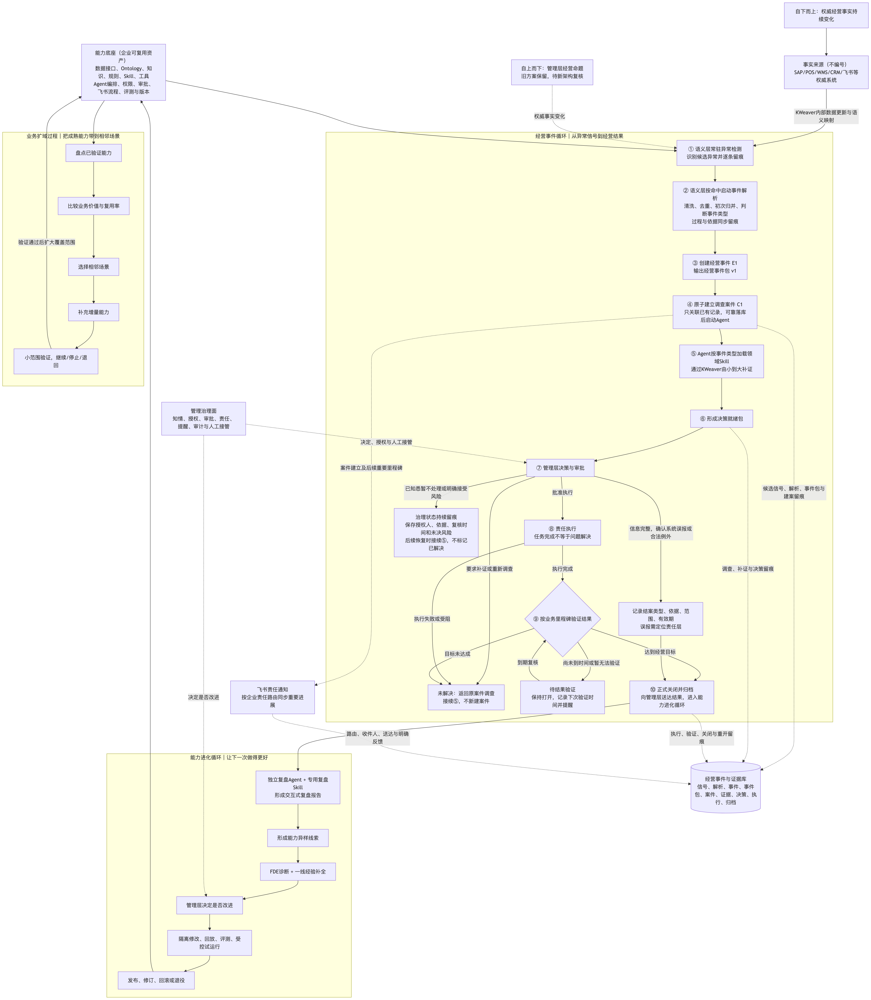

# 圣农经营智能中枢｜方案薄总览

> 定位：本文件帮助评委建立全局地图，不承担循环正文、工程合同或实施台账；三个循环的完整叙事见同目录 01、02、03 评委文案。
> 事实边界：本文描述的是方案设计，不代表圣农已经完成系统接入、组织配置、生产部署或扩域实施。真实数据、规则、权限、责任人、指标阈值和目标环境能力仍待企业验证。
> 更新日期：2026-07-24

这份薄总览只回答五件事：

1. 企业为什么需要它；
2. 共同能力底座是什么；
3. 三个循环怎样接力；
4. 证据与治理怎样贯穿；
5. 怎样从价格试点验收到逐域扩展。

---

## 1. 企业为什么需要它

圣农官方赛题披露的零售业务覆盖多区域、多人员和多渠道，相关数据分散在多个系统；圣农2025年年报同时提出精准预测、精益仓储、智能物流、产销协同、全渠道策略和B端客户全周期管理等方向。公开资料能够证明企业经营协同范围广、数据和责任链条复杂，但不能证明圣农已经存在某个具体经营异常。

在这种环境中，企业缺少的通常不是更多报表或一个能回答问题的聊天机器人，而是把分散事实持续转化为经营行动的共同机制：

> **权威事实发生变化 → 识别值得调查的经营事件 → 取得充分证据 → 由管理层决策和组织执行 → 用真实经营结果验证 → 把经验沉淀为下一次可复用能力。**

本方案因此不重做ERP，也不追求一次性建设全集团智能平台，而是从价格域建立一个范围小、结构完整、可以审计和验证的经营闭环，再用真实结果决定是否扩展。

| 事实状态 | 当前结论 |
|---|---|
| 公开资料支持 | 多区域、多人员、多渠道经营，以及数据分散、产销协同、仓储物流和客户治理等方向 |
| 方案设计推断 | 以微型Ontology、经营事件、领域Skill、证据留痕和人工治理组成的闭环，适合先在价格域验证 |
| 待企业验证 | 真实痛点、源系统字段与接口、组织责任、历史样本、价值基线、目标租户能力和生产约束 |

01 的已定稿入口是"权威经营事实变化形成候选异常"。管理层经营命题先进入试点目标、经营规则、治理要求和03扩域共创，不在本总览中虚构一个尚未确认的自动成案入口。

主要公开依据见[官方赛题数据](../../research/data/official-challenges.json)和圣农发展2025年年度报告（巨潮资讯网公开披露）。

---

## 2. 共同能力底座是什么

共同能力底座不是第四个循环，而是三个循环共同使用、持续校正和逐域复用的一组企业资产。

| 能力组 | 在方案中的作用 | 必须保持的边界 |
|---|---|---|
| 权威事实与语义能力 | 保留SAP、POS、WMS、CRM、飞书等系统作为事实来源；通过数据更新、微型Ontology、业务对象关系、经营规则和受控查询，把分散字段组织成可理解的经营事实 | KWeaver可作为候选通用基座，但不自带圣农经营规则，也不取代ERP |
| Agent调查与工具能力 | Aily Agent根据事件类型加载领域Skill，通过受控工具逐步补证；Skill规定调查方法、停止条件和人工出口 | Agent不绕过权限直连源系统，不替管理层决策，不在生产运行中自行修改能力 |
| 事件、证据与版本能力 | 保存候选信号、事件解析、经营事件、案件、证据、决策、执行、结果、关闭记录和当时能力版本，使全过程可追溯、可回放、可纠错 | 经营事件与证据库是逻辑权威记录；飞书只是协作投影，不是第二套业务账 |
| 协作与治理能力 | 用身份、权限、责任路由、消息、任务、审批、人工接管、评测和回滚，把系统分析接入真实组织 | 高影响经营动作和能力变更必须由有权人员批准；目标租户能力未验证前保持未知 |

能力底座中的通用平台能力、需要配置或开发的圣农业务能力、企业现场未知项必须分开表达。KWeaver 公开平台能力以其官方文档与代码为准；目标租户能力未验证前一律标记为未知。

---

## 3. 三个循环怎样接力



[查看可缩放的 SVG 版本](../../output/方案图_2026-07-23/00_圣农经营智能中枢_三循环总图.svg)

三个循环不是并列功能，也不是一条自动流水线，而是职责不同的接力关系：

| 交接 | 交接条件 | 不代表什么 |
|---|---|---|
| 01 → 02 | 案件已经按"成功解决、合法例外、系统误报"之一形成完整关闭记录 | 任务完成、暂不处理、风险接受或信息不足都不能提前进入02 |
| 02 → 01 | 人工核实后形成改进假设，完成隔离验证并获得管理批准，候选版本回到01受控真实运行 | 一次成功处理不会自动改写生产Skill；受控验证失败必须回滚并返回诊断 |
| 01、02 → 03 | 价格试点形成可核验结果，已有能力和风险边界能够作为企业共创参考 | 不自动触发扩域，也不代表企业已经认可候选场景 |
| 03 → 01 | 企业采纳某个新场景，并同意把它作为独立业务域的小范围试点 | 不把价格案件直接切换成库存或履约案件；新事件仍建立独立案件和Agent上下文 |

详细逻辑分别下钻到：

- [01经营事件循环：让一次经营异常真正走到结果](./01_经营事件循环_评委文案.md)
- [02能力进化循环：让一次案件留下下一次能力](./02_能力进化循环_评委文案.md)
- [03业务扩域循环：试点之后，与企业共同决定下一步](./03_业务扩域循环_评委薄稿.md)

---

## 4. 证据与治理怎样贯穿

证据与治理不是额外增加的业务循环，而是从信号出现到能力变化始终存在的两条贯穿线。

```text
权威事实与版本
→ 候选异常信号与检测依据
→ 事件解析过程与经营事件包
→ 调查案件、查询轨迹与人工补证
→ 决策材料、授权与审批
→ 责任执行与动作回执
→ 经营结果验证
→ 正式关闭、重开或能力进化交接
```

| 贯穿机制 | 解决的问题 | 核心边界 |
|---|---|---|
| 经营事件与证据库 | 让每个结论都能回到来源、时间、版本、权限和处理过程，并支持复盘、纠错与回放 | 记录从候选信号开始持续追加；失败在哪里发生，就在哪里停止并保存已有信息和错误位置 |
| 管理治理 | 明确谁知情、谁补证、谁决策、谁执行、谁批准能力变化，以及何时必须人工接管 | 规则负责发现，Agent负责调查和建议，管理层负责高影响决策；系统不以模型结论替代企业授权 |
| 结果与风险治理 | 防止"任务做完"冒充"问题解决"，并保留暂缓、驳回、风险接受和回滚依据 | `执行完成 != 经营目标达成`；暂不处理或接受风险不自动关闭案件；能力改进必须先隔离验证、再审批、再受控运行 |

全过程留痕的数据合同、失败处理和案件边界，见 [01 经营事件循环评委文案](./01_经营事件循环_评委文案.md)；飞书责任路由和协作投影，见 01 评委文案中"把 Agent 的调查能力与人的经营责任接在一起"一节。

---

## 5. 怎样从价格试点验收到逐域扩展

价格试点的任务不是证明已经建成全集团智能平台，而是用范围小但结构完整的真实闭环，验证这套方法能否可靠运行、产生可检查的经营结果，并留下下一次可以复用的能力。

第一阶段以价格域微型Ontology为语义范围，目标数据范围包含SAP、POS和已有飞书数据资产；真实接入顺序仍需结合权威口径、接口成熟度、数据质量、权限和试点价值由企业现场确定。

### 5.1 试点验收边界

| 验收面 | 需要证明什么 | 当前不提前承诺什么 |
|---|---|---|
| 数据与语义 | 权威事实能够按确定路径进入语义层；候选信号、事件解析、经营事件包和案件身份可追溯 | 不虚构圣农真实字段、SAP原生连接方式、更新频率和准确率目标 |
| 经营闭环 | 代表性案件能够完成发现成案、调查补证、管理决策、责任执行和结果验证；合法例外、系统误报和失败分支可解释 | 不用演示流程或任务完成代替真实经营结果 |
| 证据与治理 | 关键结论能够回到来源、时间、版本、权限和责任人；人工接管、审批、关闭、重开和审计边界清楚 | 不把公开平台能力写成圣农目标租户已经开通 |
| 能力进化 | 每个正式关闭案件可以完整复盘；改进经过人工核实、隔离验证、管理审批、受控真实运行和必要回滚 | 不宣称系统会自动学习、自动发布或自动证明新版本更好 |
| 经营价值 | 取得处理时效、事件质量、证据完整、闭环结果和管理可用性的真实基线，能够说明收益、成本、风险和未解决问题 | 没有真实样本前不填写虚构分数、阈值、收益数字或上线承诺 |

具体指标口径在 [01 经营事件循环评委文案](./01_经营事件循环_评委文案.md) 的试点验收部分说明；样本量、阈值和达标条件必须在取得企业历史样本和目标环境证据后共同确定。

### 5.2 从验收到扩域的建议路径

```text
确认价格试点范围、责任和价值基线
→ 用历史案例回放和受控真实运行验证完整闭环
→ 形成可核验结果、能力清单、失败证据和风险边界
→ 与企业共同复查经营目标、现实痛点和资源约束
→ 企业决定继续深化、暂缓，或选择下一候选场景
→ 被采纳的新场景以小范围独立试点重新进入01
→ 新场景的真实结果再次回到02和03，校正能力与扩域建议
```

03只提供候选场景、首选下一试点和分阶段路径的建议，不采用评分制度，不自动选场景，也不执行真实审批或项目管理。企业可以采纳、调整、暂缓或否决；数据接口、字段、权限、责任人、预算周期和部署验证不是没有考虑，而是由于当前缺少企业内部信息与试验条件，有意留到企业共创和下一试点中确定。

当前总体边界是：01、02业务逻辑已经定稿，03建议性蓝图已经确认；共同能力底座、跨循环关系和验收方法已经形成方案设计，但圣农真实规则、数据接入、组织授权、目标租户能力、生产运行和扩域结果仍待企业验证。
