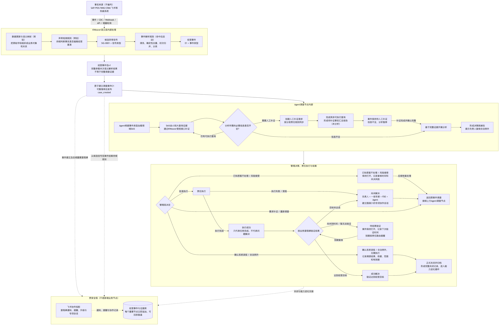

# 圣农经营智能中枢｜让一次经营异常真正走到结果

圣农已经建立了扎实的数字化基础。2024 年报显示，"SAP+智慧农场"已经上线，企业建立了全产业链数字化管理的基础；2025 年报又进一步提出"AI+BI"双轨落地和智慧中台建设。这些投入说明，作为行业龙头，圣农已经把数字化能力纳入长期经营能力建设。

但当数字化走向深水区，问题也会随之变化。官方赛题披露的零售场景覆盖 10 个区域、300 多名业务员和多个渠道，日报、经销商台账、POS 流水和价格巡查记录分散在 6 个系统中，价格异常从投诉到处置平均需要 4—5 天。这与企业已有数字底座并不矛盾：系统已经记住了大量事实，一次真实异常仍可能要经过跨系统查找、跨部门沟通和人工催办，才能变成一件有人负责的经营问题。

下一阶段的关键，是把"看见数据"继续推进到"接住问题"。我们因此提出经营事件循环：保留 SAP、POS、WMS、CRM 等现有系统的权威地位，把一次异常组织成可调查的经营事件，让 Agent 沿着证据展开调查，再把人员责任、管理决策、执行任务和结果验证接回同一件事。

> **我们不另起炉灶，也不把 Agent 停留在问答层。我们以企业现有权威系统为根，把每一次真实经营异常转化为可调查、可决策、可执行、可验证的闭环。**



[查看可缩放的 SVG 版本](../../output/方案图_2026-07-23/01_经营事件循环_总体逻辑图.svg)

## 从"看见数据"到"接住问题"

现有系统擅长产生、沉淀和展示业务事实。经营事件循环继续向前走一步：它要把分散的事实组织成一件有对象、有边界、有证据、有责任的经营问题，并让这件事从发现一直走到结果。

整条主链可以压缩为一个连续的责任过程：

```text
权威系统产生业务事实
→ 语义层形成可信经营事件
→ 一件事件建立一个独立调查案件
→ Agent 按领域方法逐步取得证据
→ 授权管理者作出决定
→ 责任人执行，系统回读权威事实验证结果
→ 目标达成后关闭；未达成则沿同一案件继续调查
```

规则、Agent 和人在这条链上各有职责。规则把值得关注的事实变成待调查事件；Agent 把事件调查成证据充分的决策材料；管理者负责把材料变成经营决定；执行与结果验证负责回答决定是否真正生效。这种分工让 Agent 能够发挥调查能力，同时不越过企业的经营责任边界。

## 先把分散事实组织成一件可信事件

一个原始字段只能说明数值发生了变化。它并不自带经营含义。一笔低于候选基准的成交价，可能来自违规低价，也可能来自合法促销、区域差异、临期处理或错误的适用基准。如果系统跳过这一层语义判断，Agent 再强，也只会以一个不可靠的起点展开调查。

语义层的价值，就在于为调查建立这个可信起点。我们没有设想一次性建模整个集团，而是从价格这个高价值业务域建立一个微型 Ontology，只组织支撑闭环所必需的商品、门店、成交、价盘、促销、审批等业务对象及其关系。开源 KWeaver Core 的对象、关系和受控查询能力可以作为候选底座；圣农真实的主键、口径、业务基准、合法例外和责任路由，则必须由项目团队与企业一线专家共同完成。

当异常检测规则命中时，系统首先保存的是候选异常信号，而不是"已经违规"的结论。事件解析再执行确定性清洗、去重、初次归并和分类，同时记录输入、规则版本、处理结果和仍然存在的不确定项。关系不清就保持独立，核心对象、事件类型或解析依据不足就停在成案之前。只有满足最低可靠条件，才会形成经营事件 E1 和经营事件包 v1。

这个事件包只说明"发生了什么、为什么值得调查"，不会预先塞入促销、审批、库存、销量和毛利等尚未取得的调查证据。语义层因此保持轻薄，专注稳定事件起点；细致的调查方法留给后续的领域 Skill。

## 让 Agent 沿着证据工作

可信事件只是调查的起点。真正决定 Agent 能否进入企业经营的，是它能否在明确方法、证据要求和停止条件下工作。

我们借鉴 Harness Engineering 的思想，但不新造一个平台。经营事件包定义调查起点，领域 Skill 定义证据槽位、查询顺序、扩大条件、停止条件和人工出口，KWeaver 对象关系与 MCP 查询能力提供受控事实。飞书/Aily 可以承担 Agent、Workflow、Skill、MCP 和人员协作的候选运行入口；案件服务与经营事件和证据库则负责稳定 ID、版本和追加式留痕。公开产品能力可以证明路线有可复用基础，圣农目标租户是否已开通对应权限，仍需现场验证。

每个经营事件固定对应一个调查案件和一个独立 Agent 上下文。价格 Agent 可以为当前案件查询库存、销量或毛利，却不能因为查到了跨对象事实，就自行创建另一件库存或销量事件。这些信号先作为当前案件证据或结构化待解决项保留，只有独立规则满足时才另行成案。

调查过程中，Agent 每取得一条证据，都要记录来源、版本、查询状态和引用关系。必需信息只能由人提供时，Agent 可以继续完成不依赖该信息的事实查询，但在补证完成之前，不得展开原因、责任、影响或行动分析。证据齐全后，Agent 形成决策就绪包，把已确认事实、未知项、可能的合法例外和处置路径分开写清，然后把决定权交给授权管理者。

## 一笔 24.9 元交易，怎样走完整个闭环

> **方案模拟：以下商品、门店、价格、促销、审批、人员和处置动作均为虚构，仅用于解释机制，不代表圣农真实经营事实。**

某门店 POS 记录一笔商品实付 `24.9 元`。系统此时只保存商品、门店、成交时间、来源系统、业务时间、接收时间和版本等事实。它不会因为价格低于某个候选基准，就直接写成"违规低价"。

语义层先将原始字段映射为商品、门店、成交记录和候选价格基准等业务对象及关系。异常规则命中后，系统保存候选异常信号 `SIG-0001`，再由事件解析规则完成确定性清洗、去重、归并和分类。事件类型、核心对象、来源版本或解析依据不可靠时，流程会停在成案前；条件满足后，才形成价格异常经营事件 `E1` 和经营事件包 `v1`。

`E1` 可靠落库后，系统原子建立调查案件 `C1`，关联 `SIG-0001`、事件解析记录和事件包，然后发布内部 `case_created` 启动信号。飞书端收到的是面向人的"案件已建立"协作投影，它与后端启动信号职责不同，但都指向同一个 `C1`。

价格 Agent 读取事件包，加载经过企业现场填充和回放验收的价格领域 Skill。它先查候选价盘适用范围，再查促销、审批和相关经营事实，每一次查询都把来源、版本、状态和引用写回 `C1`。如果促销审批记录只能由业务人员补充，Agent 就发起补证请求，同时完成其他不依赖该记录的事实查询。补证完成前，它只生成《待补证事实汇总报告（未分析）》，不推测原因，不判断责任，也不提出行动建议。

补证材料写入 `C1` 并通过完整性确认后，Agent 恢复分析，最终形成决策就绪包。在这条模拟路径中，授权管理者确认需要调整价格并批准执行。在真实经营中，管理者也可以要求补查、暂不处理、接受风险，或在完整证据下确认合法例外或系统误报。无论哪一种选择，都要记录授权人、判断依据和复核条件。

批准执行后，责任任务才会创建。执行人完成调价，只能证明动作已经发生；案件此时进入待结果验证。到达约定业务里程碑后，系统重新读取权威事实，检查价格是否按决定生效、相关经营指标是否达到目标。目标达成，`C1` 形成成功解决关闭记录；还没到验证时间，就保留打开状态和下次检查时间；目标未达成，就围绕原 `C1` 恢复调查，不再创建第二个案件。

从 `SIG-0001` 到 `E1`，再到 `C1`，变化的是处理阶段，没有变的是同一件经营问题、同一条证据链和同一套责任记录。只有正式关闭的案件，才会带着完整记录进入能力进化循环。

## 把 Agent 的调查能力与人的经营责任接在一起

企业经营中，人工介入不是系统失败后的临时补丁，而是责任体系的一部分。系统需要说清"缺什么、为什么需要、由谁补、补完怎样确认"；人则负责提供事实、还原现场、作出判断和承担执行责任。

补证责任人提供系统当前无法取得的业务事实，不替系统填写结论；FDE 与一线领域专家共同校准对象、口径、规则、Skill、例外和停止条件，不以经验直接覆盖原始事实；授权管理者决定是否补查、暂不处理、接受风险、确认例外或批准执行；执行责任人按批准的动作和期限完成工作，并如实反馈完成、失败或受阻原因。

飞书负责把案件里程碑、补证任务、审批、执行任务和提醒投影给具体人员，经营事件与证据库继续保存同一份权威案件记录。一线人员看到的是明确待办，直属负责人能及时掌握阻塞，更高管理层通过看板了解进度；只有逾期、拒绝、高影响或持续阻塞时才逐级升级。具体人员映射、通知时限、群权限和升级层级，仍需圣农现场确认。

## 可信不意味着永不出错，而是出错时停得住、查得清

> **哪里报错，哪里停止；保存已经取得的信息和错误位置，不跳过、不猜测。**

这条原则从数据进入一直贯穿到结果验证。源系统数据迟到、冲突、无权限或版本不明，系统就保存已取得信息、查询状态和错误位置，不把"查不到"解释成"没有问题"。事件类型、核心对象或解析依据不足，就保留候选信号和解析记录，不输出事件包。Agent 缺少必需调查信息，就停下分析并转人工补证。执行失败或结果未达目标，就保留执行回执和失败原因，围绕原案件恢复调查。

还有一类更难的问题：规则写错了，程序却没有报错。这种情况不能假设系统会自动发现。当 Agent、负责人、FDE 或后续复盘发现问题时，相关规则和运行版本应被冻结，已经产生的结果继续保留，修正后再在隔离环境中用原始信号重放。具体止损、业务处理和人员责任应由企业制度决定，不由技术系统擅自定责。

全过程留痕也从不等到结案时再补写。候选信号、解析运行、Agent 查询、人工补证、管理决定、责任执行和结果验证每发生一步，案件记录就追加一步。它需要回答：当时看到了什么，用了哪个规则和 Skill 版本，查过哪些来源，谁补了什么，谁作了决定，动作是否完成，结果如何验证，以及为什么关闭或重开。

源系统仍是原始事实的权威来源，案件与证据库保存的是引用、版本、运行结果和责任过程。这份记录既帮助 Agent 恢复调查上下文，也帮助管理者核对决策依据，还会成为案件关闭后复盘 Agent 能力的真实样本。

任务完成状态与问题解决状态必须分开。飞书任务显示完成，只能证明动作已经做过；权威事实回读证明经营目标已经达成，案件才能按"成功解决"关闭。如果完整证据证明这是合法例外或系统误报，也必须由授权负责人形成可追溯的关闭记录。除此之外，案件继续保持打开或沿同一案件重开调查。

## 从一个高价值问题开始

完整闭环不意味着第一天就建设全部能力。对于一个高复杂度的企业项目，最稳妥的起点是选择一个高价值经营问题，完成一条可回放、可验收的最小纵向闭环。试点要证明的，是一个真实案件能否被可靠地接住、查清、交给人决定并验证结果。

现有系统继续承担事实源，KWeaver 的通用对象和关系能力、飞书/Aily 已公开的 Agent、Workflow、Skill、MCP 与协作能力作为候选复用基础。项目需要配置数据更新通道、稳定 ID、权限、责任路由、案件状态、通知和结果验证时点；需要与圣农共建价格域对象、正常经营基准、异常与解析规则、领域 Skill、合法例外、管理审批和验收样本。真实字段质量、接口可取性、租户权限、物理存储、运行留痕、回放和端到端效果，则必须在目标环境中验证。

验收可以先用脱敏历史案件回放，确认业务语义和案件合同；再用受控试运行检查 Agent 调查、人工补证和责任协同；最后用真实业务里程碑验证执行与经营结果。接入时效、信号可靠性、事件解析质量、证据完整率、无依据结论率、结果验证率和重开率都可以测量，但具体数值只能在取得真实基线后确定。

这种路径的成本控制来自两个明确取舍：成熟通用能力不重复建设，投入集中在企业真正有差异的对象、规则、Skill 和责任机制上；试点范围可以小，但从异常发现到结果验证的业务闭环必须完整。跑通这一件事，才能知道哪些能力值得继续投入，也才能让每一次投入真正留下下一次可复用的经营能力。

## 资料依据与技术附录

本文对圣农的判断来自官方赛题、企业年报和现有调研材料；对 KWeaver、飞书/Aily 的表述只证明公开通用能力及其限制，不代表圣农目标环境已经完成接入。24.9 元案例全程为方案模拟。

- [证据与参考资料索引](./80_证据与参考资料索引.md)
- [方案薄总览](./00_方案薄总览.md)
- KWeaver Core 公开能力以其官方仓库与文档为准：<https://github.com/kweaver-ai/kweaver-core>
- 飞书/Aily 公开能力以飞书开放平台官方文档为准：<https://open.feishu.cn/>

现阶段已经完成的，是经营事件循环的业务逻辑、关键合同、模拟案件和试点设计。圣农真实字段、接口、权限、组织映射、经营规则、目标租户能力和端到端效果，仍需要从一个真实高价值案件开始，与企业共同验证。
