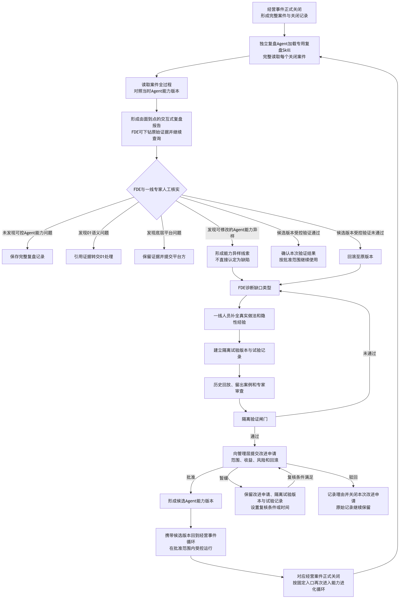

# 圣农经营智能中枢｜让一次案件留下下一次能力

一件经营案件正式关闭，说明这一次异常已经完成调查、决策、执行和结果验证。它同时也留下了一份难得的企业样本：Agent 当时查了什么，在哪里停下，人补充了哪些现场知识，管理者作出了什么决定，当时使用的 Skill、Prompt、MCP 和工作流程又是哪一个版本。

但一次案件解决，不能直接推出 Agent 已经"学会"。例如，Agent 在调查中漏查了促销审批，原因可能是 Skill 证据清单不完整，也可能是接口没有权限、源系统没有记录，甚至可能是语义层把事件起点解析错了。如果这些原因还没分清，系统就自动修改生产能力，一次偶然的处理结果反而可能被放大成更稳定的错误。

能力进化循环就是为解决这个问题而设计。它不追求让系统"自动学习"，而是把真实案件留下的证据交给独立复盘、人工核实和隔离验证，再由管理层决定一项改进是否值得回到真实业务接受检验。经过这条链条验证的方法，才有资格成为下一次可复用的 Agent 能力。

> **对企业而言，真正值得沉淀的不是一次漂亮的回答，而是一套经过现实检验、出了问题也能退回去的方法。**



[查看可缩放的 SVG 版本](../../output/方案图_2026-07-23/02_能力进化循环_逻辑骨架.svg)

## 案件关闭以后，先回看方法是否可靠

经营事件循环回答的是"这一次问题是否可以结束"；能力进化循环继续回答"下一次能否做得更好"。这两类判断必须保持边界。只有已经形成完整关闭记录的案件，才能进入能力进化循环；"执行完成""待结果验证""未解决专项协作""已知悉暂不处理"和"风险接受"仍属于 01，不能提前当作能力学习样本。

在价格试点阶段，每个正式关闭案件都进行完整复盘。调度优先级可以决定先后和并发，却不能用一次低成本初筛删去某些案件的原始信号、查询轨迹、人工修正、决策、执行和结果。这个选择看上去更重，但它能避免系统只复盘"已经看起来有问题"的案件，而错过那些没有被模型事先标记、却能暴露真实能力边界的过程。

复盘由独立于生产调查 Agent 的复盘 Agent 承担，并加载专用复盘 Skill。它从案件全貌开始，还原事件、调查路径、人工介入、决策、执行和结果如何连在一起；再把当时的 Skill、Prompt、MCP、证据使用和状态协作与应有方法对照；然后指出可能存在的能力异样线索；最后让 FDE 可以从任意判断返回当时的查询、证据、源系统记录和权限审计。

复盘报告因此不是案件摘要，而是一份可以从结论回到原始事实的能力证据。复盘 Agent 只负责查找、整理和提出线索，它没有权力宣布"Skill 已经存在缺陷"，也不会直接修改生产配置。

## 先把问题送回正确的责任边界

能力进化循环只处理经营事件包已经交给 Agent 之后、项目团队能够控制的能力。领域 Skill 可以检查证据清单是否漏项、查询顺序是否合理、停止或转人条件是否完整；Prompt 与可配置工作流程可以检查调查路径和状态推进；MCP 工具与查询协作可以检查参数、返回状态、权限、重试和证据写入；案件协作可以检查 Agent 是否正确追加证据、更新状态和发起人工补证。

源系统事实错误、迟到或没有同步，要回到 01 的事实取得和失败处置路径；KWeaver 语义映射、异常检测、事件解析或经营事件包出错，要带着证据转回 01，不在 02 中发布语义版本；飞书、Aily 或底层模型平台存在项目团队不能修改的缺陷，就保存复现证据、影响范围和平台版本，交给平台方处理。

这一步的意义，是不让"Agent 不够聪明"成为所有问题的笼统解释。问题分得清，修复方向才会对，责任也不会被技术口号混淆。

## Agent 发现线索，人完成能力判断

复盘 Agent 能够快速整理跨系统的过程证据，但现实经验不能被它替代。沿用 [经营事件循环中的 24.9 元模拟案件](./01_经营事件循环_评委文案.md#一笔-249-元交易怎样走完整个闭环)，如果复盘发现 Agent 没有主动查询促销审批，这个现象只能形成一条能力异样线索。它仍然需要一线人员说明真实做法、合法例外和权限边界，也需要 FDE 核对接口和语义起点，才能判断究竟是 Skill 没写、事实不可取，还是这个案件根本不适用该证据。

FDE 与方案团队负责提出缺口假设、核查跨系统和跨领域证据，并设计隔离试验和评测口径；一线专家还原真实做法、隐性经验、合法例外和现场约束；工程与平台团队提供隔离环境、版本、回放、评测、审计和回滚能力；管理层在技术闸门通过后，综合收益、风险、运行范围和回滚责任，决定是否进入真实运行。

FDE 为完成诊断，需要在企业授权、脱敏、下载、写入和审计规则下查看所需的全域数据。这是诊断所需的权限原则，并不代表当前已经取得圣农所有数据权限。具体身份、数据范围和审计方式，仍需企业确定。

人工核实后，案件本身复杂且不存在可控能力问题，就保存复盘记录；发现 01 语义问题或平台底层问题，就按责任边界分流；证据支持项目可以通过修改能力改善，才进入隔离试验。这样既不会把一次偶然结果包装成产品缺陷，也能让真实缺口进入正式记录和责任流程。

## 任何改进都先在隔离环境证明自己

能力异样线索只是一个待验证假设，不是发布指令。FDE 与一线专家需要在隔离环境中建立候选版本和试验记录，不直接改动生产 Skill、Prompt、MCP 或工作流程。

```text
能力异样线索
→ FDE 提出缺口假设和修改方案
→ 一线专家补全真实做法、例外和隐性约束
→ 建立基线版本、隔离试验版本和试验记录
→ 历史案件回放、留出案例和专家审查
→ 未通过：保存失败证据，回到诊断与现实补全
→ 通过：形成改进申请，提交管理层审批
```

一份试验记录至少需要说明：改了什么，基线是什么，用了哪些历史案件和留出案例，预期改善什么，哪些失败必须阻止发布，由谁审查，以及出现问题时如何回滚。样本数量、评测指标和门槛不能在没有真实试点的情况下凭空填写，它们需要与首批历史案件和业务责任人一起确定。

隔离验证把"我认为这样会更好"变成"在约定案例和口径下，证据显示它改善了什么、没有改善什么、又带来了哪些风险"。只有这道技术闸门通过后，管理层才拥有足够材料决定它是否值得进入受控真实运行。

## 管理审批之后，候选能力仍要回到真实案件

管理层批准的不是"全集团永久发布"，而是一个带有运行范围、风险、验收条件和回滚责任的候选 Agent 能力版本。它带着批准范围回到 01，在经营事件包已经形成之后处理新的真实经营案件。案件正式关闭并形成完整记录后，又按固定入口进入 02 完整复盘。真实验证通过，才按批准范围继续使用；验证未通过，立即回滚到原版本，再回到诊断与现实补全。

隔离验证通过，只能证明候选版本在既定案例集和口径下达到门槛，不能证明所有真实场景都适用。如果改进的是 Skill 的证据顺序，真实运行需要检查 Agent 是否减少漏查、是否更早识别必需补证、是否仍然遵守停止条件；如果改进的是 MCP 重试或案件状态协作，就要检查工具状态、留痕和责任路由是否按合同工作。下一个正式关闭案件仍然需要完整复盘，不会因为某个版本曾经通过，就跳过后续证据。

## 失败、暂缓和驳回也是能力建设的一部分

企业级能力进化的可信度，不只来自"通过"，也来自每个失败出口都能被追溯：

| 发生的情况 | 留下的证据 | 后续如何继续 |
|---|---|---|
| 隔离验证未通过 | 失败案例、对照结果、专家意见、版本和失败原因 | 回到诊断与现实补全，修正后重建试验 |
| 管理层暂缓 | 改进申请、隔离版本、试验记录、暂缓原因和复核条件 | 条件满足后重新提交审批 |
| 管理层驳回 | 驳回理由、审批人和时间，以及原始案件、复盘和试验记录 | 关闭本次改进申请，不把驳回写成能力已验证 |
| 真实运行未通过 | 真实案件、候选版本、运行范围、失败证据和影响范围 | 回滚至原版本，必要时按 01 处理受影响案件 |
| 未发现可控能力问题 | 完整复盘报告、人工核实结论和分流依据 | 保存记录，不为了"必须进化"强行创建版本 |

原版本始终作为可恢复基线保留。每个候选版本都需要说清它从哪个基线产生，在哪个范围运行，由谁批准，以及出现问题时如何回滚。没有这些信息，一次实验结果就还不是可复用能力。

## 先跑通一条可审查的能力改进链

能力进化循环的第一阶段，不是建设一套宏大的"自动学习平台"，而是先让一条能力改进链可以被审查：有正式入口，有完整证据，有人工责任，有隔离闸门，有管理决定，也有真实验证和回滚。这条链跑通之后，才有足够依据讨论批量调度、并发成本、版本退役和更大范围复用。

这条链不需要从空白开始。它可以直接复用 01 已经形成的案件与证据记录、能力版本引用和结果验证入口，也可以把飞书文档、消息、审批、Agent、Skill 和 MCP 等公开通用能力作为候选载体。真正需要与企业共建的，是复盘 Skill 的检查维度、FDE 与一线专家的诊断方法、实验案例集、指标口径、管理审批和候选版本发布规则。

复盘 Agent 最终由哪种平台承载，飞书文档能否支撑所需的交互式下钻，版本库、隔离环境、样本门槛、Aily 长任务和端到端回放如何实现，当前仍然需要在圣农目标环境中确定。这些未知项不会用假设的平台能力、评测数字或版本数量填满。

能力进化的速度，最终取决于每一次改进能否被验证、能否在出错时回滚、能否在新的真实案件中重复工作。当这三件事能够持续成立，一次案件才不只是被解决，它还会真正留下下一次能力。

## 资料依据与技术附录

本文中"每案完整复盘、独立复盘 Agent、人工核实、隔离验证、管理审批、回 01 真实运行和回滚"是已确认的方案逻辑。复盘平台、交互式报告载体、版本库、隔离环境、样本门槛、目标租户权限和端到端运行尚未被本方案宣称为已经建成。

- [证据与参考资料索引](./80_证据与参考资料索引.md)
- [方案薄总览](./00_方案薄总览.md)
- [经营事件循环评委文案](./01_经营事件循环_评委文案.md)
- KWeaver Core 公开能力以其官方仓库与文档为准：<https://github.com/kweaver-ai/kweaver-core>
- 飞书/Aily 公开能力以飞书开放平台官方文档为准：<https://open.feishu.cn/>

现阶段已经完成的，是能力进化循环的逻辑、责任边界、失败出口和试点治理设计。真正的复盘 Skill、案例集、指标门槛、隔离环境、版本库、权限和 E2E，必须通过真实关闭案件与企业共同建设和验证。
