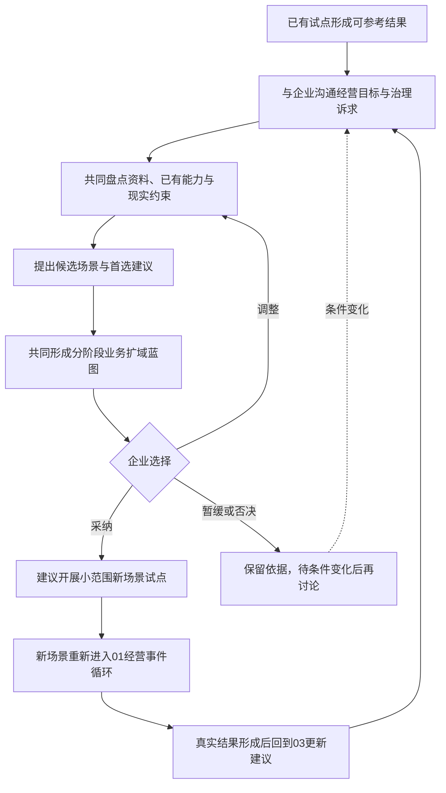

# 圣农经营智能中枢｜业务扩域循环：试点之后，与企业共同决定下一步

> 性质：03 由人主导，不是自动运行的业务系统、评分制度或实施合同；扩域选择与实施路径均为建议，最终由企业确认、调整、暂缓或否决。
> 事实边界：本文为建议性蓝图。其中的候选场景、案例构思和分阶段方向均基于公开资料推演，不代表圣农已经确认、采纳或存在相应经营异常。

## 0. 循环要解决的问题

业务扩域循环不是"一次性建设全集团智能平台"，而是回答：

> **价格试点形成可参考结果后，我们可以怎样与企业共同判断下一步扩向哪里、为什么值得扩，以及如何逐步放大经营价值和治理效能？**

建议在首个试点已经产生可核验结果、关键流程经过重复运行、主要风险已有说明时，再启动扩域讨论。这只是大致参考，不是固定门槛；企业也可以认为条件尚不成熟，暂不扩域。

### 0.1 本稿完成范围与有意留白

本稿已经讨论扩域目的、企业共创方式、候选场景、首选下一试点建议、分阶段方向及与 01、02 的衔接。

数据接口、字段、权限、责任人、指标阈值、预算周期和部署验证并非没有考虑，而是已识别为真实扩域需要补充的事项。在企业内部流程、数据、目标环境和组织授权信息不足的现阶段，继续细化会产生无证据假设，因此本稿有意停留在建议性蓝图与案例构思层，不虚构实施合同和试验结果。

## 1. 建议性的业务扩域蓝图



图中的箭头只表达建议的共创顺序，不代表自动化工作流。03 当前不设计自动触发、自动评分、自动选场景、自动审批或自动扩域；未来即使增加工具，也建议先用于资料整理和证据汇总，不替企业作经营决策。

### 1.1 建议采用的企业共创手段

1. 与管理层沟通经营目标和治理诉求；
2. 与候选业务域负责人及一线人员核验真实痛点；
3. 共同复查首个试点的结果、已有能力和未解决问题；
4. 结合企业资料，用简要情景推演讨论候选场景的数据、协作和风险；
5. 形成分阶段扩域建议，由企业选择采纳、调整或暂缓。

建议由企业管理层提供经营方向，候选业务域负责人和一线人员核验现实，IT、数据和安全团队说明可行性与约束，FDE/方案团队负责资料分析、能力盘点和建议整理。FDE 不替企业拍板；没有明确业务负责人或关键信息不足时，可以建议暂缓。

### 1.2 建议关注的判断维度

建议先关注场景能否创造重要经营价值、改善跨部门协同或提升治理效能，再讨论已有能力可以复用多少、还需补充哪些数据与能力、风险是否可控。上述内容用于帮助企业讨论，不形成分数、权重、固定阈值或强制选择规则。

## 2. 建议产物与跨循环边界

业务扩域讨论可以形成一份企业可继续修订的分阶段蓝图，简要包含：

- 候选场景及推荐顺序；
- 首选下一试点建议与主要依据；
- 可以复用的已有能力和需要补充的条件；
- 建议参与角色、后续阶段及可以暂缓的原因；
- 公开资料支持、方案推断和待企业核验项。

03 不改变已经确认的跨循环边界：

- 如果企业采纳某个新场景，建议先把它作为独立业务域的小范围试点；其中的新经营事件仍按 01 建立独立事件、案件和 Agent 上下文，不让价格案件直接切换成库存或履约 Skill；
- 真实案件关闭后，如果暴露的是 Agent 接案后可控的 Skill、Prompt、MCP 或工作流问题，再按 02 进入能力进化；
- 03 只提供扩域建议，不直接修改生产能力，不执行真实审批，也不承担扩域项目管理。

## 3. 圣农业务扩域推演示例（基于公开资料，待企业共同确认）

### 3.1 资料支持与事实边界

`公开资料支持`：圣农官方赛题披露零售业务覆盖多区域、多人员和多渠道，相关数据分散在多个系统；2025 年年报提出精准预测、高效生产、精益仓储、智能物流、产销协同、全渠道策略和 B 端客户全周期管理等方向。

`方案推断`：这些方向说明价格试点之后可以优先讨论渠道、库存、促销和履约等相邻场景，但不能证明企业已经存在某个具体异常。

`待企业核验`：真实痛点、数据可得性、业务负责人、资源投入、优先顺序和试点价值，均需结合企业内部信息共同确认。

### 3.2 三个候选场景建议

| 顺序 | 候选场景 | 简要建议 |
|---|---|---|
| 1 | 渠道库存与动销协同 | 建议作为首选下一试点。它与价格、产品、区域、客户和渠道等已有对象较相邻，也与年报中的产销协同、精益仓储和智能物流方向相符 |
| 2 | 全渠道促销执行与毛利治理 | 价格政策和渠道能力可能较容易复用，但需由企业判断它是价格域继续深化，还是值得形成独立扩域场景 |
| 3 | B 端客户全周期履约治理 | 年报已有明确战略方向，但预计需要补充订单、合同、履约和物流等更多信息，建议作为后续备选 |

首选建议不等于企业结论。公开资料尚不足以证明三个场景的真实收益、建设成本和内部优先级，企业可以调整顺序，也可以暂不选择任何场景。

### 3.3 简短案例构思

> 假设某区域产品在价格或促销策略执行后，经销商进货量增加，但终端动销没有同步变化。企业可以进一步核验这是正常备货，还是值得关注的产销协同问题。

该情景只用于说明"价格试点形成的对象和经验怎样支持相邻场景讨论"，不是已经发现的圣农经营异常；正常备货、季节性储备和其他合法经营安排都需要保留。

### 3.4 分阶段建议

```text
第一阶段建议：渠道库存与动销协同
后续相邻阶段：根据真实结果，再讨论促销毛利治理或B端履约治理
远期探索方向：生产、仓储物流、采购、养殖育种或海外业务
```

以上按现有证据成熟度和业务邻近程度排列，不设置具体时间表，也不承诺企业一定按此顺序实施。每完成一个真实试点，都可以回到 03 重新讨论下一阶段建议。

## 4. 主要资料依据

- [飞书AI人才赛企业赛题汇总｜圣农集团条目](../../research/data/official-challenges.json)：用于确认官方赛题披露的零售组织、渠道与数据分散背景；
- 圣农发展 2025 年年度报告（巨潮资讯网公开披露）：用于确认产销协同、精益仓储、智能物流、全渠道与 B 端履约方向；
- 前期业务调研（库存与经销商、跨部门协作与决策，基于公开资料整理的项目内部底稿）：用于补充候选场景线索与证据边界。

调研材料中的媒体信息、搜索摘要和行业类比只能作为线索；圣农事实优先以年报、官方赛题和企业后续提供的内部资料核验。
