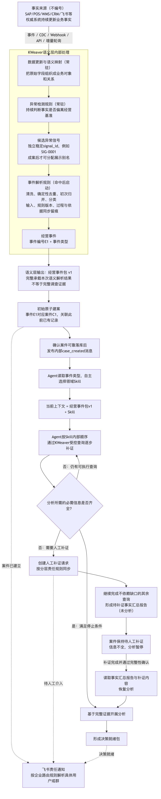
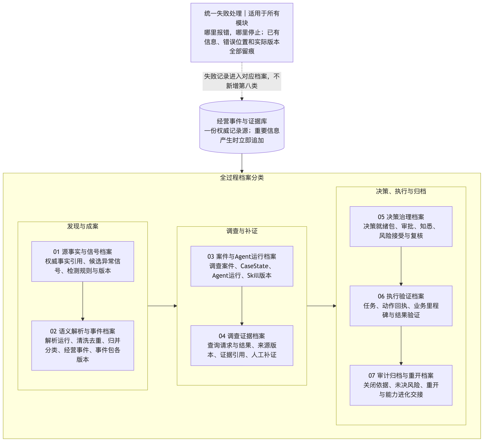

# 圣农经营智能中枢方案图（2026-07-23）

> 本目录是方案正式逻辑图的导出资产（PNG + SVG），由方案文档中的 Mermaid 图源生成，用于查看、汇报和文档插入。
> 基线重导（2026-07-23）：01 总体逻辑图、01 持续留痕图和 02 能力进化循环图均以逻辑定稿的专题 Mermaid 重新生成。最终同步（2026-07-24）：02 图按最终复核后的 Mermaid 再次重导。

## 资产清单

| 图 | 内容 | 对应评委材料 | 文件 |
|---|---|---|---|
| 00 三循环总图 | 能力底座、经营事件循环、能力进化循环与业务扩域的总体关系 | [方案薄总览](../../docs/评委材料/00_方案薄总览.md) | [PNG](00_圣农经营智能中枢_三循环总图.png) / [SVG](00_圣农经营智能中枢_三循环总图.svg) |
| 00 固定前置链路 | 权威事实进入KWeaver、异常检测、事件解析、经营事件包、建案与Agent入场 | [方案薄总览](../../docs/评委材料/00_方案薄总览.md) | [PNG](00_经营事件循环_固定前置链路.png) / [SVG](00_经营事件循环_固定前置链路.svg) |
| 01 经营事件循环总体逻辑图 | 从权威事实到正式结案；包含待验证、未解决回流、合法例外和系统误报 | [01 经营事件循环评委文案](../../docs/评委材料/01_经营事件循环_评委文案.md) | [PNG](01_经营事件循环_总体逻辑图.png) / [SVG](01_经营事件循环_总体逻辑图.svg) |
| 01 持续留痕图 | 说明重要信息在每个节点立即追加，不是结案后一次性存档 | [01 经营事件循环评委文案](../../docs/评委材料/01_经营事件循环_评委文案.md) | [PNG](01_经营事件循环_持续留痕图.png) / [SVG](01_经营事件循环_持续留痕图.svg) |
| 02 能力进化循环逻辑骨架 | 每个正式关闭案件完整复盘、人工核实、诊断、隔离验证、管理审批，以及候选版本回到01受控运行后再次进入02验证 | [02 能力进化循环评委文案](../../docs/评委材料/02_能力进化循环_评委文案.md) | [PNG](02_能力进化循环_逻辑骨架.png) / [SVG](02_能力进化循环_逻辑骨架.svg) |

## 预览

### 00 圣农经营智能中枢三循环总图

### 00 经营事件循环固定前置链路

### 01 经营事件循环总体逻辑图

### 01 经营事件循环持续留痕图

### 02 能力进化循环逻辑骨架

